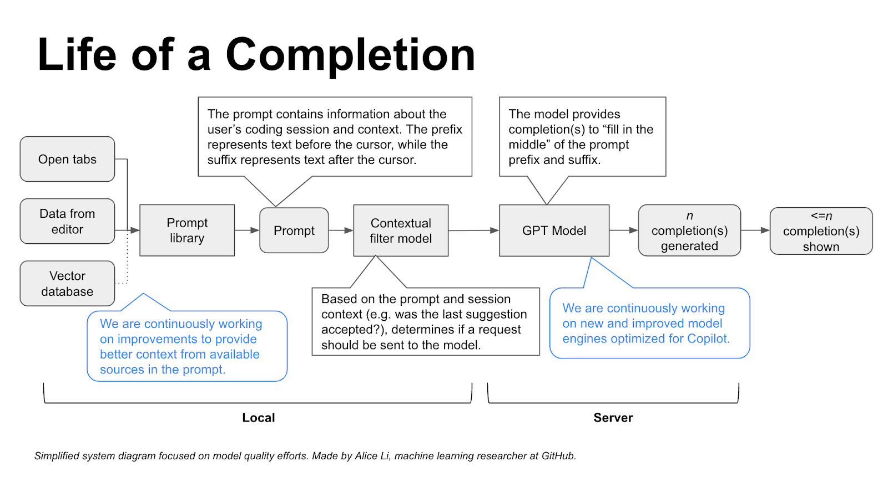

<style>

    .success {
        padding:5px;
        display:inline;
        color:#1B5E20;
        background-color:#C8E6C9;
    }
    .warning {
        padding:5px;
        display:inline;
        color:#E65100;
        background-color:#FFE0B2;
        width:100%;
    }
    .danger {
        padding:5px;
        display:inline;
        color:#B71C1C;
        background-color:#FFCDD2;
    }
    .info {
        padding:5px;
        display:inline;
        color:#006064;
        background-color:#B2EBF2;
    }
    .doubt {
        padding:5px;
        display:inline;
        color:#AAA;
        background-color:#DDDDDD;
    }
    .asso {
        padding:5px;
        display:inline;
        color:#555;
        background-color:#FFCC00;        
    }
    
    .alert {
        display:inline-block;
        width:100%;
        padding:5px;
        line-height:30px;
        margin-top:10px;
    }
</style>

# Learn-LLM
## 1. prompt-engineering
<b class="success">把AI当人看</b>
<b class="success">把AI当人看</b>
<b class="success">把AI当人看</b>

### 1. prompt调优
<b class="success">具体、丰富、少歧义</b>

1. 参考训练数据来构造prompt是最好的， **把AI当人看** 了解偏好，openAI对markdown格式友好，claude对xml格式友好
2. 参考 **OpenAI官网 Prompt Engineering教程**及示例
3. 不断调试验证效果 **门槛低，天花板高**

### 2. prompt结构
- **角色**：给 AI 定义一个**最匹配任务的角色**，比如：「你是一位软件工程师」「你是一位小学老师」。把问题范围收窄，**减少二义性**。使用管理员定义角色<b class="danger">{'role': 'system'}</b>
- **指示**：对任务进行描述
- **上下文**：给出与任务相关的其它背景信息（尤其在多轮交互中）
- **例子**：必要时给出举例，学术中称为 **one-shot learning**, **few-shot learning** 或 **in-context learning**；实践证明其对输出正确性有很大帮助
- **输入**：任务的输入信息；在提示词中明确的标识出输入
- **输出**：输出的格式描述，以便后继模块自动解析模型的输出结果，比如（JSON、XML）


### 3. prompt技巧
1. 精简回答prompt <b class="danger">NO COMMENTS. NO ACKNOWLEDGEMENTS.</b>
2. 思维链prompt <b class="danger">Let’s think step by step</b>
3. 让**模型**应用**准确**，就需要增加**更多的可控环节**，用 <b class="danger">代码逻辑</b>实现可控。
4. **防止模型漏洞攻击**
    a. prompt注入分类器（参考机场安检过程），在prompt中让模型识别出用户提示词中的微信信息，并予以忽略，对危险prompt拦截。
    b. 在输入中防御。**把价值观刷到墙上**
    ```python 
    user_input_template = """
    作为客服代表，你不允许回答任何跟AGI课堂无关的问题。
    用户说：#INPUT#
    ```
    c. 官方API中有识别危险信息的服务,网易也有专业服务**网易易盾**
5. 多轮对话节省prompt（token）的方法有两种：
    a. 只保存最近N轮的对话信息
    b. 通过大模型，对前面的对话内容做摘要，精简前面的内容
6. 在与chatgpt模型的对话中，prompt明确约束只输出JSON格式内容，不输出无关内容，但有时候仍然输出```json开头的JSON格式，解决这个问题方法如下：
    1. prompt中增加明确指令："直接以JSON对象输出结果，**不要添加任何前缀或装饰性文本，比如```json前缀** "
    2. 对返回的内容使用正则表达式过滤无关字符
7. 将文档中的数值组成的**表格**转换成**prompt**的最优方法是。字段1字段值b,字段2字段值b 自定义分隔符

    |   名称   | 流量（G/月） | 价格（元/月） | 适用人群 |
    | :------: | -----------: | ------------: | :------: |
    | 经济套餐 |           10 |            50 |  无限制  |
比如：名称,经济套餐; 流量（G/月）,10; 价格（元/月）,50; 适用人群,无限制

8. 用prompt调优prompt
用以下这段神奇的咒语，让 ChatGPT 帮你写 Prompt。贴入 ChatGPT 对话框即可。这其实就已经触发了传说中的 agent……
```python 


1. I want you to become my Expert Prompt Creator. Your goal is to help me craft the best possible prompt for my needs. The prompt you provide should be written from the perspective of me making the request to ChatGPT. Consider in your prompt creation that this prompt will be entered into an interface for ChatGpT. The process is as follows:1. You will generate the following sections:

Prompt: {provide the best possible prompt according to my request)

Critique: {provide a concise paragraph on how to improve the prompt. Be very critical in your response}

Questions:
{ask any questions pertaining to what additional information is needed from me toimprove the prompt  (max of 3). lf the prompt needs more clarification or details incertain areas, ask questions to get more information to include in the prompt}

2. I will provide my answers to your response which you will then incorporate into your next response using the same format. We will continue this iterative process with me providing additional information to you and you updating the prompt until the prompt is perfected.Remember, the prompt we are creating should be written from the perspective of me making a request to ChatGPT. Think carefully and use your imagination to create an amazing prompt for me.
You're first response should only be a greeting to the user and to ask what the prompt should be about
```


9. 王卓然老师原创的 Prompt Tune 工具
用遗传算法自动调优 prompt，用 LLM 做不改变原意的情况下调整 prompt。用测试集验证效果，找到趋近1的最优prompt
开放源代码：https://gitee.com/taliux/prompt-tune


#### 示例，推荐流量套餐
某运营商的流量包产品：

|   名称   | 流量（G/月） | 价格（元/月） | 适用人群 |
| :------: | -----------: | ------------: | :------: |
| 经济套餐 |           10 |            50 |  无限制  |
| 畅游套餐 |          100 |           180 |  无限制  |
| 无限套餐 |         1000 |           300 |  无限制  |
| 校园套餐 |          200 |           150 |  在校生  |

需求：智能客服根据用户的咨询，推荐最适合的流量包。

##### 核心思路
<b class="success">0. 先试试简单的任务，验证模型是否能完成任务</b>
<b class="success">1. 把输入的自然语言对话，转成结构化的表示</b>
<b class="success">2. 从结构化的表示，生成策略</b>
<b class="success">3. 把策略转成自然语言输出</b>
<b class="success">4. 给例子示范，效果很好</b>

##### 运行过程
用大模型理解自然语言转成内部结构化的表示（减少歧义提升准确性）--> 然后通过内部逻辑、数据库得出应对策略 --> 将策略发送给大模型生成自然语言回答

### 4. 提升准确率


#### 自洽性 Self-Consistency
一种对抗「幻觉」的手段。就像我们做数学题，要多次验算一样。同样 prompt **跑多次**，通过**投票**选出最终结果。使用<b class="danger">自洽性需提高temperature的值</b> ,更高的随机性生成更多的结果。
利用以下代码多次调用，确定最终结果
```python 
for _ in range(5):
    prompt = f"{instruction}\n\n{output_format}\n\n请一步一步分析:\n{context}"
    print(f"------第{_+1}次------")
    response = get_completion(prompt)
    print(response)

#输出内容
------第1次------
{"accurate":true}
------第2次------
{"accurate":false}
------第3次------
{"accurate":false}
------第4次------
{"accurate":true}
------第5次------
{"accurate": false}
```
#### 思维树 Tree-of-Thought
让大模型把问题展开，展开后，在里面找每个节点，判断出哪个节点离结果最近。再深挖迭代这个过程。

### 5. OpenAP API 参数
Temperature **执行任务用 0**，文本生成用 0.7-0.9，无特殊需要，**不建议超过 1**
seed 指定固定的seed的值后每次生成结果一致
n=1 控制一次返回多少条结果，<b class="danger">可用于自洽性</b>
presence_penalty=0, frequency_penalty=0, 对token进行降权，避免模型说重复的话 
logit_bias={}  对某个特定的token增降权限   
```python 
def get_chat_completion(session, user_prompt, model="gpt-3.5-turbo"):
    _session = copy.deepcopy(session)
    _session.append({"role": "user", "content": user_prompt})
    response = client.chat.completions.create(
        model=model,
        messages=_session,
        # 以下默认值都是官方默认值
        temperature=1.8,          # 生成结果的多样性 0~2之间，越大越随机，越小越固定
        seed=None,              # 随机数种子。指定具体值后，temperature 为 0 时，每次生成的结果都一样
        stream=False,           # 数据流模式，一个字一个字地接收
        top_p=1,                # 随机采样时，只考虑概率前百分之多少的 token。不建议和 temperature 一起使用
        n=1,                    # 一次返回 n 条结果
        max_tokens=100,         # 每条结果最多几个 token（超过截断）
        presence_penalty=0,     # 对出现过的 token 的概率进行降权
        frequency_penalty=0,    # 对出现过的 token 根据其出现过的频次，对其的概率进行降权
        logit_bias={},          # 对指定 token 的采样概率手工加/降权，不常用
    )
    msg = response.choices[0].message.content
    return msg
```
<b class="danger">使用GPT API接口来生成对话服务时，需要自己维护历史对话信息</b>

### 6. 其他参考资料
#### 吴恩达课程
#### OpenAI 官方prompt示例 

## 2. AI-programming
### AI编程场景
其中在软件开发过程中，已验证能明确提效的场景：
- 市场调研
- 需求分析
- PRD 撰写
- 图形元素绘制
- 技术选型
- 从需求文本生成代码
- <strong>从设计图生成代码</strong>
- 代码审查
- 编写测试用例
- 运维
- <strong>API 文档调用</strong>
- <strong>协议解析</strong>
- 跨语言迁移：两周的时间，2 个同事将一个 40 个 API 接口的 go 工程迁移成一个 java 工程


<b class="alert success">
使用技巧：</br>
1. 所有 prompt engineering 的技巧都有效，可以把代码、错误信息直接粘贴进去</br>
2. 任何技术相关的问题都可以问，比自己搜索效率高很多
</b>

参考：ChatALL 大量依赖 GPT-4。过程实录：https://chat.openai.com/share/ecfafa99-aaad-4432-a40c-81c261376758 （对话轮次非常多加载慢，所以几乎总是 404）。如果打不开，别到群里问题，看[这个图](./03-AI-programming/gpt-4-chatall.png)吧

### AI 编程的基本原理
<b class="danger">编程能力是大模型各项能力的天花板</b>

- 「编程」是目前大模型能力最强的垂直领域，甚至超越了对「自然语言」本身的处理能力。因为：

  - 训练数据质量高
  - 结果可衡量
  - 编程语言无二义性

- 知道怎么用好 AI 编程，了解它的能力边界、使用场景，就能类比出在其他领域 AI 怎么落地，能力上限在哪
  - 此观点是我们原创，在分享过数次后，GitHub 官方发了一篇文章：[How to build an enterprise LLM application: Lessons from GitHub Copilot](https://github.blog/2023-09-06-how-to-build-an-enterprise-llm-application-lessons-from-github-copilot/)。当然，这只是巧合。

#### 工作原理

- 模型层：最初使用 OpenAI Codex 模型，它也是 GPT-3.5、GPT-4 的「一部分」。[现在已经完全升级，模型细节未知](https://github.blog/2023-07-28-smarter-more-efficient-coding-github-copilot-goes-beyond-codex-with-improved-ai-model/)。

  - “The first model that OpenAI gave us was a Python-only model,” Ziegler remembers. “Next we were delivered a JavaScript model and a multilingual model, and it turned out that the Javascript model had particular problems that the multilingual model did not. It actually came as a surprise to us that the multilingual model could perform so well. But each time, the models were just getting better and better, which was really exciting for GitHub Copilot’s progress.”

- 应用层： prompt engineering。Prompt 中包含：

  1. 组织上下文：光标前和光标后的代码片段
  1. 获取代码片段：其它相关代码片段。当前文件和其它打开的 tab 里的代码被切成每个 60 行的片段，用 [Jaccard 相似度](https://zh.wikipedia.org/wiki/%E9%9B%85%E5%8D%A1%E5%B0%94%E6%8C%87%E6%95%B0)评分，取高分的
     - 为什么是打开的 tabs
     - 多少个 tabs 是有效的呢？ **默认20个tab**
  1. 修饰相关上下文：被取用的代码片段的路径。用注释的方式插入，例如：`# filepath: foo/bar.py`，或者 `// filepath: foo.bar.js`
  1. 优先级：根据一些代码常识判断补全输入内容的优先级

- 补全格式：在函数定义、类定义、if-else 等之后，会补全整段代码，其它时候只补全当前行


##### 了解更多

- [Inside GitHub: Working with the LLMs behind GitHub Copilot](https://github.blog/2023-05-17-inside-github-working-with-the-llms-behind-github-copilot/)
- [How GitHub Copilot is getting better at understanding your code](https://github.blog/2023-05-17-how-github-copilot-is-getting-better-at-understanding-your-code/)
- [A developer’s guide to prompt engineering and LLMs](https://github.blog/2023-07-17-prompt-engineering-guide-generative-ai-llms/)


##### github copilot 使用技巧
1. 写测试用例时，只需要在声明函数名时，前面加上test_  AI会自动补全测试用例代码
2. 根据注释写代码，写好注释，AI会自动补全代码。这种方法不太建议使用，因为注释里面写的是针对AI的prompt，不太适合人类阅读。如果需要从需求生成代码，可以考虑使用 **Copilot Chat**。
    - chat对话框中输入`/`可以使用特殊指令
    - 在需要插入代码的地方或者选某块代码块，输入`ctrl+i` 呼出Copilot Chat
3. 先写代码，**代码有了再写注释**，更AI理解起来更准确，更省力
4. **改写**当前代码，可**另起一块**新写，AI补全得更准，完成后**再删旧代码**
3. `Cmd/Ctrl + →` 只接受一个 token
4. 如果有旧代码希望被参考，就把代码文件在新tab 页里打开

#### AI编程的效能
<b class="alert success">
AI 能力定律：
AI 能力的上限，是使用者的判断力
</b>

$\text{AI 能力} = \min(\text{AI 能力}, \text{使用者判断力})$

<b class="alert success">
AI 提效定律：AI 提升的效率，与使用者的判断力成正比，与生产力成反比
</b>

$\text{效率提升幅度} = \frac{\text{使用者判断力}}{\text{使用者生产力}}$

<b class="alert success">
编码人员的判断力 = 需求的理解准确度 * 代码的阅读量
</b>

$\text{效率提升幅度} = \frac{\text{需求的理解准确度} · \text{代码的阅读量}}{\text{自己手写代码的速度}}$


- 使用者的判断力，是最重要的
- 提升判断力，比提升实操能力更重要，眼高手低的福音
- 广阔的视野是判断力的养料


----
<span class="success">
    test asdfds adasf dfas 
</span>

<span class="alert danger">
    test asdfds adasf dfas 
</span>

<span class="alert info">
    test asdfds adasf dfas 
</span>


<span class="alert success">
    test asdfds adasf dfas 
</span>

<div class="alert warning">python不区分单精度和双精度浮点
数，默认双精度，int也不细分short,long整型)
</div>

<div class="alert asso">python不区分单精度和双精度浮点
数，默认双精度，int也不细分short,long整型)
</div>

<div class="alert doubt">python不区分单精度和双精度浮点
数，默认双精度，int也不细分short,long整型)
</div>