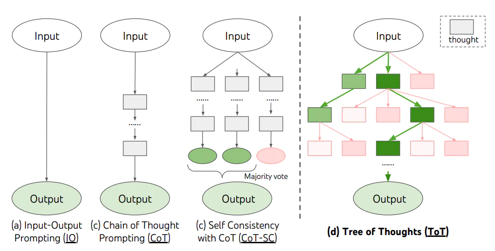

<style>

    .success {
        padding:5px;
        display:inline;
        color:#1B5E20;
        background-color:#C8E6C9;
    }
    .warning {
        padding:5px;
        display:inline;
        color:#E65100;
        background-color:#FFE0B2;
        width:100%;
    }
    .danger {
        padding:5px;
        display:inline;
        color:#B71C1C;
        background-color:#FFCDD2;
    }
    .info {
        padding:5px;
        display:inline;
        color:#006064;
        background-color:#B2EBF2;
    }
    .doubt {
        padding:5px;
        display:inline;
        color:#AAA;
        background-color:#DDDDDD;
    }
    .asso {
        padding:5px;
        display:inline;
        color:#555;
        background-color:#FFCC00;        
    }
    
    .alert {
        display:inline-block;
        width:100%;
        padding:5px;
        line-height:30px;
        margin-top:10px;
    }
</style>

# Learn-LLM

## 0. 大模型 to B 开发的四个技术方向
1. Prompt 提示词工程
2. AI agent 开发（根据任务来自动完成目标）
3. 对话系统chatbot开发（智能客服系统，问诊系统，法律咨询等）
4. 4.大模型微调（微调行业垂直模型）

<b class="info">学习路线</b>[聚客AI学习路线](./01/AI大模型学习路线.pdf)


## 1. prompt-engineering
<b class="success">把AI当人看</b>
<b class="success">把AI当人看</b>
<b class="success">把AI当人看</b>

<b class="danger">知道哪些问题用提示词工程解决更高效，哪些用传统编程解决更高效</b>

### 1. prompt调优
<b class="success">具体、丰富、少歧义</b>

1. 参考训练数据来构造prompt是最好的， **把AI当人看** 了解偏好，openAI对markdown格式友好，claude对xml格式友好
2. 参考 **OpenAI官网 Prompt Engineering教程**及示例
3. 不断调试验证效果 **门槛低，天花板高**

### 2. prompt结构
- **角色**：给 AI 定义一个**最匹配任务的角色**，比如：「你是一位软件工程师」「你是一位小学老师」。把问题范围收窄，**减少二义性**。使用管理员定义角色<b class="danger">{'role': 'system'}</b>
- **指示**：对任务进行描述
- **上下文**：给出与任务相关的其它背景信息（尤其在多轮交互中）
- **例子**：必要时给出举例，学术中称为 **one-shot learning**, **few-shot learning** 或 **in-context learning**；实践证明其对输出正确性有很大帮助
- **输入**：任务的输入信息；在提示词中明确的标识出输入
- **输出**：输出的格式描述，以便后继模块自动解析模型的输出结果，比如（JSON、XML）


### 3. prompt技巧
1. 精简回答prompt <b class="danger">NO COMMENTS. NO ACKNOWLEDGEMENTS.</b>
2. 思维链prompt <b class="danger">Let’s think step by step</b>
3. 让**模型**应用**准确**，就需要增加**更多的可控环节**，用 <b class="danger">代码逻辑</b>实现可控。
4. **防止模型漏洞攻击**
    a. prompt注入分类器（参考机场安检过程），在prompt中让模型识别出用户提示词中的微信信息，并予以忽略，对危险prompt拦截。
    b. 在输入中防御。**把价值观刷到墙上**
    ```python 
    user_input_template = """
    作为客服代表，你不允许回答任何跟AGI课堂无关的问题。
    用户说：#INPUT#
    ```
    c. 官方API中有识别危险信息的服务,网易也有专业服务**网易易盾**
5. 多轮对话节省prompt（token）的方法有两种：
    a. 只保存最近N轮的对话信息
    b. 通过大模型，对前面的对话内容做摘要，精简前面的内容
6. 在与chatgpt模型的对话中，prompt明确约束只输出JSON格式内容，不输出无关内容，但有时候仍然输出```json开头的JSON格式，解决这个问题方法如下：
    1. prompt中增加明确指令："直接以JSON对象输出结果，**不要添加任何前缀或装饰性文本，比如```json前缀** "
    2. 对返回的内容使用正则表达式过滤无关字符
7. 将文档中的数值组成的**表格**转换成**prompt**的最优方法是。字段1字段值b,字段2字段值b 自定义分隔符

    |   名称   | 流量（G/月） | 价格（元/月） | 适用人群 |
    | :------: | -----------: | ------------: | :------: |
    | 经济套餐 |           10 |            50 |  无限制  |
比如：名称,经济套餐; 流量（G/月）,10; 价格（元/月）,50; 适用人群,无限制

8. 用prompt调优prompt
用以下这段神奇的咒语，让 ChatGPT 帮你写 Prompt。贴入 ChatGPT 对话框即可。这其实就已经触发了传说中的 agent……
```python 


1. I want you to become my Expert Prompt Creator. Your goal is to help me craft the best possible prompt for my needs. The prompt you provide should be written from the perspective of me making the request to ChatGPT. Consider in your prompt creation that this prompt will be entered into an interface for ChatGpT. The process is as follows:1. You will generate the following sections:

Prompt: {provide the best possible prompt according to my request)

Critique: {provide a concise paragraph on how to improve the prompt. Be very critical in your response}

Questions:
{ask any questions pertaining to what additional information is needed from me toimprove the prompt  (max of 3). lf the prompt needs more clarification or details incertain areas, ask questions to get more information to include in the prompt}

2. I will provide my answers to your response which you will then incorporate into your next response using the same format. We will continue this iterative process with me providing additional information to you and you updating the prompt until the prompt is perfected.Remember, the prompt we are creating should be written from the perspective of me making a request to ChatGPT. Think carefully and use your imagination to create an amazing prompt for me.
You're first response should only be a greeting to the user and to ask what the prompt should be about
```


9. 王卓然老师原创的 Prompt Tune 工具
用遗传算法自动调优 prompt，用 LLM 做不改变原意的情况下调整 prompt。用测试集验证效果，找到趋近1的最优prompt
开放源代码：https://gitee.com/taliux/prompt-tune


#### 示例，推荐流量套餐
某运营商的流量包产品：

|   名称   | 流量（G/月） | 价格（元/月） | 适用人群 |
| :------: | -----------: | ------------: | :------: |
| 经济套餐 |           10 |            50 |  无限制  |
| 畅游套餐 |          100 |           180 |  无限制  |
| 无限套餐 |         1000 |           300 |  无限制  |
| 校园套餐 |          200 |           150 |  在校生  |

需求：智能客服根据用户的咨询，推荐最适合的流量包。

##### 核心思路
<b class="success">0. 先试试简单的任务，验证模型是否能完成任务</b>
<b class="success">1. 把输入的自然语言对话，转成结构化的表示</b>
<b class="success">2. 从结构化的表示，生成策略</b>
<b class="success">3. 把策略转成自然语言输出</b>
<b class="success">4. 给例子示范，效果很好</b>

##### 运行过程
用大模型理解自然语言转成内部结构化的表示 **（NLU）**（减少歧义提升准确性）--> 然后通过内部逻辑、数据库得出应对策略 --> 将策略发送给大模型生成自然语言回答

| 对话轮次 | 用户提问              | NLU 语义理解               | DST 状态跟踪                         | Policy 对话策略                 | NLG 自然语言生成                                       |
| -------- | --------------------- | ----------------- | --------------------------- | ---------------------- | ----------------------------------------- |
| 1        | 流量大的套餐有什么    | sort_descend=data | sort_descend=data           | inform(name=无限套餐)  | 我们现有无限套餐，流量不限量，每月 300 元 |
| 2        | 月费 200 以下的有什么 | price<200         | sort_descend=data price<200 | inform(name=劲爽套餐)  | 推荐劲爽套餐，流量 100G，月费 180 元      |
| 3        | 算了，要最便宜的      | sort_ascend=price | sort_ascend=price           | inform(name=经济套餐)  | 最便宜的是经济套餐，每月 50 元，10G 流量  |
| 4        | 有什么优惠吗          | request(discount) | request(discount)           | confirm(status=优惠大) | 您是在找优惠吗                            |

### 4. 提升准确率





#### 自洽性 Self-Consistency
一种对抗「幻觉」的手段。就像我们做数学题，要多次验算一样。同样 prompt **跑多次**，通过**投票**选出最终结果。使用<b class="danger">自洽性需提高temperature的值</b> ,更高的随机性生成更多的结果。
利用以下代码多次调用，确定最终结果
```python 
for _ in range(5):
    prompt = f"{instruction}\n\n{output_format}\n\n请一步一步分析:\n{context}"
    print(f"------第{_+1}次------")
    response = get_completion(prompt)
    print(response)

#输出内容
------第1次------
{"accurate":true}
------第2次------
{"accurate":false}
------第3次------
{"accurate":false}
------第4次------
{"accurate":true}
------第5次------
{"accurate": false}
```
#### 思维树 Tree-of-Thought
让大模型把问题展开，展开后，在里面找每个节点，判断出哪个节点离结果最近。再深挖迭代这个过程。

### 5. OpenAP API 参数
Temperature **执行任务用 0**，文本生成用 0.7-0.9，无特殊需要，**不建议超过 1**
seed 指定固定的seed的值后每次生成结果一致
n=1 控制一次返回多少条结果，<b class="danger">可用于自洽性</b>
presence_penalty=0, frequency_penalty=0, 对token进行降权，避免模型说重复的话 
logit_bias={}  对某个特定的token增降权限   
```python 
def get_chat_completion(session, user_prompt, model="gpt-3.5-turbo"):
    _session = copy.deepcopy(session)
    _session.append({"role": "user", "content": user_prompt})
    response = client.chat.completions.create(
        model=model,
        messages=_session,
        # 以下默认值都是官方默认值
        temperature=1.8,          # 生成结果的多样性 0~2之间，越大越随机，越小越固定
        seed=None,              # 随机数种子。指定具体值后，temperature 为 0 时，每次生成的结果都一样
        stream=False,           # 数据流模式，一个字一个字地接收
        top_p=1,                # 随机采样时，只考虑概率前百分之多少的 token。不建议和 temperature 一起使用
        n=1,                    # 一次返回 n 条结果
        max_tokens=100,         # 每条结果最多几个 token（超过截断）
        presence_penalty=0,     # 对出现过的 token 的概率进行降权
        frequency_penalty=0,    # 对出现过的 token 根据其出现过的频次，对其的概率进行降权
        logit_bias={},          # 对指定 token 的采样概率手工加/降权，不常用
    )
    msg = response.choices[0].message.content
    return msg
```
<b class="danger">使用GPT API接口来生成对话服务时，需要自己维护历史对话信息</b>

### 6. 其他参考资料
#### 吴恩达课程
#### OpenAI 官方prompt示例 

## 2. AI-programming
### AI编程场景
其中在软件开发过程中，已验证能明确提效的场景：
- 市场调研
- 需求分析
- PRD 撰写
- 图形元素绘制
- 技术选型
- 从需求文本生成代码
- <strong>从设计图生成代码</strong>
- 代码审查
- 编写测试用例
- 运维
- <strong>API 文档调用</strong>
- <strong>协议解析</strong>
- 跨语言迁移：两周的时间，2 个同事将一个 40 个 API 接口的 go 工程迁移成一个 java 工程


<b class="alert success">
使用技巧：</br>
0. 写需求文档时，先写某个细化功能的需求（或者用户故事），让AI先协助生成或补全故事，让AI进一步完善细节。</br>
1. 所有 prompt engineering 的技巧都有效，可以把代码、错误信息直接粘贴进去</br>
2. 任何技术相关的问题都可以问，比自己搜索效率高很多 </br>
3. 给AI发送已有的API接口文档，实现对应需求，AI可以自动抓取文档。
</b>


<b class="danger">
比如：
https://docs.binance.us/#WEBSOCKET-STREAMS 根据以上接口文档内容，编写一段消息订阅java程序</b>

参考：ChatALL 大量依赖 GPT-4。过程实录：https://chat.openai.com/share/ecfafa99-aaad-4432-a40c-81c261376758 （对话轮次非常多加载慢，所以几乎总是 404）。如果打不开，别到群里问题，看[这个图](./03-AI-programming/gpt-4-chatall.png)吧

### AI 编程的基本原理
<b class="danger">编程能力是大模型各项能力的天花板</b>

- 「编程」是目前大模型能力最强的垂直领域，甚至超越了对「自然语言」本身的处理能力。因为：

  - 训练数据质量高
  - 结果可衡量
  - 编程语言无二义性

- 知道怎么用好 AI 编程，了解它的能力边界、使用场景，就能类比出在其他领域 AI 怎么落地，能力上限在哪
  - 此观点是我们原创，在分享过数次后，GitHub 官方发了一篇文章：[How to build an enterprise LLM application: Lessons from GitHub Copilot](https://github.blog/2023-09-06-how-to-build-an-enterprise-llm-application-lessons-from-github-copilot/)。当然，这只是巧合。

#### 工作原理

- 模型层：最初使用 OpenAI Codex 模型，它也是 GPT-3.5、GPT-4 的「一部分」。[现在已经完全升级，模型细节未知](https://github.blog/2023-07-28-smarter-more-efficient-coding-github-copilot-goes-beyond-codex-with-improved-ai-model/)。

  - “The first model that OpenAI gave us was a Python-only model,” Ziegler remembers. “Next we were delivered a JavaScript model and a multilingual model, and it turned out that the Javascript model had particular problems that the multilingual model did not. It actually came as a surprise to us that the multilingual model could perform so well. But each time, the models were just getting better and better, which was really exciting for GitHub Copilot’s progress.”

- 应用层： prompt engineering。Prompt 中包含：

  1. 组织上下文：光标前和光标后的代码片段
  1. 获取代码片段：其它相关代码片段。当前文件和其它打开的 tab 里的代码被切成每个 60 行的片段，用 [Jaccard 相似度](https://zh.wikipedia.org/wiki/%E9%9B%85%E5%8D%A1%E5%B0%94%E6%8C%87%E6%95%B0)评分，取高分的
     - 为什么是打开的 tabs
     - 多少个 tabs 是有效的呢？ **默认20个tab**
  1. 修饰相关上下文：被取用的代码片段的路径。用注释的方式插入，例如：`# filepath: foo/bar.py`，或者 `// filepath: foo.bar.js`
  1. 优先级：根据一些代码常识判断补全输入内容的优先级

- 补全格式：在函数定义、类定义、if-else 等之后，会补全整段代码，其它时候只补全当前行


##### 了解更多

- [Inside GitHub: Working with the LLMs behind GitHub Copilot](https://github.blog/2023-05-17-inside-github-working-with-the-llms-behind-github-copilot/)
- [How GitHub Copilot is getting better at understanding your code](https://github.blog/2023-05-17-how-github-copilot-is-getting-better-at-understanding-your-code/)
- [A developer’s guide to prompt engineering and LLMs](https://github.blog/2023-07-17-prompt-engineering-guide-generative-ai-llms/)


##### github copilot 使用技巧
1. 写测试用例时，只需要在声明函数名时，前面加上test_  AI会自动补全测试用例代码
2. 根据注释写代码，写好注释，AI会自动补全代码。这种方法不太建议使用，因为注释里面写的是针对AI的prompt，不太适合人类阅读。如果需要从需求生成代码，可以考虑使用 **Copilot Chat**。
    - chat对话框中输入`/`可以使用特殊指令
    - 在需要插入代码的地方或者选某块代码块，输入`ctrl+i` 呼出Copilot Chat
3. 先写代码，**代码有了再写注释**，更AI理解起来更准确，更省力
4. **改写**当前代码，可**另起一块**新写，AI补全得更准，完成后**再删旧代码**
3. ` Alt + ] `查看下一个建议，` Alt + [` 查看上一个建议，` Cmd/Ctrl + → ` 只接受一个 token即部分建议
4. 如果有旧代码希望被参考，就把代码文件在新tab 页里打开

#### AI编程的效能
<b class="alert success">
AI 能力定律：
AI 能力的上限，是使用者的判断力
</b>

$\text{AI 能力} = \min(\text{AI 能力}, \text{使用者判断力})$

<b class="alert success">
AI 提效定律：AI 提升的效率，与使用者的判断力成正比，与生产力成反比
</b>

$\text{效率提升幅度} = \frac{\text{使用者判断力}}{\text{使用者生产力}}$

<b class="alert success">
编码人员的判断力 = 需求的理解准确度 * 代码的阅读量
</b>

$\text{效率提升幅度} = \frac{\text{需求的理解准确度} · \text{代码的阅读量}}{\text{自己手写代码的速度}}$


- 使用者的判断力，是最重要的
- 提升判断力，比提升实操能力更重要，眼高手低的福音
- 广阔的视野是判断力的养料

#### AI编程技巧
- 先以**架构师**的身份，让AI辅助，对架构进行选型： 通过需求文档和业务文档，让 AI 给出架构的建议。**先将整体需求细化成一个个具体的需求，足够细化，细化到要么是一个接口，要么是一个函数**。
- 然后以开发者的身份，让 AI 辅助你写业务代码 （逐层拆分向下写)


## 3. Function Calling 结构化输出
<b class="alert success">
让大模型链接外部系统，是通过自然语言来实现的，不需要给大模型编写特定的代码让其与外部系统API对接，只需要将外部系统API的能力用自然语言进行描述，大模型就能判断出什么时候调用API。
</b>


大模型的应用领域：能替代人，而且出错概率比人小的场景。


## 4.RAG 检索增强生成 Retrieval Augumented Generation

#### LLM的局限性
1. LLM的知识不是实时的
2. LLM不具备私有场景/专业领域的知识

#### 检索增强生成
通过**检索**的方法来**增强**生成**模型的能力**
<b class="success">RAG的流程类似开卷考试。让 LLM 先翻书，再回答问题。</b>


#### RAG的优势
私有数据，数据实时性，问答来源的可解释性，降低幻觉。

#### 一、RAG系统的基本搭建流程
1. **load 文档加载**（pdf,docx,html,video,voice,excel）
2. **split 文档切分** 
   a. 拆分后的词组或句子太长不利于模型理解和答案抽取，如果太短无法保证原文内容语义的连贯性。 实际使用中使用 **langchain** 开发框架定义 **chunk overlap** 来控制切分文档时重叠区域的大小。
   b. 问题的答案可能跨越两个片段
3. **embed 向量化** 
   将切分后的文档片段使用embedding模型进行向量化，常用的embedding模型有 text-embedding-3-large, text-embedding-3-small
4. **store 向量化存储** 将向量数据存储到向量数据库中

**Query -> 检索 -> Prompt -> LLM -> 回复**
<b class="alert success">RAG过程：1. 向量数据库中存放的有文档片段原文和文档片段的向量数据（向量会作为索引进行匹配）。
2. 用户的问题首先会经过向量化处理（转换成一段向量数据），然后用这个问题的向量数据作为索引，去向量数据库中找，与之最匹配（向量空间的余弦夹角最小值或欧氏距离最小值）的文档片段的向量数据索引。
3. 找到之后将其对应的片段原文+提问原文拼接成prompt发送给LLM，让LLM生成答案。
</b>

##### 1.1 文档的加载与切分
    这段代码定义了一个名为 extract_text_from_pdf 的函数，用于从 PDF 文件中提取文本，并根据指定条件（如页码和最小行长度）对提取出的文字进行处理。以下是代码的详细解释：

    函数接受三个参数：

    filename: PDF 文件的路径。
    page_numbers: 需要提取文本的页码列表，默认为 None，表示提取所有页。
    min_line_length: 行的最小长度，默认为 1。
    定义了一些变量用于存储结果：

    paragraphs: 存储最终整理后的段落列表。
    buffer: 临时存储当前行及其前一行的组合文本。
    full_text: 存储整篇文档的文本。
    使用 enumerate(extract_pages(filename)) 遍历 PDF 的每一页。这里假设 extract_pages 是一个已定义好的函数或方法，它返回 PDF 中每一页的布局对象。

    对于每一页，如果指定了 page_numbers 并且当前页码不在其中，则跳过该页。

    遍历每一页中的元素，如果元素是 LTTextContainer 类型（假设这是 PyPDF2 或类似库中的一个类，用于表示文本容器），则将其文本添加到 full_text 中。

    将 full_text 按行分割，并遍历每一行文本：

    如果行的长度大于等于 min_line_length，则将其与前一行合并（如果前一行以连字符结尾则去除连字符），并存入 buffer。
    如果行为空（长度小于 min_line_length），且 buffer 不为空，则将 buffer 中的内容添加到 paragraphs 列表中，并清空 buffer。
    最后检查 buffer 是否还有剩余内容，如果有，则将其添加到 paragraphs 中。

    函数返回 paragraphs 列表。

### 过召回重排序 sentence-transformers
`from sentence_transformers import CrossEncoder`   
这段代码的作用是什么?
这段代码用于从 `sentence_transformers` 库中导入 `CrossEncoder` 类。`CrossEncoder` 是一个基于 transformer 的模型，通常用于比较两个输入文本的相似性或相关性，这类模型在一些 NLP 任务中非常有用。

##### 具体作用

`CrossEncoder` 被设计用于直接在两个句子/文本对上进行评分。与传统的双塔模型（Bi-Encoder）不同，`CrossEncoder` 将两个输入文本一起输入到同一个 transformer 模型中处理。这意味着模型在同一时间使用整个句子对的信息来进行推理，这通常能够捕获两者之间更细粒度的交互信息，因此更适用于需要精确评分的任务。

##### 典型应用场景

1. **文本分类**：可以对文本对进行分类，例如判断两个句子是否具有相同意图。
   
2. **问答匹配**：在问答系统中用来判断问题和答案的匹配度或相关性。

3. **信息检索重排序阶段**：用来对基于初步检索后的候选结果进行更精细的排序，根据文本对间更高阶的语义联系给出更准确的相关性评分。

##### 使用示例

假设在一个对自然语言处理（NLP）任务中，你需要给句子对打分，那么可以使用 CrossEncoder 进行简单的实现：

```python
from sentence_transformers import CrossEncoder

# 初始化 CrossEncoder，选择需要用的预训练模型
cross_encoder = CrossEncoder('model_name')

# 句子对列表，用于比较的两个句子的相似性
sentence_pairs = [('Sentence 1A', 'Sentence 1B'), ('Sentence 2A', 'Sentence 2B')]

# 使用模型获取句子对的评分
scores = cross_encoder.predict(sentence_pairs)

print(scores)  # 打印各对句子的相关性分数
```

##### 注意事项

- 使用 CrossEncoder 会比 Bi-Encoders 更为计算密集，尤其是当处理大规模数据时。因为 CrossEncoder 的整个句子对必须输入到同一个模型中，所以计算成本和时间可能较大。
- 选择预训练模型时，应根据具体任务需要选择适合的模型（可以在 Transformers 的模型集市上找到很多预训练的模型可供选择）。

虽然 CrossEncoder 提供了更多细粒度的比较与分类能力，往往在相关度准确性上有更好的表现，但需要在使用时注意合适的场景和计算资源的消耗。


### 过召回重排序 sentence-transformers
这段代码的作用是从 sentence-transformers 库中导入 CrossEncoder 类。sentence-transformers 是一个用于自然语言处理（NLP）任务的库，特别是用于句子嵌入和语义相似度计算。CrossEncoder 是该库中的一个类，用于实现交叉编码器（Cross-Encoder）模型。
##### 什么是交叉编码器（Cross-Encoder）？
交叉编码器是一种深度学习模型，通常用于解决涉及两个文本序列的任务，如语义相似度计算、文本匹配等。它的工作原理如下：
1. 输入：交叉编码器接受两个文本序列作为输入，例如查询（query）和文档（document）。
2. 编码：这两个文本序列被连接在一起，形成一个新的输入序列。这个序列被送入一个预训练的Transformer模型（如BERT、RoBERTa等）进行编码。
3. 输出：Transformer模型的输出经过一个分类层（通常是全连接层），生成一个表示两个文本序列之间关系的分数或标签。
##### 主要用途
1. 语义相似度计算：判断两个句子或短文本的语义相似度。
2. 文本匹配：判断两个文本是否匹配或相关。
3. 问答系统：判断给定的问题和答案是否匹配。
4. 信息检索：在候选文档中找到与查询最相关的文档。
##### 示例
以下是一个简单的示例，展示了如何使用 CrossEncoder 来计算两个句子的相似度：
```python
from sentence_transformers import CrossEncoder

# 初始化交叉编码器模型
model = CrossEncoder('sentence-transformers/cross-encoder-ms-marco-MiniLM-L-6-v2')

# 定义两个句子
sentences = [
    ["这是一个例子句子", "这是另一个例子句子"],
    ["天气很好", "今天阳光明媚"]
]

# 计算相似度
scores = model.predict(sentences)

# 打印结果
for score in scores:
    print(f"相似度得分: {score:.4f}")
```

在这个示例中，CrossEncoder 模型会计算每对句子的相似度得分，并返回一个分数列表。
##### 优点
•高精度：由于使用了预训练的Transformer模型，交叉编码器通常具有很高的精度。
•灵活性：可以用于多种文本匹配和相似度计算任务。
##### 缺点
•计算成本：相对于简单的向量检索方法（如余弦距离），交叉编码器的计算成本较高，特别是在处理大规模数据时。
希望这些信息对你有帮助！如果你有更多问题或需要进一步的示例，请告诉我。内容由AI生成
已记录
记录代码和模型的使用方法
制作演示文稿介绍模型
如何优化CrossEncoder的性能？


### embedding模型如何选择
参考huggingface的模型库，选择适合自己的模型。
huggingface的模型库：https://huggingface.co/spaces/mteb/leaderboard
基于以下四点选择
1.Sequence length 长度指标，比如chunksize分完后，chunk的标准答案已经很长了，比如超过了512了，那选择模型的时候要选择一个Sequence length 长度指标能处理这种长文本的模型。这取决于对应answer的长度
2.embedding dimensions 嵌入维度指标，比如512，768，1024等。并不是越大越好，取决于业务场景中语义是否丰富，如果语义特别丰富保罗万象该指标越大越好，如果业务场景的语义比较精比较专业，选择指标小的更好。
3.model size 指标，取决个人设备的显存存储情况。
4.用具体的简单的demo测试不同的模型，基于问题抽取10个或5个文本块，进行可视化后判断。


## 文档中的表格处理
1.将每页PDF转成图片
2.在图片中采用OCR识别表格
3.将表格内容向量化


<b class="alert info">
业界常用的做法：向量数据库和传统关系型数据库同时使用，比如简历信息中姓名，年龄，性别这些适用结构化检索的数据用关系型数据库存储，工作经历等描述型文本（不适合SQL查询检索的非结构化数据）使用向量数据库。当需要根据工作经历筛选最符合岗位的人员时查向量数据库，当需要具体年龄的人员时查结构化数据库。推荐适用milvus、weaviate向量数据库</b>


embedding模型的选择：https://www.bilibili.com/video/BV1GPS4YfEtu/?spm_id_from=333.999.0.0


### 通过bert模型微调，实现识别段落之间的关联性，提高RAG场景下切分文档的准确性，保证语义性

如果要对bert基础模型进行微调，实现能识别中文段落之间是否有强关联，应该怎么做？用什么数据集来微调？
要对基础的BERT模型进行微调，以实现能够识别中文**段落**之间是否存在强关联，您可以按照以下步骤进行操作。此外，我将推荐适合该任务的中文数据集或数据构建方法。


## 1. **任务定义**
将任务定义为一个二分类问题，即判断两个段落之间是否存在强关联。
明确任务目标是关键。针对识别**段落**之间的强关联性，您可以将其视为一种**段落对关系分类**任务。具体来说，任务可以定义为判断两个段落之间的关系类型，例如：

- **强关联（Strongly Related）**
- **中等关联（Moderately Related）**
- **无关联（Unrelated）**

## 2. **模型选择与微调**

### **选择基础模型**

对于中文段落关系识别，建议选择已经预训练好的中文BERT模型，例如：

- **[Chinese-BERT-wwm](https://huggingface.co/hfl/chinese-bert-wwm)**：采用全词掩码技术，适合中文语义理解。
- **[RoBERTa-zh](https://huggingface.co/hfl/roberta-zh)**：基于RoBERTa架构，性能优秀。

### **微调步骤**

以下以`transformers`库为例，展示如何微调BERT模型以进行段落关系识别：

```python
from transformers import BertTokenizer, BertForSequenceClassification, Trainer, TrainingArguments
from datasets import load_dataset, load_metric

# 加载预训练的中文BERT模型和分词器
tokenizer = BertTokenizer.from_pretrained('hfl/chinese-bert-wwm')
model = BertForSequenceClassification.from_pretrained('hfl/chinese-bert-wwm', num_labels=3)  # 三种关系

# 加载数据集（以自定义数据集为例）
dataset = load_dataset('your_custom_paragraph_dataset')

# 定义分词函数
def tokenize_function(examples):
    return tokenizer(examples['paragraph1'], examples['paragraph2'], padding='max_length', truncation=True)

# 预处理数据
tokenized_datasets = dataset.map(tokenize_function, batched=True)

# 加载评价指标
metric = load_metric('accuracy')

def compute_metrics(p):
    predictions, labels = p
    preds = predictions.argmax(-1)
    return metric.compute(predictions=preds, references=labels)

# 设置训练参数
training_args = TrainingArguments(
    output_dir='./results',
    evaluation_strategy="epoch",
    learning_rate=2e-5,
    per_device_train_batch_size=8,
    per_device_eval_batch_size=8,
    num_train_epochs=5,
    weight_decay=0.01,
)

# 初始化Trainer
trainer = Trainer(
    model=model,
    args=training_args,
    train_dataset=tokenized_datasets['train'],
    eval_dataset=tokenized_datasets['validation'],
    compute_metrics=compute_metrics,
)

# 开始训练
trainer.train()
```

**注意事项**：

- 确保安装必要的库：

  ```bash
  pip install transformers datasets
  ```

- 根据具体任务调整`num_labels`。例如，这里假设有三种关系类型。
- 调整`per_device_train_batch_size`和`num_train_epochs`以适应您的计算资源和数据规模。

## 3. **推荐数据集**

针对**段落关系识别**，目前公开的中文数据集较少，建议考虑以下几种方法：

### **1. 使用现有的NLI数据集**

虽然大多数自然语言推断（NLI）数据集以句子对为单位，但您可以将其扩展为段落对。例如：

- **[OCNLI（Open Chinese Natural Language Inference）](https://github.com/OYE93/OCNLI)**：
  - **描述**：中文自然语言推断数据集，包含大量句子对，适用于判断句子之间的推理关系。
  - **资源**：
    - [OCNLI Hugging Face 页面](https://huggingface.co/datasets/OCNLI)
    - 可通过`datasets`库加载：
      ```python
      from datasets import load_dataset
      dataset = load_dataset('OCNLI')
      ```

**扩展方法**：

将多个句子对组合成段落对，以模拟段落间的关系。例如，将两个相关的句子对组成一个段落。

### **2. 构建自定义数据集**

如果现有数据集无法满足需求，建议构建自定义数据集。步骤包括：

#### **a. 数据收集**

收集包含多个段落的中文文档，如新闻文章、学术论文或报告。

#### **b. 数据标注**

设计标注指南，定义段落之间的关系类型。例如：

- **强关联**：段落内容高度相关，相互支持或补充。
- **中等关联**：段落内容有一定关联，但不紧密。
- **无关联**：段落内容无明显关联。

使用众包平台或内部团队进行数据标注，确保标注质量。

#### **c. 数据预处理**

将标注的段落对格式化为模型可接受的输入格式。例如：

```json
{
  "paragraph1": "段落1的文本内容。",
  "paragraph2": "段落2的文本内容。",
  "label": 0  # 0: 强关联, 1: 中等关联, 2: 无关联
}
```

### **3. 使用其他相关任务的数据集**

一些文档结构分析或文本相似度评估的数据集也可以进行改造以适应段落关系识别任务。例如：

- **[LCQMC（Large-scale Chinese Question Matching Corpus）](https://github.com/CLUEbenchmark/CLUE)**：
  - **描述**：大规模中文问题匹配数据集，适用于句子相似度评估。
  - **资源**：
    - [LCQMC GitHub](https://github.com/CLUEbenchmark/CLUE/tree/main/CLUEdatasets/LCQMC)
    - 可通过`datasets`库加载：
      ```python
      from datasets import load_dataset
      dataset = load_dataset('lcqmc')
      ```

**扩展方法**：

将句子对扩展为段落对，或者将多个句子对组合成段落对。

## 4. **数据预处理**

无论选择哪种数据集，数据预处理都是关键步骤，包括：

- **文本清洗**：去除噪音字符、特殊符号等。
- **分段处理**：确保每个输入样本包含两个完整的段落。
- **分词与编码**：使用BERT的分词器对段落进行分词和编码。
- **标签编码**：将文本标签转换为数值标签，如`强关联`→0，`中等关联`→1，`无关联`→2。

示例分词函数已在上述代码中提供。

## 5. **评价指标**

在微调和评估过程中，建议使用以下评价指标：

- **准确率（Accuracy）**：适用于均衡数据集。
- **F1分数**：特别是宏平均F1，适用于类别不平衡的场景。
- **精确率与召回率（Precision & Recall）**：深入了解模型在各类别上的表现。

可以根据具体需求调整评价指标。

## 6. **模型评估与优化**

- **交叉验证**：使用k折交叉验证评估模型的泛化能力。
- **超参数调整**：调整学习率、批量大小、训练轮次等参数以优化性能。
- **模型集成**：结合多个模型的预测结果，提升整体性能。
- **错误分析**：分析模型错误预测的案例，改进数据集或模型结构。

## 7. **示例代码详解**

以下是对上述示例代码的详细说明：

```python
from transformers import BertTokenizer, BertForSequenceClassification, Trainer, TrainingArguments
from datasets import load_dataset, load_metric

# 1. 加载模型和分词器
tokenizer = BertTokenizer.from_pretrained('hfl/chinese-bert-wwm')
model = BertForSequenceClassification.from_pretrained('hfl/chinese-bert-wwm', num_labels=3)

# 2. 加载数据集
dataset = load_dataset('your_custom_paragraph_dataset')  # 替换为您的数据集

# 3. 分词和编码
def tokenize_function(examples):
    return tokenizer(examples['paragraph1'], examples['paragraph2'], padding='max_length', truncation=True)

tokenized_datasets = dataset.map(tokenize_function, batched=True)

# 4. 加载评价指标
metric = load_metric('accuracy')

def compute_metrics(p):
    predictions, labels = p
    preds = predictions.argmax(-1)
    return metric.compute(predictions=preds, references=labels)

# 5. 设置训练参数
training_args = TrainingArguments(
    output_dir='./results',
    evaluation_strategy="epoch",
    learning_rate=2e-5,
    per_device_train_batch_size=8,
    per_device_eval_batch_size=8,
    num_train_epochs=5,
    weight_decay=0.01,
)

# 6. 初始化Trainer
trainer = Trainer(
    model=model,
    args=training_args,
    train_dataset=tokenized_datasets['train'],
    eval_dataset=tokenized_datasets['validation'],
    compute_metrics=compute_metrics,
)

# 7. 开始训练
trainer.train()
```

**关键步骤解释**：

1. **加载模型和分词器**：选择适合中文的预训练BERT模型，并加载相应的分词器。
2. **加载数据集**：使用`datasets`库加载自定义的段落关系数据集。
3. **分词和编码**：将段落对转换为模型可接受的输入格式，确保长度一致。
4. **加载评价指标**：定义如何评估模型性能，这里使用准确率。
5. **设置训练参数**：配置输出目录、学习率、批量大小、训练轮次等参数。
6. **初始化Trainer**：将模型、训练参数、数据集和评价指标结合起来。
7. **开始训练**：执行模型训练过程。

## 8. **结论**

通过选择合适的中文预训练BERT模型，并使用适当的中文段落关系数据集进行微调，您可以训练出能够有效识别段落之间强关联性的模型。确保在微调过程中合理预处理数据，选择合适的评价指标，并根据模型表现不断优化训练参数，以达到最佳效果。

如果现有的数据集无法完全满足需求，建议构建自定义数据集，以更贴近具体应用场景。同时，结合领域知识和实际需求，调整模型架构和训练策略，以提升模型在特定任务上的表现。


## 其他内容
盘古、混元、文心、通义（基座，基础模型）
基础模型+行业数据+训练+微调=行业垂直模型（付费）
通过行业垂直模型+RAG 来实现场景落地

### 如何分割文档保证内容语义完整性？<b class="danger">使用BERT模型NSP来进行训练微调</b>
1. 利用自然语言特征
按段落分割：文本通常按段落分割，每个段落围绕一个中心思想，这通常能保持语义的完整性。如果文本格式整齐（如 PDF 或 HTML），段落分割是一个很好的起点。
使用句子边界检测：应用自然语言处理工具来检测句子边界，保证每个片段至少包含若干完整的句子。
2. 智能分割算法
文本建模：使用主题建模或语义分析工具，通过提取文本的主题结构来指导分割。这可以帮助识别出语义上相近的文本块，避免不相关的混杂。
重叠窗口技术：为保证上下文的连续性，可以使用重叠窗口进行切片。即在每个片段的开头或结尾重复一些内容，使片段之间内容稍有重叠以保证信息的连续性。
3. 基于语义的分割
聚类分析：通过词嵌入和聚类算法，可以将相似句子或段落聚集到一起。这允许分割基于语义特性而非仅仅形式特征，适用于更复杂和主题分明的文档。
关键点检测：使用深度学习模型（如 BERT）来了解句子间的关系和重要性，自动检测主题转折点，决定分割边界。
4. 基于结构化信息
利用文档结构：如果文档是结构化的（如 JSON、XML 等），那么可以利用结构层级（如章节、条目）来引导分割。
基于标记：许多文档格式包含标记语言（如 Markdown 中的头标签），这可以作为自然的分割点使用。
5. 经验法则和人工干预
专家知识：对领域中特殊格式的采用人工标注或领域专家提供自动分割指导。
迭代和反馈：尝试使用一些智能方法进行初步分割，然后通过用户反馈来不断优化分割策略。
6. 工具和库
NLTK 和 SpaCy：这些库提供了大量自然语言处理的工具包，可以帮助进行句子分割和词法分析。
Transformers 模型：如 BERT，可用于生成句子或文档嵌入，帮助识别语境和语义信息。
通过结合使用这些方法和技巧，您可以在 RAG 应用中更好地保障文档内容的语义完整性和连贯性，从而提高系统的精确性和可靠性。确保语义上整合良好的文档切片有利于在实际应用中提供更精细和有价值的信息检索结果。

### 使用BERT模型NSP来进行训练，如何提高RAG分割文档的准确性和完整性。
在 RAG 系统中，使用 BERT 模型的 Next Sentence Prediction（NSP）任务可以帮助提高文档分割的准确性和语义完整性。NSP 任务训练一个模型来判断两个句子是否应该在一起出现，即它们是否在原文本中连续。这种能力可以被用来识别文档的自然分割点，确保切分后保留语义的连贯性。以下是一些具体方法：
1. 微调 BERT NSP 模型
数据准备：
从目标语料中获取真实文档，并制作正样本（紧邻句子对）和负样本（随机句子对），用于微调 BERT 的 NSP 部分。
可以增加一些跨段落但连续的句子对，帮助模型学会识别自然段落。
训练策略：
在您的领域数据上重新微调 BERT 的 NSP 部分，数据中的句子对结构越接近目标应用，效果越好。
使用大量领域样本，保证模型能够学到不同语境中自然句子连续性的特征。
2. 利用 NSP 预测分割点
预测应用：
将文档内容分段后，对每个相邻句子对应用 NSP 模型，通过高可信度的连续标签判断适合分割的点。
将分割可能性转化为阈值，确保每个片段在预测的基础上保持语义一致。
动态窗口法：
在较长文本切割成均匀段落，并对这些切片进行 NSP 分类，通过逐步调整扇区大小，预测合成自然段。
3. 基于 NSP 的语义完整性提升
结合其他语义工具：
可以结合上下文语义分析工具，从词汇和主题层面再验证 NSP 初始分割的准确性。
使用聚类或主题检测确认模型分割后的片段是否具有实际语义意义。
评价与选优：
设计多种分割策略，通过模型评估确定 NSP 为基础模型策略的合适性，持续引入新数据和反馈优化切分。
4. 工具和技术结合
集成 BERT 与 Info Extraction：
要注意 BERT 的能力在于识别上下文关联。你可以在分割后的每个段落进行信息提取来再次验证分割的合理性。
增量模型微调：
通过将新的数据输入到训练和调整的过程中，逐步增强模型的领域识别能力。
通过利用 BERT 的 NSP 能力，在 RAG 系统中对文档分割进行优化，你可以更好地保持文本切分后的语义完整性，降低文档内容丢失或语义断裂的风险。这将有助于新生成内容的质量和精准度，让信息检索和生成任务能更好地贴合用户需求。


## 硬件需求
1、模型大小6-8B足矣支撑企业特定业务场景的AI应用（智能客服，助手）。70B以上大小的模型适用通用领域应用。
2、

rerank是，将多个由向量索引检索到的原文结果和问题原文进行相关性排序，找出关联性最大的一项。

检索结果重排序：通过排序模型对query和document重新打分排序，解决多个满足query的答案没有被排在最前面。

问答对类型的文档，可以将问题向量化来兜住用户的提问，也可以将问题和答案一起向量化。


----
<span class="success">
    test asdfds adasf dfas 
</span>

<span class="alert danger">
    test asdfds adasf dfas 
</span>

<span class="alert info">
    test asdfds adasf dfas 
</span>


<span class="alert success">
    test asdfds adasf dfas 
</span>

<div class="alert warning">python不区分单精度和双精度浮点
数，默认双精度，int也不细分short,long整型)
</div>

<div class="alert asso">python不区分单精度和双精度浮点
数，默认双精度，int也不细分short,long整型)
</div>

<div class="alert doubt">python不区分单精度和双精度浮点
数，默认双精度，int也不细分short,long整型)
</div>