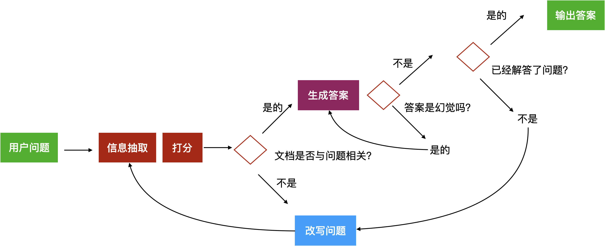

<style>

    .success {
        padding:5px;
        display:inline;
        color:#1B5E20;
        background-color:#C8E6C9;
    }
    .warning {
        padding:5px;
        display:inline;
        color:#000001;
        font-weight:bold;
        background-color:#FFD600;
        width:100%;
    }
    .danger {
        padding:5px;
        display:inline;
        color:#B71C1C;
        background-color:#FFCDD2;
    }
    .info {
        padding:5px;
        display:inline;
        color:#006064;
        background-color:#B2EBF2;
    }
    .doubt {
        padding:5px;
        display:inline;
        color:#AAA;
        background-color:#DDDDDD;
    }
    .asso {
        padding:5px;
        display:inline;
        color:#555;
        background-color:#FFCC00;        
    }
    
    .alert {
        display:inline-block;
        width:100%;
        padding:5px;
        line-height:30px;
        margin-top:10px;
    }
</style>
# 学习方法
### 费曼学习法
**把自己当成知识的传授者去学习，以教检学**
1. 费曼学习法的自定义指令如下，为AI设定一个角色：

2. 费曼学习法的提示词：


3. 上面的学习流程结束后，费曼学习法让AI扮演学生来提问，这里AI会从学生的角度评价讲解的是否通俗易懂（这个角色用来检验我们将学会的知识能否系统的讲解）：

4. 费曼学习法让AI扮演理论教育专家，对上面的讲解进行专业的评判，的是否准确并补充（这个角色负责查缺补漏）：


### 麦肯锡学习法
快速的了解一个行业，**整理关键词、访谈专家、阅读专业书籍**
1. 让AI帮忙整理出100个目标领域的**高频、专业**词汇即关键词

2. 让AI用通俗易懂的方式解释这些专业词汇

3. 让AI扮演专业领域里的专家，让AI给出5个采访的问题

4. 向AI提问，让AI回答这5个问题，体验和大师的对话

5. 追问AI，让AI帮忙找5本入门AI的**新手读本**，不要看偏向底层逻辑的书籍，最好是通识类的畅销书


# Learn-LLM

## 0. 大模型 to B 开发的四个技术方向
1. Prompt 提示词工程
2. AI agent 开发（根据任务来自动完成目标）
3. 对话系统chatbot开发（智能客服系统，问诊系统，法律咨询等）
4. 4.大模型微调（微调行业垂直模型）

5. 模型文档DeepSeek,同义千问
6. RAG框架学习LlamaIndex, RAGFLOW, AnythingLLM
7. 工作流及复杂场景开发框架  LangChain, Dify,
8. 部署工具学习Ollama,VLLM,LMStudio
9. 向量数据库Milvus,Elasticsearch

<b class="info">学习路线</b>[聚客AI学习路线](./01/AI大模型学习路线.pdf)


<b class="info">
对function calling的建议，大模型自主决定什么时候calling function不太靠谱，如果是线上正式的且对稳定性要求较高的服务，建议自己用prompt解析需求，手工调function更靠谱。即根据解析的结果，意图判断的结果手工调function，不要完全依赖大模型调用function calling的机制
</b>

## 点子 
<b class="danger">1. 搭建工作流，通过文生图片，文生视频模型，创作语文教学诗词素材</b>
<b class="danger">2. 搭建工作流，爬取ZF网站文件，下载后由模型解读，生成解读报告。</b>
<b class="danger">3. 搭建工作流，对接好会计后台API接口，实现自动记账</b>

#### <b class="danger">待解决问题</b> 
1. python代码实现，按一定粒度，部分重叠式的切割文本，使上下文更完整
2. python代码实现的rrf融合排序算法
```python
import json

def rrf(ranks, k=1):
    ret = {}
    # 遍历每次的排序结果
    for rank in ranks:
        # 遍历排序中每个元素
        for id, val in rank.items():
            if id not in ret:
                ret[id] = {"score": 0, "text": val["text"]}
            # 计算 RRF 得分
            ret[id]["score"] += 1.0/(k+val["rank"])
    # 按 RRF 得分排序，并返回
    return dict(sorted(ret.items(), key=lambda item: item[1]["score"], reverse=True))
    

# 融合两次检索的排序结果
reranked = rrf([keyword_search_results, vector_search_results])

print(json.dumps(reranked, indent=4, ensure_ascii=False))
```
3. 盘古、混元、文心、通义（基座，基础模型）
基础模型+行业数据+训练+微调=行业垂直模型（付费）
通过行业垂直模型+RAG 来实现场景落地

4. docker的使用，milvus数据库的部署及使用
5. 中文pdf的切分，如何将上下文语义相关的段落合并成一个段落。pdf转markdown库的使用。使用递归切分、文档基于语义的动态窗口切分，参考bilibili的视频教程文档切分。密集向量和稀疏向量搜索方法。
6. 如何部署模型，实现对外提供并发调用
7. 将对话逻辑封装在fastapi中，使用dify发布GUI的WEB界面应用

8. 模型评估标准
   - 准确率、精确率、召回率、F1分数
   - 其他评估标准：AUC、ROC曲线等
9. 性能调优的基本方法
   - 调整模型参数
   - 数据预处理与增强
   - 模型选择与替代方法
10. 大模型的可扩展性与效率
    - 如何优化大规模模型的计算效率
    - 并行计算与分布式训练
11. Ollama结合Docker在本地部署一个大模型，并结合webUI实现对话


## 1. prompt-engineering
<b class="success">把AI当人看</b>
<b class="success">把AI当人看</b>
<b class="success">把AI当人看</b>

<b class="danger">知道哪些问题用提示词工程解决更高效，哪些用传统编程解决更高效</b>

### 1. prompt调优
<b class="success">具体、丰富、少歧义</b>

1. 参考训练数据来构造prompt是最好的， **把AI当人看** 了解偏好，openAI对markdown格式友好，claude对xml格式友好
2. 参考 **OpenAI官网 Prompt Engineering教程**及示例
3. 不断调试验证效果 **门槛低，天花板高**

### 2. prompt结构
- **角色**：给 AI 定义一个**最匹配任务的角色**，比如：「你是一位软件工程师」「你是一位小学老师」。把问题范围收窄，**减少二义性**。使用管理员定义角色<b class="danger">{'role': 'system'}</b>
- **指示**：对任务进行描述
- **上下文**：给出与任务相关的其它背景信息（尤其在多轮交互中）
- **例子**：必要时给出举例，学术中称为 **one-shot learning**, **few-shot learning** 或 **in-context learning**；实践证明其对输出正确性有很大帮助
- **输入**：任务的输入信息；在提示词中明确的标识出输入
- **输出**：输出的格式描述，以便后继模块自动解析模型的输出结果，比如（JSON、XML）


### 3. prompt技巧
1. 精简回答prompt <b class="danger">NO COMMENTS. NO ACKNOWLEDGEMENTS.</b>
2. 思维链prompt <b class="danger">Let’s think step by step</b>
3. 让**模型**应用**准确**，就需要增加**更多的可控环节**，用 <b class="danger">代码逻辑</b>实现可控。
4. **防止模型漏洞攻击**
    a. prompt注入分类器（参考机场安检过程），在prompt中让模型识别出用户提示词中的微信信息，并予以忽略，对危险prompt拦截。
    b. 在输入中防御。**把价值观刷到墙上**
    ```python 
    user_input_template = """
    作为客服代表，你不允许回答任何跟AGI课堂无关的问题。
    用户说：#INPUT#
    ```
    c. 官方API中有识别危险信息的服务,网易也有专业服务**网易易盾**
5. 多轮对话节省prompt（token）的方法有两种：
    a. 只保存最近N轮的对话信息
    b. 通过大模型，对前面的对话内容做摘要，精简前面的内容
6. 在与chatgpt模型的对话中，prompt明确约束只输出JSON格式内容，不输出无关内容，但有时候仍然输出```json开头的JSON格式，解决这个问题方法如下：
    1. prompt中增加明确指令："直接以JSON对象输出结果，**不要添加任何前缀或装饰性文本，比如```json前缀** "
    2. 对返回的内容使用正则表达式过滤无关字符
7. 将文档中的数值组成的**表格**转换成**prompt**的最优方法是。字段1字段值b,字段2字段值b 自定义分隔符

    |   名称   | 流量（G/月） | 价格（元/月） | 适用人群 |
    | :------: | -----------: | ------------: | :------: |
    | 经济套餐 |           10 |            50 |  无限制  |
比如：名称,经济套餐; 流量（G/月）,10; 价格（元/月）,50; 适用人群,无限制

8. 用prompt调优prompt
用以下这段神奇的咒语，让 ChatGPT 帮你写 Prompt。贴入 ChatGPT 对话框即可。这其实就已经触发了传说中的 agent……
```python 


1. I want you to become my Expert Prompt Creator. Your goal is to help me craft the best possible prompt for my needs. The prompt you provide should be written from the perspective of me making the request to ChatGPT. Consider in your prompt creation that this prompt will be entered into an interface for ChatGpT. The process is as follows:1. You will generate the following sections:

Prompt: {provide the best possible prompt according to my request)

Critique: {provide a concise paragraph on how to improve the prompt. Be very critical in your response}

Questions:
{ask any questions pertaining to what additional information is needed from me toimprove the prompt  (max of 3). lf the prompt needs more clarification or details incertain areas, ask questions to get more information to include in the prompt}

2. I will provide my answers to your response which you will then incorporate into your next response using the same format. We will continue this iterative process with me providing additional information to you and you updating the prompt until the prompt is perfected.Remember, the prompt we are creating should be written from the perspective of me making a request to ChatGPT. Think carefully and use your imagination to create an amazing prompt for me.
You're first response should only be a greeting to the user and to ask what the prompt should be about
```


9. 王卓然老师原创的 Prompt Tune 工具
用遗传算法自动调优 prompt，用 LLM 做不改变原意的情况下调整 prompt。用测试集验证效果，找到趋近1的最优prompt
开放源代码：https://gitee.com/taliux/prompt-tune


#### 示例，推荐流量套餐
某运营商的流量包产品：

|   名称   | 流量（G/月） | 价格（元/月） | 适用人群 |
| :------: | -----------: | ------------: | :------: |
| 经济套餐 |           10 |            50 |  无限制  |
| 畅游套餐 |          100 |           180 |  无限制  |
| 无限套餐 |         1000 |           300 |  无限制  |
| 校园套餐 |          200 |           150 |  在校生  |

需求：智能客服根据用户的咨询，推荐最适合的流量包。

##### 核心思路
<b class="success">0. 先试试简单的任务，验证模型是否能完成任务</b>
<b class="success">1. 把输入的自然语言对话，转成结构化的表示</b>
<b class="success">2. 从结构化的表示，生成策略</b>
<b class="success">3. 把策略转成自然语言输出</b>
<b class="success">4. 给例子示范，效果很好</b>

##### 运行过程
用大模型理解自然语言转成内部结构化的表示 **（NLU）**（减少歧义提升准确性）--> 然后通过内部逻辑、数据库得出应对策略 --> 将策略发送给大模型生成自然语言回答

| 对话轮次 | 用户提问              | NLU 语义理解               | DST 状态跟踪                         | Policy 对话策略                 | NLG 自然语言生成                                       |
| -------- | --------------------- | ----------------- | --------------------------- | ---------------------- | ----------------------------------------- |
| 1        | 流量大的套餐有什么    | sort_descend=data | sort_descend=data           | inform(name=无限套餐)  | 我们现有无限套餐，流量不限量，每月 300 元 |
| 2        | 月费 200 以下的有什么 | price<200         | sort_descend=data price<200 | inform(name=劲爽套餐)  | 推荐劲爽套餐，流量 100G，月费 180 元      |
| 3        | 算了，要最便宜的      | sort_ascend=price | sort_ascend=price           | inform(name=经济套餐)  | 最便宜的是经济套餐，每月 50 元，10G 流量  |
| 4        | 有什么优惠吗          | request(discount) | request(discount)           | confirm(status=优惠大) | 您是在找优惠吗                            |

### 4. 提升准确率


#### 自洽性 Self-Consistency
一种对抗「幻觉」的手段。就像我们做数学题，要多次验算一样。同样 prompt **跑多次**，通过**投票**选出最终结果。使用<b class="danger">自洽性需提高temperature的值</b> ,更高的随机性生成更多的结果。
利用以下代码多次调用，确定最终结果
```python 
for _ in range(5):
    prompt = f"{instruction}\n\n{output_format}\n\n请一步一步分析:\n{context}"
    print(f"------第{_+1}次------")
    response = get_completion(prompt)
    print(response)

#输出内容
------第1次------
{"accurate":true}
------第2次------
{"accurate":false}
------第3次------
{"accurate":false}
------第4次------
{"accurate":true}
------第5次------
{"accurate": false}
```
#### 思维树 Tree-of-Thought
让大模型把问题展开，展开后，在里面找每个节点，判断出哪个节点离结果最近。再深挖迭代这个过程。

### 5. OpenAP API 参数
Temperature **执行任务用 0**，文本生成用 0.7-0.9，无特殊需要，**不建议超过 1**
seed 指定固定的seed的值后每次生成结果一致
n=1 控制一次返回多少条结果，<b class="danger">可用于自洽性</b>
presence_penalty=0, frequency_penalty=0, 对token进行降权，避免模型说重复的话 
logit_bias={}  对某个特定的token增降权限   
```python 
def get_chat_completion(session, user_prompt, model="gpt-3.5-turbo"):
    _session = copy.deepcopy(session)
    _session.append({"role": "user", "content": user_prompt})
    response = client.chat.completions.create(
        model=model,
        messages=_session,
        # 以下默认值都是官方默认值
        temperature=1.8,          # 生成结果的多样性 0~2之间，越大越随机，越小越固定
        seed=None,              # 随机数种子。指定具体值后，temperature 为 0 时，每次生成的结果都一样
        stream=False,           # 数据流模式，一个字一个字地接收
        top_p=1,                # 随机采样时，只考虑概率前百分之多少的 token。不建议和 temperature 一起使用
        n=1,                    # 一次返回 n 条结果
        max_tokens=100,         # 每条结果最多几个 token（超过截断）
        presence_penalty=0,     # 对出现过的 token 的概率进行降权
        frequency_penalty=0,    # 对出现过的 token 根据其出现过的频次，对其的概率进行降权
        logit_bias={},          # 对指定 token 的采样概率手工加/降权，不常用
    )
    msg = response.choices[0].message.content
    return msg
```
<b class="danger">使用GPT API接口来生成对话服务时，需要自己维护历史对话信息</b>

### 6. 其他参考资料
#### 吴恩达课程
#### OpenAI 官方prompt示例 

## 2. AI-programming
### AI编程场景
其中在软件开发过程中，已验证能明确提效的场景：
- 市场调研
- 需求分析
- PRD 撰写
- 图形元素绘制
- 技术选型
- 从需求文本生成代码
- <strong>从设计图生成代码</strong>
- 代码审查
- 编写测试用例
- 运维
- <strong>API 文档调用</strong>
- <strong>协议解析</strong>
- 跨语言迁移：两周的时间，2 个同事将一个 40 个 API 接口的 go 工程迁移成一个 java 工程


<b class="alert success">
使用技巧：</br>
0. 写需求文档时，先写某个细化功能的需求（或者用户故事），让AI先协助生成或补全故事，让AI进一步完善细节。</br>
1. 所有 prompt engineering 的技巧都有效，可以把代码、错误信息直接粘贴进去</br>
2. 任何技术相关的问题都可以问，比自己搜索效率高很多 </br>
3. 给AI发送已有的API接口文档，实现对应需求，AI可以自动抓取文档。
</b>


<b class="danger">
比如：
https://docs.binance.us/#WEBSOCKET-STREAMS 根据以上接口文档内容，编写一段消息订阅java程序</b>

参考：ChatALL 大量依赖 GPT-4。过程实录：https://chat.openai.com/share/ecfafa99-aaad-4432-a40c-81c261376758 （对话轮次非常多加载慢，所以几乎总是 404）。如果打不开，别到群里问题，看[这个图](./03-AI-programming/gpt-4-chatall.png)吧

### AI 编程的基本原理
<b class="danger">编程能力是大模型各项能力的天花板</b>

- 「编程」是目前大模型能力最强的垂直领域，甚至超越了对「自然语言」本身的处理能力。因为：

  - 训练数据质量高
  - 结果可衡量
  - 编程语言无二义性

- 知道怎么用好 AI 编程，了解它的能力边界、使用场景，就能类比出在其他领域 AI 怎么落地，能力上限在哪
  - 此观点是我们原创，在分享过数次后，GitHub 官方发了一篇文章：[How to build an enterprise LLM application: Lessons from GitHub Copilot](https://github.blog/2023-09-06-how-to-build-an-enterprise-llm-application-lessons-from-github-copilot/)。当然，这只是巧合。

#### 工作原理

- 模型层：最初使用 OpenAI Codex 模型，它也是 GPT-3.5、GPT-4 的「一部分」。[现在已经完全升级，模型细节未知](https://github.blog/2023-07-28-smarter-more-efficient-coding-github-copilot-goes-beyond-codex-with-improved-ai-model/)。

  - “The first model that OpenAI gave us was a Python-only model,” Ziegler remembers. “Next we were delivered a JavaScript model and a multilingual model, and it turned out that the Javascript model had particular problems that the multilingual model did not. It actually came as a surprise to us that the multilingual model could perform so well. But each time, the models were just getting better and better, which was really exciting for GitHub Copilot’s progress.”

- 应用层： prompt engineering。Prompt 中包含：

  1. 组织上下文：光标前和光标后的代码片段
  1. 获取代码片段：其它相关代码片段。当前文件和其它打开的 tab 里的代码被切成每个 60 行的片段，用 [Jaccard 相似度](https://zh.wikipedia.org/wiki/%E9%9B%85%E5%8D%A1%E5%B0%94%E6%8C%87%E6%95%B0)评分，取高分的
     - 为什么是打开的 tabs
     - 多少个 tabs 是有效的呢？ **默认20个tab**
  1. 修饰相关上下文：被取用的代码片段的路径。用注释的方式插入，例如：`# filepath: foo/bar.py`，或者 `// filepath: foo.bar.js`
  1. 优先级：根据一些代码常识判断补全输入内容的优先级

- 补全格式：在函数定义、类定义、if-else 等之后，会补全整段代码，其它时候只补全当前行


##### 了解更多

- [Inside GitHub: Working with the LLMs behind GitHub Copilot](https://github.blog/2023-05-17-inside-github-working-with-the-llms-behind-github-copilot/)
- [How GitHub Copilot is getting better at understanding your code](https://github.blog/2023-05-17-how-github-copilot-is-getting-better-at-understanding-your-code/)
- [A developer’s guide to prompt engineering and LLMs](https://github.blog/2023-07-17-prompt-engineering-guide-generative-ai-llms/)


##### github copilot 使用技巧
1. 写测试用例时，只需要在声明函数名时，前面加上test_  AI会自动补全测试用例代码
2. 根据注释写代码，写好注释，AI会自动补全代码。这种方法不太建议使用，因为注释里面写的是针对AI的prompt，不太适合人类阅读。如果需要从需求生成代码，可以考虑使用 **Copilot Chat**。
    - chat对话框中输入`/`可以使用特殊指令
    - 在需要插入代码的地方或者选某块代码块，输入`ctrl+i` 呼出Copilot Chat
3. 先写代码，**代码有了再写注释**，更AI理解起来更准确，更省力
4. **改写**当前代码，可**另起一块**新写，AI补全得更准，完成后**再删旧代码**
3. ` Alt + ] `查看下一个建议，` Alt + [` 查看上一个建议，` Cmd/Ctrl + → ` 只接受一个 token即部分建议
4. 如果有旧代码希望被参考，就把代码文件在新tab 页里打开

#### AI编程的效能
<b class="alert success">
AI 能力定律：
AI 能力的上限，是使用者的判断力
</b>

$\text{AI 能力} = \min(\text{AI 能力}, \text{使用者判断力})$

<b class="alert success">
AI 提效定律：AI 提升的效率，与使用者的判断力成正比，与生产力成反比
</b>

$\text{效率提升幅度} = \frac{\text{使用者判断力}}{\text{使用者生产力}}$

<b class="alert success">
编码人员的判断力 = 需求的理解准确度 * 代码的阅读量
</b>

$\text{效率提升幅度} = \frac{\text{需求的理解准确度} · \text{代码的阅读量}}{\text{自己手写代码的速度}}$


- 使用者的判断力，是最重要的
- 提升判断力，比提升实操能力更重要，眼高手低的福音
- 广阔的视野是判断力的养料

#### AI编程技巧
- 先以**架构师**的身份，让AI辅助，对架构进行选型： 通过需求文档和业务文档，让 AI 给出架构的建议。**先将整体需求细化成一个个具体的需求，足够细化，细化到要么是一个接口，要么是一个函数**。
- 然后以开发者的身份，让 AI 辅助你写业务代码 （逐层拆分向下写)


## 3. Function Calling 结构化输出
<b class="alert success">
让大模型链接外部系统，是通过自然语言来实现的，不需要给大模型编写特定的代码让其与外部系统API对接，只需要将外部系统API的能力用自然语言进行描述，大模型就能判断出什么时候调用API。
</b>

在大型语言模型（LLM）中，function calling 中的函数是由大模型间接调用执行的，实际的执行通常由后端服务或中间件来完成。具体来说，这个过程可以分为以下几个步骤：
1. 模型生成调用指令：当用户与模型交互时，模型根据输入和上下文生成一个调用特定函数的指令。这个指令通常包含函数名和所需的参数。
比如模型生成以下文本或结构化数据，提示系统调用某个函数
```json
{
    "function": "get_weather",
    "parameters": {
      "location": "Beijing",
      "date": "2023-10-01"
    }
}
```
2. 传递给后端服务：生成的调用指令被传递给后端服务或中间件。后端服务负责实际执行这些函数。
实际负责调用和执行定义函数的部分，通常涉及中间软件、API调用框架或特定应用实现。
    工作原理：
    - 解析指令：模型通过与用户的对话，识别出当与用户的对话中，是否要调用预先定义的函数。如果需要则生成调用函数的指令，包含函数名称和参数。
    - 调用合适的函数：在开发chat的业务逻辑中，获取模型返回的内容即上面解析指令后返回的内容，如果模型返回的内容包含函数调用指令，则在response中通过获取到函数名和参数来执行具体的函数。
    - 返回结果：执行后，将函数的输出结果传递回模型。
3. 执行函数：后端服务调用相应的函数，执行具体的操作（如查询数据库、调用API、执行计算等）。
4. 返回结果：函数执行的结果被返回给模型。执行结果可以作为模型输出的一部分，向用户显示或被进一步使用。
5. 模型生成响应：模型将函数的执行结果纳入生成的文本中，最终返回给用户。

这种架构既保障了模型的功能扩展性和安全性，又使得它可以与现实世界的数据和服务相结合，提供更加全面和有用的功能。


### <b class="danger">大模型的应用领域：能替代人，而且出错概率比人小的场景。</b> 


## 4.RAG 检索增强生成 Retrieval Augumented Generation


### 模型的硬件需求
模型大小6-8B足矣支撑企业特定业务场景的AI应用（智能客服，助手）。70B以上大小的模型适用通用领域应用。

#### LLM的局限性
1. LLM的知识不是实时的
2. LLM不具备私有场景/专业领域的知识

#### 检索增强生成
通过**检索**的方法来**增强**生成**模型的能力**
<b class="success">RAG的流程类似开卷考试。让 LLM 先翻书，再回答问题。</b>


#### RAG的优势
私有数据，数据实时性，问答来源的可解释性，降低幻觉。

#### 一、RAG系统的基本搭建流程
1. **load 文档加载**（pdf,docx,html,video,voice,excel）
2. **split 文档切分** 
   a. 拆分后的词组或句子太长不利于模型理解和答案抽取，如果太短无法保证原文内容语义的连贯性。 实际使用中使用 **langchain** 开发框架定义 **chunk overlap** 来控制切分文档时重叠区域的大小。
   b. 问题的答案可能跨越两个片段
3. **embed 向量化** 
   将切分后的文档片段使用embedding模型进行向量化，常用的embedding模型有 text-embedding-3-large, text-embedding-3-small
4. **store 向量化存储** 将向量数据存储到向量数据库中

**Query -> 检索 -> Prompt -> LLM -> 回复**
<b class="alert success">RAG过程：1. 向量数据库中存放的有文档片段原文和文档片段的向量数据（向量会作为索引进行匹配）。
2. 用户的问题首先会经过向量化处理（转换成一段向量数据），然后用这个问题的向量数据作为索引，去向量数据库中找，与之最匹配（向量空间的余弦夹角最小值或欧氏距离最小值）的文档片段的向量数据索引。
3. 找到之后将其对应的片段原文+提问原文拼接成prompt发送给LLM，让LLM生成答案。
</b>


#### 二、基于OpenAI在assistants API中集成的RAG能力，可以作为参考
 1. 面向检索的用户query的改写，将用户的query进行改写，保留核心主干问题，避免过于简单或复杂影响效果
 2. 复杂的query拆解成多个，并行执行query检索
 3. 使用关键字检索和向量检索相结合，混合检索
 4. 检索后排序
 5. 配置参考
    - chunk size大小: 800 tokens 文档片段大小
    - chunk overlap大小： 400 tokens 文档之间重叠区域大小
    - embedding mode：text-embedding-3-large at 256 dimensisions 使用large embedding模型，向量纬度256
    - maximum number of chunks added to context: 20  即每次最多返回20个chunk做后排序
    - **用好向量数据库的meta data元数据**，可对检索内容基于key,value信息做过滤


#### 三、RAG中chunking 分块策略
 - 固定大小分块：将文本按固定大小分块，简单高效，但会破坏原文档的语义性
 - 递归分块：使用递归方式按标点符号分块（**逗号，句号，换行**等），直到每个分块的大小都符合设置值。首先设定块的大小，整个过程先按句号分，比如定义一个块的大小为20个字符，当对文档**先用句号**切分的时候如果某个块超过20个字符，则**递归**，**进一步使用逗号分隔**，将超过的部分切到下一个块中。当切分不足20个字符时，也会将下一句的部分内容切入到片段，直到这个块**接近**20个字符。
 - 基于文档结构的分块：基于文档的逻辑结构进行分块，比如md文档有明确的段落或小结，这种方式适用有逻辑结构的文档。
 - 基于语义的分块：将文档依据标点符号（。？！）切分成诺干句子（句子之间有重叠。除开第一个句子和后一个句子重叠、最后一个句子和前一个句子重叠之外，中间的句子取重叠时都会覆盖前一个句子和后一个句子）。然后将相似度接近的句子合并在一起组成一个chunk.

#### 如何确定文本切割策略
**如何确定chunk_size大小。**
- 首先要考虑**embedding model**模型的**max token**参数大小。每个chunk_size的大小不能超过embedding模型的**max token**参数大小<b class="danger">（是原始文本embedding之后的token的长度）</b>。
- LLM model的 **max sequence length**参数，**这个参数不要根据单一的chunk_size的大小来确定。** 而应该根据**召回retrieval数量构成的总文本长度来确定**。比如召回top5数量的内容，这5个文本内容拼接起来，还要加上其他的prompt，其总长度不能超过大模型的max sequence length参数大小。

**常见的文本切分策略**
- **CharacterTextSplitter**：基于字符切分文本，通过限制字符的数量来确定chunk_size大小。适合小文本，比如markdown格式的文本。
- **RecursiveCharacterTextSplitter**：基于**字符列表**拆分文本，**递归切割**，递归切割的阈值是chunk_size的大小，当文本长度大于chunk_size的大小时，将文本进行递归切割，直到文本长度小于等于chunk_size的大小。适合长文本，比如PDF格式的文本。
- **Document Specific Splitter**：符合英文的语义方式，对英文文档支持好，中文较差。针对不同的文件类型使用不同的切分，比如markdown格式的文本，或者pdf格式的文本，或者html格式的文本等。

- **Semantic Splitter**： 滑动窗口切分，效果最好，基于文本的语义切分，比如根据文本的句法结构进行切分，然后将相似度接近的句子合并在一起组成一个chunk。

https://www.bilibili.com/video/BV1dr421x7Su/?spm_id_from=333.788.recommend_more_video.3&vd_source=32fa1c202efe5bb6942b35f0c043a7e9
13分10秒

https://www.bilibili.com/video/BV1meqLYxEfN/?spm_id_from=333.999.0.0&vd_source=32fa1c202efe5bb6942b35f0c043a7e9


<b class="danger">待解决问题：将文档切分出来的片段，经过embedding处理后，token的长度区间分布，用plot直方图可视化展示出来。了解文档切分成诺干份后，经过embedding处理，token的长度分布区间，基于分布图来考虑是否要调整chunk_size大小</b>
https://www.bilibili.com/video/BV1dr421x7Su/?spm_id_from=333.788.recommend_more_video.3&vd_source=32fa1c202efe5bb6942b35f0c043a7e9
10分35秒


#### 四、如何选择embedded模型
huggingface embedded模型排名
https://huggingface.co/spaces/mteb/leaderboard
第一选择**bce-embedding-base_v1**，支持中英双语
第二选择**BAAI/bge-large-zh-v1.5** 中文模型
```python
from llama_index.embeddings.huggingface import HuggingFaceEmbedding
from llama_index.core import Settings

Settings.embed_model = HuggingFaceEmbedding(
    model_name="BAAI/bge-large-zh-v1.5"
)
```

第三选择**m3e-base**模型，中文模型
```python
from sentence_transformers import SentenceTransformer
model = SentenceTransformer("moka-ai/m3e-base")
embeddings = model.encode(sentences)
```


### embedding模型如何选择
选择embedding模型时的四个参考要点
参考huggingface的模型库，选择适合自己的模型。
huggingface的模型库：https://huggingface.co/spaces/mteb/leaderboard
基于以下四点选择
1.Sequence length 参数，根据文档分块后的chunk size的大小来确定。长度指标，比如chunksize分完后，chunk的标准答案已经很长了，比如超过了512了，那选择模型的时候要选择一个Sequence length 长度指标能处理这种长文本的模型。这取决于对应answer的长度
2.embedding dimensions 参数，根据文本词汇的语义复杂程度来确定。嵌入维度指标，比如512，768，1024等。并不是越大越好，取决于业务场景中语义是否丰富，如果文本词汇的语义非常丰富保罗万象该指标越大越好，如果业务场景的语义比较精比较专业，比如针对专精业务领域的词汇、句子、文本，选择指标小的更好。
3.model size 指标，取决个人设备的显存存储情况。
4.用具体的简单的demo测试不同的模型，将query的embedding和文本的embedding进行可视化展示，识别模型效果。

<b class="alert info">
业界常用的做法：向量数据库和传统关系型数据库同时使用，比如简历信息中姓名，年龄，性别这些适用结构化检索的数据用关系型数据库存储，工作经历等描述型文本（不适合SQL查询检索的非结构化数据）使用向量数据库。当需要根据工作经历筛选最符合岗位的人员时查向量数据库，当需要具体年龄的人员时查结构化数据库。推荐适用milvus、weaviate向量数据库</b>

embedding模型的选择：https://www.bilibili.com/video/BV1GPS4YfEtu/?spm_id_from=333.999.0.0


##### 句子sentence 的embedded 如何处理
1. 首先分词处理，将句子切分成词汇，然后将每个词对应一个word embedding
2. 池化pooling，可使用均值pooling_mode_mean_tokens，pooling_mode_max_tokens，bert的pooling_mode_cls_token，pooling_mode_mean_sqrt_len_tokens

<b class="info">embedded模型一般是基于Sentence 使用BERT模型NSP来进行训练。
</b>


#### 五、如何选择PDF文档解析器
RAG的数据取决于两方面，一是数据的来源，二是对数据的解析。
- **marker** pdf转换器MARKER，转成markdown格式。或者选择docling。
- **llamaParse** llamaindex的基于AI能力的解析工具IDP。这类库可将复杂的文档解析为markdown格式，但可扩展性差，高延迟。
- **Tesseract** OCR这类库较成熟，能捕获文档结构和布局，但高延迟。


- 安装marker
    - pip install marker-pdf
    - pytorch 页面选择合适的版本安装pytorch 


### 过召回重排序 sentence-transformers
rerank是，将多个由向量索引检索到的原文结果和问题原文进行相关性排序，找出关联性最大的一项。
检索结果重排序：通过排序模型对query和document重新打分排序，解决多个满足query的答案没有被排在最前面。
```python
from sentence_transformers import CrossEncoder

# model = CrossEncoder('cross-encoder/ms-marco-MiniLM-L-6-v2', max_length=512) # 英文，模型较小
model = CrossEncoder('BAAI/bge-reranker-large', max_length=512) # 多语言，国产，模型较大

user_query = "how safe is llama 2"
# user_query = "llama 2安全性如何"
scores = model.predict([(user_query, doc)
                       for doc in search_results['documents'][0]])
# 按得分排序
sorted_list = sorted(
    zip(scores, search_results['documents'][0]), key=lambda x: x[0], reverse=True)
for score, doc in sorted_list:
    print(f"{score}\t{doc}\n")
```
model.predict() 方法用于预测给定输入与文档的相关性得分。具体来说，它接受一个列表，其中每个元素是一个元组，包含用户查询和一个文档。模型会根据这些输入计算出每个文档与用户查询的相关性得分。scores 列表中的每个元素对应一个文档的相关性得分。

这段代码的作用是从 sentence-transformers 库中导入 CrossEncoder 类。sentence-transformers 是一个用于自然语言处理（NLP）任务的库，特别是用于句子嵌入和语义相似度计算。CrossEncoder 是该库中的一个类，用于实现交叉编码器（Cross-Encoder）模型。
##### 什么是交叉编码器（Cross-Encoder）？
交叉编码器是一种深度学习模型，通常用于解决涉及两个文本序列的任务，如语义相似度计算、文本匹配等。它的工作原理如下：
1. 输入：交叉编码器接受两个文本序列作为输入，例如查询（query）和文档（document）。
2. 编码：这两个文本序列被连接在一起，形成一个新的输入序列。这个序列被送入一个预训练的Transformer模型（如BERT、RoBERTa等）进行编码。
3. 输出：Transformer模型的输出经过一个分类层（通常是全连接层），生成一个表示两个文本序列之间关系的分数或标签。
##### 主要用途
1. 语义相似度计算：判断两个句子或短文本的语义相似度。
2. 文本匹配：判断两个文本是否匹配或相关。
3. 问答系统：判断给定的问题和答案是否匹配。
4. 信息检索：在候选文档中找到与查询最相关的文档。
##### 示例
以下是一个简单的示例，展示了如何使用 CrossEncoder 来计算两个句子的相似度：
```python
from sentence_transformers import CrossEncoder

# 初始化交叉编码器模型
model = CrossEncoder('sentence-transformers/cross-encoder-ms-marco-MiniLM-L-6-v2')

# 定义两个句子
sentences = [
    ["这是一个例子句子", "这是另一个例子句子"],
    ["天气很好", "今天阳光明媚"]
]

# 计算相似度
scores = model.predict(sentences)

# 打印结果
for score in scores:
    print(f"相似度得分: {score:.4f}")
```

在这个示例中，CrossEncoder 模型会计算每对句子的相似度得分，并返回一个分数列表。
##### 优点
•高精度：由于使用了预训练的Transformer模型，交叉编码器通常具有很高的精度。
•灵活性：可以用于多种文本匹配和相似度计算任务。
##### 缺点
•计算成本：相对于简单的向量检索方法（如余弦距离），交叉编码器的计算成本较高，特别是在处理大规模数据时。


### 混合检索
在实际生产中，传统的关键字检索（稀疏表示）与向量检索（稠密表示）各有优劣。RAG实践中，文档切分后做两套策略，关键字检索、向量化检索结合实现混合检索。


### <b class="danger">使用BERT模型NSP来进行训练微调</b>
#### 如何分割文档保证内容语义完整性？
1. 利用自然语言特征
按段落分割：文本通常按段落分割，每个段落围绕一个中心思想，这通常能保持语义的完整性。如果文本格式整齐（如 PDF 或 HTML），段落分割是一个很好的起点。
使用句子边界检测：应用自然语言处理工具来检测句子边界，保证每个片段至少包含若干完整的句子。
2. 智能分割算法
文本建模：使用主题建模或语义分析工具，通过提取文本的主题结构来指导分割。这可以帮助识别出语义上相近的文本块，避免不相关的混杂。
重叠窗口技术：为保证上下文的连续性，可以使用重叠窗口进行切片。即在每个片段的开头或结尾重复一些内容，使片段之间内容稍有重叠以保证信息的连续性。
3. 基于语义的分割
聚类分析：通过词嵌入和聚类算法，可以将相似句子或段落聚集到一起。这允许分割基于语义特性而非仅仅形式特征，适用于更复杂和主题分明的文档。
关键点检测：使用深度学习模型（如 BERT）来了解句子间的关系和重要性，自动检测主题转折点，决定分割边界。
4. 基于结构化信息
利用文档结构：如果文档是结构化的（如 JSON、XML 等），那么可以利用结构层级（如章节、条目）来引导分割。
基于标记：许多文档格式包含标记语言（如 Markdown 中的头标签），这可以作为自然的分割点使用。
5. 经验法则和人工干预
专家知识：对领域中特殊格式的采用人工标注或领域专家提供自动分割指导。
迭代和反馈：尝试使用一些智能方法进行初步分割，然后通过用户反馈来不断优化分割策略。
6. 工具和库
NLTK 和 SpaCy：这些库提供了大量自然语言处理的工具包，可以帮助进行句子分割和词法分析。
Transformers 模型：如 BERT，可用于生成句子或文档嵌入，帮助识别语境和语义信息。
通过结合使用这些方法和技巧，您可以在 RAG 应用中更好地保障文档内容的语义完整性和连贯性，从而提高系统的精确性和可靠性。确保语义上整合良好的文档切片有利于在实际应用中提供更精细和有价值的信息检索结果。

#### 使用BERT模型NSP来进行训练，如何提高RAG分割文档的准确性和完整性。
在 RAG 系统中，使用 BERT 模型的 Next Sentence Prediction（NSP）任务可以帮助提高文档分割的准确性和语义完整性。NSP 任务训练一个模型来判断两个句子是否应该在一起出现，即它们是否在原文本中连续。这种能力可以被用来识别文档的自然分割点，确保切分后保留语义的连贯性。以下是一些具体方法：
1. 微调 BERT NSP 模型
数据准备：
从目标语料中获取真实文档，并制作正样本（紧邻句子对）和负样本（随机句子对），用于微调 BERT 的 NSP 部分。
可以增加一些跨段落但连续的句子对，帮助模型学会识别自然段落。
训练策略：
在您的领域数据上重新微调 BERT 的 NSP 部分，数据中的句子对结构越接近目标应用，效果越好。
使用大量领域样本，保证模型能够学到不同语境中自然句子连续性的特征。
2. 利用 NSP 预测分割点
预测应用：
将文档内容分段后，对每个相邻句子对应用 NSP 模型，通过高可信度的连续标签判断适合分割的点。
将分割可能性转化为阈值，确保每个片段在预测的基础上保持语义一致。
动态窗口法：
在较长文本切割成均匀段落，并对这些切片进行 NSP 分类，通过逐步调整扇区大小，预测合成自然段。
3. 基于 NSP 的语义完整性提升
结合其他语义工具：
可以结合上下文语义分析工具，从词汇和主题层面再验证 NSP 初始分割的准确性。
使用聚类或主题检测确认模型分割后的片段是否具有实际语义意义。
评价与选优：
设计多种分割策略，通过模型评估确定 NSP 为基础模型策略的合适性，持续引入新数据和反馈优化切分。
4. 工具和技术结合
集成 BERT 与 Info Extraction：
要注意 BERT 的能力在于识别上下文关联。你可以在分割后的每个段落进行信息提取来再次验证分割的合理性。
增量模型微调：
通过将新的数据输入到训练和调整的过程中，逐步增强模型的领域识别能力。
通过利用 BERT 的 NSP 能力，在 RAG 系统中对文档分割进行优化，你可以更好地保持文本切分后的语义完整性，降低文档内容丢失或语义断裂的风险。这将有助于新生成内容的质量和精准度，让信息检索和生成任务能更好地贴合用户需求。


### 通过bert模型微调，实现识别段落之间的关联性，提高RAG场景下切分文档的准确性，保证语义性

如果要对bert基础模型进行微调，实现能识别中文段落之间是否有强关联，应该怎么做？用什么数据集来微调？
要对基础的BERT模型进行微调，以实现能够识别中文**段落**之间是否存在强关联，您可以按照以下步骤进行操作。此外，我将推荐适合该任务的中文数据集或数据构建方法。


## 1. **任务定义**
将任务定义为一个二分类问题，即判断两个段落之间是否存在强关联。
明确任务目标是关键。针对识别**段落**之间的强关联性，您可以将其视为一种**段落对关系分类**任务。具体来说，任务可以定义为判断两个段落之间的关系类型，例如：

- **强关联（Strongly Related）**
- **中等关联（Moderately Related）**
- **无关联（Unrelated）**

## 2. **模型选择与微调**

### **选择基础模型**

对于中文段落关系识别，建议选择已经预训练好的中文BERT模型，例如：

- **[Chinese-BERT-wwm](https://huggingface.co/hfl/chinese-bert-wwm)**：采用全词掩码技术，适合中文语义理解。
- **[RoBERTa-zh](https://huggingface.co/hfl/roberta-zh)**：基于RoBERTa架构，性能优秀。

### **微调步骤**

以下以`transformers`库为例，展示如何微调BERT模型以进行段落关系识别：

```python
from transformers import BertTokenizer, BertForSequenceClassification, Trainer, TrainingArguments
from datasets import load_dataset, load_metric

# 加载预训练的中文BERT模型和分词器
tokenizer = BertTokenizer.from_pretrained('hfl/chinese-bert-wwm')
model = BertForSequenceClassification.from_pretrained('hfl/chinese-bert-wwm', num_labels=3)  # 三种关系

# 加载数据集（以自定义数据集为例）
dataset = load_dataset('your_custom_paragraph_dataset')

# 定义分词函数
def tokenize_function(examples):
    return tokenizer(examples['paragraph1'], examples['paragraph2'], padding='max_length', truncation=True)

# 预处理数据
tokenized_datasets = dataset.map(tokenize_function, batched=True)

# 加载评价指标
metric = load_metric('accuracy')

def compute_metrics(p):
    predictions, labels = p
    preds = predictions.argmax(-1)
    return metric.compute(predictions=preds, references=labels)

# 设置训练参数
training_args = TrainingArguments(
    output_dir='./results',
    evaluation_strategy="epoch",
    learning_rate=2e-5,
    per_device_train_batch_size=8,
    per_device_eval_batch_size=8,
    num_train_epochs=5,
    weight_decay=0.01,
)

# 初始化Trainer
trainer = Trainer(
    model=model,
    args=training_args,
    train_dataset=tokenized_datasets['train'],
    eval_dataset=tokenized_datasets['validation'],
    compute_metrics=compute_metrics,
)

# 开始训练
trainer.train()
```

**注意事项**：

- 确保安装必要的库：

  ```bash
  pip install transformers datasets
  ```

- 根据具体任务调整`num_labels`。例如，这里假设有三种关系类型。
- 调整`per_device_train_batch_size`和`num_train_epochs`以适应您的计算资源和数据规模。

## 3. **推荐数据集**

针对**段落关系识别**，目前公开的中文数据集较少，建议考虑以下几种方法：

### **1. 使用现有的NLI数据集**

虽然大多数自然语言推断（NLI）数据集以句子对为单位，但您可以将其扩展为段落对。例如：

- **[OCNLI（Open Chinese Natural Language Inference）](https://github.com/OYE93/OCNLI)**：
  - **描述**：中文自然语言推断数据集，包含大量句子对，适用于判断句子之间的推理关系。
  - **资源**：
    - [OCNLI Hugging Face 页面](https://huggingface.co/datasets/OCNLI)
    - 可通过`datasets`库加载：
      ```python
      from datasets import load_dataset
      dataset = load_dataset('OCNLI')
      ```

**扩展方法**：

将多个句子对组合成段落对，以模拟段落间的关系。例如，将两个相关的句子对组成一个段落。

### **2. 构建自定义数据集**

如果现有数据集无法满足需求，建议构建自定义数据集。步骤包括：

#### **a. 数据收集**

收集包含多个段落的中文文档，如新闻文章、学术论文或报告。

#### **b. 数据标注**

设计标注指南，定义段落之间的关系类型。例如：

- **强关联**：段落内容高度相关，相互支持或补充。
- **中等关联**：段落内容有一定关联，但不紧密。
- **无关联**：段落内容无明显关联。

使用众包平台或内部团队进行数据标注，确保标注质量。

#### **c. 数据预处理**

将标注的段落对格式化为模型可接受的输入格式。例如：

```json
{
  "paragraph1": "段落1的文本内容。",
  "paragraph2": "段落2的文本内容。",
  "label": 0  # 0: 强关联, 1: 中等关联, 2: 无关联
}
```

### **3. 使用其他相关任务的数据集**

一些文档结构分析或文本相似度评估的数据集也可以进行改造以适应段落关系识别任务。例如：

- **[LCQMC（Large-scale Chinese Question Matching Corpus）](https://github.com/CLUEbenchmark/CLUE)**：
  - **描述**：大规模中文问题匹配数据集，适用于句子相似度评估。
  - **资源**：
    - [LCQMC GitHub](https://github.com/CLUEbenchmark/CLUE/tree/main/CLUEdatasets/LCQMC)
    - 可通过`datasets`库加载：
      ```python
      from datasets import load_dataset
      dataset = load_dataset('lcqmc')
      ```

**扩展方法**：

将句子对扩展为段落对，或者将多个句子对组合成段落对。

## 4. **数据预处理**

无论选择哪种数据集，数据预处理都是关键步骤，包括：

- **文本清洗**：去除噪音字符、特殊符号等。
- **分段处理**：确保每个输入样本包含两个完整的段落。
- **分词与编码**：使用BERT的分词器对段落进行分词和编码。
- **标签编码**：将文本标签转换为数值标签，如`强关联`→0，`中等关联`→1，`无关联`→2。

示例分词函数已在上述代码中提供。

## 5. **评价指标**

在微调和评估过程中，建议使用以下评价指标：

- **准确率（Accuracy）**：适用于均衡数据集。
- **F1分数**：特别是宏平均F1，适用于类别不平衡的场景。
- **精确率与召回率（Precision & Recall）**：深入了解模型在各类别上的表现。

可以根据具体需求调整评价指标。

## 6. **模型评估与优化**

- **交叉验证**：使用k折交叉验证评估模型的泛化能力。
- **超参数调整**：调整学习率、批量大小、训练轮次等参数以优化性能。
- **模型集成**：结合多个模型的预测结果，提升整体性能。
- **错误分析**：分析模型错误预测的案例，改进数据集或模型结构。

## 7. **示例代码详解**

以下是对上述示例代码的详细说明：

```python
from transformers import BertTokenizer, BertForSequenceClassification, Trainer, TrainingArguments
from datasets import load_dataset, load_metric

# 1. 加载模型和分词器
tokenizer = BertTokenizer.from_pretrained('hfl/chinese-bert-wwm')
model = BertForSequenceClassification.from_pretrained('hfl/chinese-bert-wwm', num_labels=3)

# 2. 加载数据集
dataset = load_dataset('your_custom_paragraph_dataset')  # 替换为您的数据集

# 3. 分词和编码
def tokenize_function(examples):
    return tokenizer(examples['paragraph1'], examples['paragraph2'], padding='max_length', truncation=True)

tokenized_datasets = dataset.map(tokenize_function, batched=True)

# 4. 加载评价指标
metric = load_metric('accuracy')

def compute_metrics(p):
    predictions, labels = p
    preds = predictions.argmax(-1)
    return metric.compute(predictions=preds, references=labels)

# 5. 设置训练参数
training_args = TrainingArguments(
    output_dir='./results',
    evaluation_strategy="epoch",
    learning_rate=2e-5,
    per_device_train_batch_size=8,
    per_device_eval_batch_size=8,
    num_train_epochs=5,
    weight_decay=0.01,
)

# 6. 初始化Trainer
trainer = Trainer(
    model=model,
    args=training_args,
    train_dataset=tokenized_datasets['train'],
    eval_dataset=tokenized_datasets['validation'],
    compute_metrics=compute_metrics,
)

# 7. 开始训练
trainer.train()
```

**关键步骤解释**：

1. **加载模型和分词器**：选择适合中文的预训练BERT模型，并加载相应的分词器。
2. **加载数据集**：使用`datasets`库加载自定义的段落关系数据集。
3. **分词和编码**：将段落对转换为模型可接受的输入格式，确保长度一致。
4. **加载评价指标**：定义如何评估模型性能，这里使用准确率。
5. **设置训练参数**：配置输出目录、学习率、批量大小、训练轮次等参数。
6. **初始化Trainer**：将模型、训练参数、数据集和评价指标结合起来。
7. **开始训练**：执行模型训练过程。

## 8. **结论**

通过选择合适的中文预训练BERT模型，并使用适当的中文段落关系数据集进行微调，您可以训练出能够有效识别段落之间强关联性的模型。确保在微调过程中合理预处理数据，选择合适的评价指标，并根据模型表现不断优化训练参数，以达到最佳效果。

如果现有的数据集无法完全满足需求，建议构建自定义数据集，以更贴近具体应用场景。同时，结合领域知识和实际需求，调整模型架构和训练策略，以提升模型在特定任务上的表现。


## 文档中的表格处理
1.将每页PDF转成图片
2.在图片中采用OCR识别表格
3.将表格内容向量化


## 混合搜索策略 Hybrid Search 中的密集向量和稀疏向量搜索方法
Hybrid Search 是一种结合了密集向量搜索（Dense Vector Search）和稀疏向量搜索（Sparse Vector Search）的技术，旨在充分利用两种搜索方法的优点，提高搜索的准确性和效率。

1. 密集向量搜索（Dense Vector Search）
密集向量是指每个向量的维度较高，且每个维度上的值通常是非零的。密集向量通常通过深度学习模型（如 BERT、ResNet 等）生成，这些模型可以将文本、图像等数据转换为固定长度的向量表示。

    特点：
    语义理解：密集向量能够捕捉数据的语义信息，使得相似的向量在向量空间中距离较近。
    高效搜索：使用向量相似度度量（如余弦相似度、欧氏距离等）进行搜索，通常非常高效。
    适用场景：适用于需要理解数据语义的场景，如推荐系统、图像搜索、自然语言处理等。
    示例：
    文本：使用 BERT 将句子“我喜欢猫”转换为一个 768 维的向量。
    图像：使用 ResNet 将一张图片转换为一个 2048 维的向量。

2. 稀疏向量搜索（Sparse Vector Search）
稀疏向量是指每个向量的维度较高，但大部分维度上的值为零。稀疏向量通常通过传统的方法（如 TF-IDF、BM25 等）生成，这些方法将文本数据转换为词频向量。

    特点：
    精确匹配：稀疏向量能够捕捉关键词的出现频率，适合进行精确的关键词匹配。
    高效索引：稀疏向量通常使用倒排索引等技术进行高效索引和搜索。
    适用场景：适用于需要精确匹配关键词的场景，如全文搜索、日志分析等。
    示例：
    文本：使用 TF-IDF 将句子“我喜欢猫”转换为一个稀疏向量，其中“我”、“喜欢”、“猫”对应的维度值非零，其他维度值为零。
    密集检索和稀疏检索是否就是关键字检索？
    密集检索：

    不是关键字检索：密集检索主要依赖于向量的语义相似度，而不是具体的关键词匹配。它通过深度学习模型生成的向量来表示数据，搜索时比较向量之间的相似度。
    优点：能够捕捉数据的语义信息，适用于需要理解数据含义的场景。
    稀疏检索：

    接近关键字检索：稀疏检索通过关键词的频率和位置信息进行搜索，与传统的关键字检索非常相似。它使用词频向量（如 TF-IDF）来表示数据，搜索时匹配关键词的出现频率。
    优点：能够进行精确的关键词匹配，适用于需要精确查找特定词汇的场景。
    Hybrid Search 的优势
    Hybrid Search 结合了密集向量搜索和稀疏向量搜索的优点，能够在同一系统中同时进行语义相似度搜索和关键词匹配搜索，从而提高搜索的准确性和召回率。

    提高准确性：通过密集向量搜索捕捉数据的语义信息，通过稀疏向量搜索进行精确的关键词匹配。
    提高效率：结合两种搜索方法的优势，可以在不同的搜索阶段使用不同的技术，提高整体搜索效率。

    总结
    密集向量搜索：基于向量的语义相似度，适用于需要理解数据语义的场景。
    稀疏向量搜索：基于关键词的频率和位置信息，接近传统的关键字检索，适用于需要精确匹配关键词的场景。
    Hybrid Search：结合了密集向量搜索和稀疏向量搜索的优点，能够在同一系统中同时进行语义相似度搜索和关键词匹配搜索。


## 倒排索引和全文检索的关系
倒排索引（Inverted Index）和全文检索（Full-Text Search）是密切相关的技术，**倒排索引是实现高效全文检索的核心数据结构。** 倒排索引是实现全文检索的关键技术之一，它通过高效的数据结构优化了查询性能。全文检索系统则依赖倒排索引来快速、准确地查找用户所需的文档。两者相辅相成，共同构成了现代搜索引擎的基础。
- 倒排索引。倒排索引是一种用于快速查找文档中包含特定词项的数据结构。它通过建立从词项到文档的映射来加速查询过程。具体来说：
    - 构建方式：在倒排索引中，每个词项（通常是单词或短语）对应一个列表，这个列表包含了所有包含该词项的文档ID及其出现的位置。
    - 优点：能够快速定位包含特定词项的文档，大大提高了搜索效率
    - 示例：文档集合：["我喜欢猫", "狗和猫都是好宠物"]，倒排索引：
        - 猫 -> [1, 2]
        - 我 -> [1]
        - 喜欢 -> [1]
        - 狗 -> [2]
        - 和 -> [2]
        - 都是 -> [2]
        - 好 -> [2]
        - 宠物 -> [2]
- 全文检索。全文检索是指在一个大的文本集合中查找与用户查询相关的文档的技术。它的目标是从大量文本数据中快速、准确地找到匹配的文档。全文检索系统通常使用倒排索引来实现高效的查询处理。     
- 倒排索引和全文检索的关系。倒排索引是全文检索的核心技术：倒排索引使得全文检索系统能够在海量文本数据中快速定位包含特定词项的文档，从而极大地提高了搜索速度和效率。全文检索依赖倒排索引来实现：通过构建倒排索引，全文检索系统可以高效地处理复杂的查询，如布尔查询（AND/OR/NOT）、短语查询、模糊查询等。
- 工作流程。
    1. 预处理：对文档进行分词、去除停用词、词干化等操作，生成词项。
    2. 索引构建：为每个词项构建倒排索引，记录其出现在哪些文档中。
    3. 查询处理：当用户输入查询时，系统解析查询并利用倒排索引快速定位相关文档。
    4. 结果排序：根据相关性算法（如TF-IDF、BM25等）对结果进行排序，返回最相关的文档。


---
## 5.Assitants API

Assistants API具备的能力：
- 创建和管理Assistants 每个Assistants都有独立的配置
- 支持代码沙箱，可向code interpreter 发送文件
- 支持function calling 
- 通过集成自有的向量数据库支持RAG
- 支持无限多轮对话，保存在openai服务器上


OpenAI 为了降低开发门槛所提供的一套开发工具。**类似字节跳动的coze开发工具、dify框架（支持本地部署）**，适合快速搭建一个基于语言模型的原型demo，**验证功能、汇报**，如果要做生产级的应用此类开发工具还是有所欠缺，**无法精细化操控**。想要极致调优，还得原生API+RAG
创建步骤：
 1. 在playground中创建。 配置function call, code interpreter, file search等
 2. 在playground中调试测试效果。
 3. 发布之后，得到一个assistant id号
 4. 将调试后的代码集成到其他web，app应用中，通过代码访问和调用。

<b class="info">Dify是一个低代码平台，通过可视化界面简化了AI应用的创建过程，适合非技术用户，支持拖放式界面和预建模型，降低了技术门槛。更适合非技术用户和希望快速上手的团队，其低代码平台和用户友好的界面使其成为快速开发AI应用的理想选择。更适合快速构建和部署AI应用，尤其是中小型企业或初创公司。简化了从想法到产品的过程，减少了技术壁垒。dify、coze 的优势在于其易用性和集成能力，特别适合那些希望快速构建和部署AI应用的用户。它提供了较低的学习曲线和更高的生产力。</b>


### assitant
创建assistant `assistant = client.beta.assistants.creat()`
```python
assistant = client.beta.assistants.creat(
    name="AGIClass Demo TempLive",
    instructions="你叫瓜瓜，你是AGI课堂的智能助理。你负责回答与AGI课堂有关的问题。",
    model="gpt-4o"
)
```

获取所有assistant 列表 `assistants = client.beta.assistants.list()`
删除指定id的assistant `client.beta.assistants.delete(id)`

### thread
**thread中保存的是对话历史，即message**
管理和保存每个assitant和用户的对话历史。
每个通过assitants api搭建的assitant发布后都会与很多用户交互，每个用户交互的对话历史都存在thread中即messages
一个assistant可以有多个thread
一个thread可以有无限条message
一个用户与assistant的多轮对话可以维护在一个thread中


创建thread `thread = client.beta.threads.create`
```python
thread = client.beta.threads.create(
    metadata={"fullname": "王卓然", "username": "wzr"}
)
```

获取 thread`threads.retrieve()`
获取thread `thread = client.beta.threads.retrieve(thread.id)`

修改 thread `threads.modify()`
删除 thread`threads.delete()`


### message
在thread中创建消息 `message=client.beta.threads.messages.create()`

```python
message = client.beta.threads.messages.create(
    thread_id=thread.id, #message必须归属一个thread_id,
    role="user",
    content="你能做什么"
)
```
获取消息`threads.message.retrieve()`
列出给定thread下的所有消息`threads.message.list()`
**更新**message中的 **metadata** `threads.message.update()`


### run方法
run方法是把assistant 和 threads 关联起来，进行对话
**一个prompt 就是一次run，通过不同的run_id来维护**


##### 将存在的thread_id对应thread和指定assistant_id的assistant绑定，根据thread中已有的信息，机器人就可以开始产生回复了。
```python
assistant_id='xxxxx'


run= client.beta.threads.runs.create_and_poll(
    thread_id=thread.id,
    assistant_id=assistant_id
)

if run.status == 'completed':
    message = client.beta.threads.messages,list(
        thead_id=thread.id
    )
    show_json(message)
else:
    print(run.status)

# 示例2
# 创建 thread
thread = client.beta.threads.create()

# 创建thread之后，向thread中添加新一轮的 user message
message = client.beta.threads.messages.create(
    thread_id=thread.id,
    role="user",
    content="用代码计算 1234567 的平方根",
)

```

##### 使用 stream 接口并传入 EventHandler()

```python
from typing_extensions import override
from openai import AssistantEventHandler

class EventHandler(AssistantEventHandler):
    # override 装饰器，用来标记和声明覆写父类的on_text_created方法，便于静态类型检查时提前发现覆写因为拼写或逻辑的错误
    @override
    def on_text_created(self, text) -> None:
        """响应输出创建事件"""
        print(f"\nassistant > ", end="", flush=True)

    @override
    def on_text_delta(self, delta, snapshot):
        """响应输出生成的流片段"""
        print(delta.value, end="", flush=True)

with client.beta.threads.runs.stream(
    thread_id=thread.id,
    assistant_id=assistant_id,
    event_handler=EventHandler(),
) as stream:
    stream.until_done()
```


列出thread 下所有的run `threads.runs.list()`
获取run `threads.runs.retrieve()`
**修改run 的metadata** `threads.runs.update()`
取消in_progress状态的run `threads.runs.cancel()`
流式对话`threads.runs.stream()`


### 创建Assistant 时声明function
```python
assistant = client.beta.assistants.create(
  instructions="你叫瓜瓜。你是AGI课堂的助手。你只回答跟AI大模型有关的问题。不要跟学生闲聊。每次回答问题前，你要拆解问题并输出一步一步的思考过程。",
  model="gpt-4o",
  tools=[{
    "type": "function",
    "function": {
      "name": "course_info",
      "description": "用于查看具体课程信息，包括时间表，题目，讲师，等等。Function输入必须是一个合法的SQL表达式。",
      "parameters": {
        "type": "object",
        "properties": {
          "query": {
            "type": "string",
            "description": "SQL query extracting info to answer the user's question.\nSQL should be written using this database schema:\n\nCREATE TABLE Courses (\n\tid INT AUTO_INCREMENT PRIMARY KEY,\n\tcourse_date DATE NOT NULL,\n\tstart_time TIME NOT NULL,\n\tend_time TIME NOT NULL,\n\tcourse_name VARCHAR(255) NOT NULL,\n\tinstructor VARCHAR(255) NOT NULL\n);\n\nThe query should be returned in plain text, not in JSON.\nThe query should only contain grammars supported by SQLite."
          }
        },
        "required": [
          "query"
        ]
      }
    }
  }]
)
```

### Assistant 内置RAG
```python
# 创建vector_store
vector_store = client.beta.vector_stores.create(
  name="MyVectorStore")

# 上传文件
file = client.files.create(
  file=open("agiclass_intro.pdf", "rb"),
  purpose="assistants"
)

# 将文件添加到vector_store
vector_store_file = client.beta.vector_stores.files.create(
  vector_store_id=vector_store.id,
  file_id=file.id
)
```
列出所有文件 `client.files.list()` 
获取文件对象 `client.files.retrieve()` 
删除文件 `client.files.delete()` 
读取文件内容 `client.files.content()` 

### 创建assistant时 声明RAG能力
```python
assistant = client.beta.assistants.create(
  instructions="你是个问答机器人，你根据给定的知识回答用户问题。",
  model="gpt-4o",
  tools=[{"type": "file_search"}],
)

# 指定assistant的检索源
assistant = client.beta.assistants.update(
  assistant_id=assistant.id,
  tool_resources={"file_search": {"vector_store_ids": [vector_store.id]}},
)
```


## 6.LlamaIndex

<b class="info">专注于索引和检索，特别适合处理大规模文本数据的应用场景。适合构建问答系统、搜索引擎等需要高效检索的应用。对于特定的索引和检索任务，提供了最佳的性能和效率。</b>

LlamaIndex是大语言模型的开发框架SDK，它提供了各种工具，让开发者可以更方便地开发基于大语言模型的应用。
  - 第三方能力抽象。比如 LLM、向量数据库、搜索接口等
  - 常用工具、方案封装
  - 底层实现封装。比如流式接口、超时重连、异步与并行等

使用LlamaIndex开发框架的优势：比如可以随意更换 LLM 而不用大量重构代码，将经常变的prompt部分放在外部维护而不是放在代码里，方便调试和测试。

##### LlamaIndex 是一个为开发 **「上下文增强」** 的大语言模型应用的框架（也就是 SDK）


### RAG pipeline 的5个阶段
1. Loading
加载：这指的是从数据所在的位置获取数据，无论是文本文件、PDF、另一个网站、数据库还是 API，将其加载到到流程中。LlamaHub 提供了数百个连接器供选择。
2. Indexing
索引：创建一种数据结构，以便查询数据。对于LLMs，基本都使用 vector embeddings策略来建立向量索引，以便轻松准确地找到上下文相关的数据。
3. Storing
存储：数据被索引后，通过向量数据库来存储索引，以及其他元数据（元数据可避免需要重新索引）。
4. Querying
查询：对于任何给定的索引策略，有多种方式可以利用 LLMs 和 LlamaIndex 数据结构进行查询，包括子查询、多步查询和混合策略。
5. Evaluation
评估：在任何流程中都是一个关键步骤，即检查其相对于其他策略的有效性，或者当进行业务更改时。评估提供了关于查询响应的准确性、一致性和速度的客观指标。

### RAG的核心概念
1. **Document** 是围绕任何数据源的容器 - 例如，PDF、API 输出或从数据库中检索数据。 
2. **Node** 是 LlamaIndex 中数据的原子单元，代表源 Document 的“块”。nodes节点具有与它们所在的文档documents和其他节点相关的元数据。
3. **Connectors** 数据连接器（通常称为 Reader ）从不同的数据源和数据格式中摄取数据到 Documents 和 Nodes 。
4. **Indexes** LlamaIndex 将数据索引到易于检索的结构中。通常涉及生成 vector embeddings ，这些数据存储在向量数据库中。
5. **Embeddings** 嵌入：由LLMs生成 embeddings 的数据的数值表示。在进行相关性过滤时，LlamaIndex 会将查询转换为嵌入，在向量数据库中找到与query的查询embeddings数值相似的数据。
6. **Retrievers** 检索器：检索器定义了在给定查询时如何从索引结果中准确高效地检索出相关的上下文。
7. **Routers** 路由器：路由器决定使用哪个检索器从知识库中检索相关上下文。RouterRetriever 类负责选择一个或多个候选检索器来执行查询。它们使用选择器根据每个候选检索器的元数据和查询来选择最佳选项。
8. **Node Postprocessors** 节点后处理器，接收一组检索到的节点，并对其应用转换、过滤或重新排序逻辑。
9. **Response Synthesizers** 响应合成器通过使用用户查询和一组检索到的文本片段，从LLM生成响应。

### Document 和 Node的关系
**Document:** 文档是围绕任何数据源的通用容器 - 例如，PDF、API 输出或从数据库检索的数据。可以手动创建document，也可以通过数据加载器从各种数据源中摄取数据。

**Node:** 节点代表源文档的“块”，无论是文本块、图像还是其他。类似于文档，它们包含与其他节点的关系信息和元数据。可以选择直接定义节点及其所有属性。也可以选择通过**NodeParser** 类将源文档“解析”为节点。**从文档构建出的每个节点都将继承该文档的相同元数据（例如：file_name）**

**文档存储着文本和一些其他属性。**
- metadata: 元数据，例如文件名、路径、创建时间等。可以附加到文本上的注释字典
- relationships: 包含与其他文档/节点关系的字典。

```python
# 对文档索引
from llama_index.core import Document, VectorStoreIndex

index = VectorStoreIndex.from_documents(documents)

# 对节点索引
from llama_index.core.node_parser import SentenceSplitter
parser = SentenceSplitter()
nodes = parser.get_nodes_from_documents(documents)

index = VectorStoreIndex(nodes)
```

### metadata 元数据
每个document文档上的 metadata 字典，可以包含额外信息以帮助提供响应并追踪查询响应的来源。这些信息可以是任何内容，例如文件名或类别。
任何在document文档的 metadata 字典中设置的任何元信息都会显示在每个Node节点（由文档创建）的 metadata 中,使索引能够在查询和响应中利用它。

<b class="danger">默认情况下，设置的任何元数据都将包含在embeddings生成中，还有LLM生成中</b>
一个文档可能包含许多元数据键，但实际开发时可能不希望所有这些键值对元数据在LLM生成响应时对LLM可见。比如不希望LLM读取文档的 file_name属性，但在生成embedded嵌入时又需要file_name属性。
- 自定义对LLM模型生成响应时，元数据的可见范围 
```python
# 排除某个元数据
document.excluded_llm_metadata_keys = ["file_name"]

# 测试LLM生成响应时，实际看到的metadata，验证上面的排除是否生效
from llama_index.core.schema import MetadataMode
print(document.get_content(metadata_mode=MetadataMode.LLM))
```

- 自定义对embedded模型生成嵌入时，元数据的可见范围
```python
document.excluded_embed_metadata_keys = ["file_name"]

# 测试embedded模型，在生成嵌入时，能看看到metadata，验证上面的排除是否生效
from llama_index.core.schema import MetadataMode
print(document.get_content(metadata_mode=MetadataMode.EMBED))
```

- 自定义元数据的展示格式，由三个属性控制
    - Document.metadata_seperator 设置连接所有元数据的键/值对的分割符
    - Document.metadata_template 设置元数据的展示格式，如：`{key}: {value}`，默认为`{key}={value}`
    - Document.text_template 设置元数据与文档/节点文本内容结合时的模板格式


**添加元数据的几种方法**：
- 文档构造函数中添加元数据
```python
document = Document(
    text="text",
    metadata={"filename": "<doc_file_name>", "category": "<category>"},
)
```
- 文档创建后添加元数据`document.metadata={"filename": "<doc_file_name>", "category": "<category>"}`
- 使用simpleDirectoryReader类读取文档时，通过钩子函数设置元数据
```python
from llama_index.core import SimpleDirectoryReader
filename_fn = lambda filename: {"file_name": filename}
# automatically sets the metadata of each document according to filename_fn
documents = SimpleDirectoryReader(
    "./data", file_metadata=filename_fn
).load_data()
```


**元数据提取的几种方法**： 可以使用 Metadata Extractor 模块自动化元数据提取。元数据提取模块包括以下“特征提取器”：
- SummaryExtractor - 自动从一组节点中提取摘要
- QuestionsAnsweredExtractor - 提取一组节点可以回答的问题
- TitleExtractor - 从每个节点的内容中提取标题
- EntityExtractor - 提取每个节点内容中提到的实体（即地点、人物、事物名称）
```python
from llama_index.core.extractors import (
    TitleExtractor,
    QuestionsAnsweredExtractor,
)
from llama_index.core.node_parser import TokenTextSplitter

text_splitter = TokenTextSplitter(
    separator=" ", chunk_size=512, chunk_overlap=128
)
title_extractor = TitleExtractor(nodes=5)
qa_extractor = QuestionsAnsweredExtractor(questions=3)

# assume documents are defined -> extract nodes
from llama_index.core.ingestion import IngestionPipeline

pipeline = IngestionPipeline(
    # 链式调用
    # transformations的流程是，先分割文本，再提取标题，最后提取节点中可以回答的提问
    transformations=[text_splitter, title_extractor, qa_extractor]
)

nodes = pipeline.run(
    documents=documents,
    in_place=True,
    show_progress=True,
)

# 或者在插入索引时使用链式调用，提取元数据
from llama_index.core import VectorStoreIndex

index = VectorStoreIndex.from_documents(
    # transformations的流程是，先分割文本，再提取标题，最后提取节点中可以回答的提问
    documents, transformations=[text_splitter, title_extractor, qa_extractor]
)
```

### index 索引
在「检索」相关的上下文中，「索引」即index， 通常是指为了实现快速检索而设计的特定「数据结构」。
常见的两种索引类型
 - **向量存储索引** VectorStoreIndex 文档被拆分成节点之后，为每个节点创建 vector embeddings ，以便由LLM进行查询。
 - 摘要索引 summary index 一种更简单的索引形式，生成文档的文本摘要并创建索引，查询时返回的是整个文档document。

 VectorStoreIndex 返回最相似的嵌入及其对应的文本块。控制返回多少嵌入的参数称为 top_k，k即返回的嵌入数量。
```python
from llama_index.core import VectorStoreIndex
# 文档创建向量索引
index = VectorStoreIndex.from_documents(documents)
# nodes创建向量索引
index = VectorStoreIndex(nodes)
```

**索引建立后的文档管理 document management** 索引结构允许对document文档进行查看、插入、删除、更新和刷新操作。
- 创建索引后可将文档插入到索引结构中
    - 动态添加数据，数据是动态生成或动态获取的。创建索引后，可以根据需要逐步插入文档，而不需要一次性加载所有数据。
    - 灵活性，通过 insert 方法，你可以在任何时候向索引中添加新的文档，而不需要重新创建整个索引。
    - 性能优化，在创建索引时，如果初始文档数量非常大，一次性加载所有文档可能会导致内存和性能问题。通过逐步插入文档，可以更好地控制内存使用和性能，特别是在资源有限的环境中。
- deletion 通过指定document_id，从索引中删除文档
```python
# 参数delete_from_docstore
# True：不仅从索引中删除文档引用，还会从 DocStore 中删除该文档。
# False：仅从索引中删除文档引用，但不从 DocStore 中删除该文档。
index.delete_ref_doc("doc_id_0", delete_from_docstore=True)
```

- update 文档已在索引中存在,可根据文档的doc_id来更新文档
    ```python
    # NOTE: the document has a `doc_id` specified
    doc_chunks[0].text = "Brand new document text"
    index.update_ref_doc(doc_chunks[0])
    ```
- refresh refresh() 函数只会更新具有相同 doc id_ 但不同文本内容的文档。另外，刷新时，如果不在索引中的文档也将被插入。
    ```python
    # modify first document, with the same doc_id 修改doc_id_0 的文本
    doc_chunks[0] = Document(text="Super new document text", id_="doc_id_0")

    # add a new document  这里创建了一个doc_id为doc_id_3 的新文档
    doc_chunks.append(
        Document(
            text="This isn't in the index yet, but it will be soon!",
            id_="doc_id_3",
        )
    )

    # refresh the index 执行刷新操作，这里会更新doc_id_0 和 新插入doc_id_3
    refreshed_docs = index.refresh_ref_docs(doc_chunks)

    # refreshed_docs[0] and refreshed_docs[-1] should be true 修改的文档和最后添加的文档都会被刷新，索引-1即最后一个添加的文档
    ```
- 文档的跟踪，查看已插入的文档
    ```python
    print(index.ref_doc_info)
    """
    > {'doc_id_1': RefDocInfo(node_ids=['071a66a8-3c47-49ad-84fa-7010c6277479'], metadata={}),
    'doc_id_2': RefDocInfo(node_ids=['9563e84b-f934-41c3-acfd-22e88492c869'], metadata={}),
    'doc_id_0': RefDocInfo(node_ids=['b53e6c2f-16f7-4024-af4c-42890e945f36'], metadata={}),
    'doc_id_3': RefDocInfo(node_ids=['6bedb29f-15db-4c7c-9885-7490e10aa33f'], metadata={})}
    """
    ```


### storing 存储
数据加载和索引完成，需要存储起来，以避免重建索引的时间和成本。索引默认存储在内存中。
索引内置持久化方法`.persist()`
- 持久化，写入磁盘存储索引
```python
# 将索引写入磁盘
index.storage_context.persist(persist_dir="<persist_dir>")

# 从磁盘加载索引
from llama_index.core import StorageContext, load_index_from_storage
storage_context = StorageContext.from_defaults(persist_dir="<persist_dir>")
# 加载索引
index = load_index_from_storage(storage_context)
```

- 持久化，vector store 向量存储
```python
import chromadb
from llama_index.core import VectorStoreIndex, SimpleDirectoryReader
from llama_index.vector_stores.chroma import ChromaVectorStore
from llama_index.core import StorageContext

# load some documents
documents = SimpleDirectoryReader("./data").load_data()

# initialize client, setting path to save data
db = chromadb.PersistentClient(path="./chroma_db")

# create collection
chroma_collection = db.get_or_create_collection("quickstart")

# assign chroma as the vector_store to the context
vector_store = ChromaVectorStore(chroma_collection=chroma_collection)
storage_context = StorageContext.from_defaults(vector_store=vector_store)

# create your index 从文档创建向量索引
index = VectorStoreIndex.from_documents(
    documents, storage_context=storage_context
)

# create a query engine and query 创建query engine并查询
query_engine = index.as_query_engine()
response = query_engine.query("What is the meaning of life?")
print(response)


# load your index from stored vectors 从存储的向量加载索引
index = VectorStoreIndex.from_vector_store(
    vector_store, storage_context=storage_context
)
# create a query engine 创建query engine并查询
query_engine = index.as_query_engine()
response = query_engine.query("What is llama2?")
print(response)

```

- 向量数据库推荐
    - Alibaba Cloud OpenSearch 云服务，收费，不支持混合检索
    - Elasticsearch 单机部署或云服务，开源，支持混合检索。适合需要综合搜索和分析功能的场景，适合中小规模的向量数据集，对性能要求不是特别高的场景。
    - Milvus 单机部署或云服务，开源，支持混合检索，可使用GUP加速。适合需要高性能向量搜索的场景，特别是处理大规模向量数据集。适合专注于向量相似度搜索的应用，如推荐系统、图像搜索、自然语言处理等。

### querying 查询引擎
query_engine由索引和prompt组成，用于从索引中检索信息，并根据用户输入的prompt生成答案。
```python
# 单论输出
query_engine = index.as_query_engine()
response = query_engine.query("What is the meaning of life?")

# 流式输出
query_engine = index.as_query_engine(streaming=True)
response = query_engine.query("What is the meaning of life?")
response.print_response_stream()

# 多轮对话
chat_engine = index.as_chat_engine()
response = chat_engine.chat("Llama2 有多少参数?")
print(response)
response = chat_engine.chat("How many at most?")
print(response)

# 多轮对话流式输出
chat_engine = index.as_chat_engine()
streaming_response = chat_engine.stream_chat("Llama 2有多少参数?")
# streaming_response.print_response_stream()
for token in streaming_response.response_gen:
    print(token, end="", flush=True)
```

### 查询的三个阶段
 - Retrieval 召回，检索是指从您的 Index 中找到并返回与您的查询最相关的文档。最常见的一种检索类型是“top-k”语义检索，但还有许多其他的检索策略。
 - Postprocessing  后处理，将检索到的 Node 可以根据需要重新排序、转换或过滤，例如要求它们具有特定的元数据，如附加的关键词。
 - Response synthesis 响应合成，将查询、最相关的数据和用户的提示信息结合起来，发送到LLM以返回响应。

 ##### querying engine 的低级API，对查询过程细粒度控制
 ```python

from llama_index.core import VectorStoreIndex, get_response_synthesizer
from llama_index.core.retrievers import VectorIndexRetriever
from llama_index.core.query_engine import RetrieverQueryEngine
from llama_index.core.postprocessor import SimilarityPostprocessor

# build index
index = VectorStoreIndex.from_documents(documents)

# configure retriever 配置检索器
retriever = VectorIndexRetriever(
    index=index,
    similarity_top_k=10,
)

# configure response synthesizer 配置响应合成器
response_synthesizer = get_response_synthesizer()

# assemble query engine 构建查询引擎
query_engine = RetrieverQueryEngine(
    retriever=retriever, # 检索器
    response_synthesizer=response_synthesizer, # 响应合成器
    node_postprocessors=[SimilarityPostprocessor(similarity_cutoff=0.7)], # 后处理器
)

# query
response = query_engine.query("What did the author do growing up?")
print(response)
 ```


##### 检索器
检索器负责根据用户查询（或聊天消息）获取最相关的上下文。可以在索引之上构建，但也可以独立定义。它被用作查询引擎（和聊天引擎）中检索相关上下文的关键构建块。
```python
# 从索引获取检索器
retriever = index.as_retriever()
nodes = retriever.retrieve("Who is Paul Graham?")

# 使用索引特定的检索器类， 这里创建了一个基于摘要的索引器
retriever = summary_index.as_retriever(
    retriever_mode="llm",
)
```
##### 检索器模型 Retriever Modules
- BM25Retriever：基于 tokenizer 实现的 BM25 经典检索算法
- KeywordTableGPTRetriever：使用 GPT 提取检索关键字
- KeywordTableSimpleRetriever：使用正则表达式提取检索关键字
- KeywordTableRAKERetriever：使用RAKE算法提取检索关键字（有语言限制）


##### 索引模式 Retriever Modes
- 向量索引检索 vector_index.as_retriever() ，总是返回一个 VectorIndexRetriever
- 摘要索引检索 summary_index.as_retriever(retriever_mode="llm或者embedding")
- 树索引检索 tree_index.as_retriever(retriever_mode="select_leaf或者select_leaf_embedding或者all_leaf或者root")
- 关键词索引检索 keyword_index.as_retriever(retriever_mode="simple或者rake")
- 知识图谱索引检索 knowledge_graph_index.as_retriever()
- 文档摘要索引检索 summary_index.as_retriever(retriever_mode="llm或者embedding")


##### 检索后处理 Postprocessors 后处理器
节点后处理器是一组模块，它们接收一组节点，并在返回之前对它们进行某种转换或过滤。例如可以用不同模型**对检索后的 Nodes 做重排序**
**节点后处理器通常在查询引擎中应用，在节点检索步骤之后和响应合成步骤之前。**
支持高级 Node 过滤和增强，这可以进一步提高检索到的 Node 对象的相关性。这有助于减少调用/数量LLM或提高响应质量。比如
KeywordNodePostprocessor ：用于确保某些关键词被排除或包含，通过 required_keywords 和 exclude_keywords 过滤节点
SimilarityPostprocessor : 通过设置相似度分数的阈值来过滤节点（仅由基于嵌入的检索器支持）
PrevNextNodePostprocessor：基于节点关系，为检索到的节点对象补充额外的相关上下文。
MetadataReplacementPostProcessor：用于将节点内容替换为节点元数据中的字段。如果元数据中不存在该字段，则节点文本保持不变。在与其他功能结合使用时最为有用。

```python
node_postprocessors = [
    KeywordNodePostprocessor(
        required_keywords=["Combinator"], exclude_keywords=["Italy"]
    )
]
query_engine = RetrieverQueryEngine.from_args(
    retriever, node_postprocessors=node_postprocessors
)
response = query_engine.query("What did the author do growing up?")
```

#####  response synthesis 响应合成
```python
query_engine = RetrieverQueryEngine.from_args(
    retriever, response_mode=response_mode #default 或者 compact 或者tree_summarize 或者no_text 或者accumulate
)
```


<b class="info">RetrieverQueryEngine()：直接初始化，适合参数已知且固定的情况。</b>
<b class="info">RetrieverQueryEngine.from_args()：工厂方法，适合需要根据不同参数动态创建实例的情况，更加灵活。</b>


### LlamaIndex的核心模块


### Building a RAG pipeline with LlamaIndex
- step1: load data 加载数据
- step2: transformer the data 转换数据
- step3: index and store then data 索引并存储数据

#### 1. Reader 数据连接器
LlamaIndex 通过数据连接器来完成这项工作，也称为 Reader 。数据连接器从不同的数据源中获取数据，并将数据**格式化为 Document** 对象。一个 Document 是数据的集合,以及关于该数据的元数据。

加载本地数据，使用**SimpleDirectoryReader** 这是一个llamaindex自带的简单的本地文件加载器。它会遍历指定目录，并根据文件扩展名自动加载文件（文本内容）。支持各种常见的文档类型csv,pdf,txt,docx,png,mp3,ppt等。

如自带数据连接器无法实现需求(SQL数据库读取，API接口读取)，可以通过llamaindex提供的第三方数据连接器实现。https://llamahub.ai/?tab=readers

#### 2. Transformer 数据转换器 及 Node节点解析模块
通过 Transformations 定义一个数据（Documents）的多步处理的流程（Pipeline）。 这个 **Pipeline 的一个显著特点是，它的每个子步骤是可以缓存（cache）的**，即如果该子步骤的输入与处理方法不变，重复调用时会直接从缓存中获取结果，而无需重新执行该子步骤，这样即节省时间也会节省 token 

数据加载后，您需要对其进行处理和转换输出Node，然后再将其放入存储系统。这些转换包括分块、提取元数据和嵌入每个块。
**节点解析器**是一种简单的抽象，它将文档列表分成 Node 对象，使得每个节点是父文档的特定片段。
<b class="danger">当文档被分解成节点时，它的所有属性都会继承到子节点（即 metadata ，文本和元数据模板等）</b> 

transformer API
**高级转换API** 封装好的功能，简便操作，可控性低
```python
from llama_index.core.node_parser import SentenceSplitter
text_splitter = SentenceSplitter(chunk_size=512, chunk_overlap=10)

# global 全局settings
from llama_index.core import Settings

Settings.text_splitter = text_splitter

# per-index
index = VectorStoreIndex.from_documents(
    documents, transformations=[text_splitter]
)
```
**低级转换API** 可控性高，高度定制转换过程，文本拆分器、元数据提等操作
分为四个步骤
    - 拆分文档为节点Node
    - 添加元数据
    - embedding 文本向量化嵌入
    - 创建索引

##### 如何使用节点解析器
 - 独立使用
```python
from llama_index.core import Document
from llama_index.core.node_parser import SentenceSplitter

node_parser = SentenceSplitter(chunk_size=1024, chunk_overlap=20)

nodes = node_parser.get_nodes_from_documents(
    [Document(text="long text")], show_progress=False
)
```
 - 在transformer转换器的**摄取管道**中使用
```python
from llama_index.core import SimpleDirectoryReader
from llama_index.core.ingestion import IngestionPipeline
from llama_index.core.node_parser import TokenTextSplitter

documents = SimpleDirectoryReader("./data").load_data()

pipeline = IngestionPipeline(transformations=[TokenTextSplitter(), ...])

nodes = pipeline.run(documents=documents)
```
 - 在索引中使用
```python
from llama_index.core import SimpleDirectoryReader, VectorStoreIndex
from llama_index.core.node_parser import SentenceSplitter

documents = SimpleDirectoryReader("./data").load_data()

# global
from llama_index.core import Settings

Settings.text_splitter = SentenceSplitter(chunk_size=1024, chunk_overlap=20)
index = VectorStoreIndex.from_documents(
    documents,
    transformations=[SentenceSplitter(chunk_size=1024, chunk_overlap=20)],
)
```


##### 基于文件的节点解析器
根据解析的内容类型（JSON、Markdown 等）创建节点
- SimpleFileNodeParser 简单文件解析器（自动使用最适合每种内容类型的节点解析器来创建节点）
- HTMLNodeParser HTML 节点解析器（根据html文档创建节点）
- JSONNodeParser JSON 节点解析器（根据json文档创建节点）

##### 节点解析器的文本切分策略
**SentenceSplitter** 
- 按指定chunk_size和chunk_overlap参数来控制句子边界，进而来切分文本
- 适用场景，适用于短文本和细粒度检索。
    - 短文本处理：适用于处理短文章、新闻摘要、社交媒体帖子等，这些文本通常由简短的句子组成。
    - 细粒度检索：当需要对文本进行细粒度的检索和分析时，按句子分割可以提供更精确的匹配。

**SentenceWindowNodeParser** 句子窗口节点解析器
- 将所有文档拆分为单个句子，生成的节点还包含每个节点周围的“窗口”句子信息，具体来说，它决定了每个节点中包含的**前后**连续句子的数量。可以保留更多的上下文信息。例如，如果一个句子的意义需要前一句或后一句来补充，较大的 window_size 可以确保这些句子一起被处理。
- 适用场景，适用于需要考虑上下文相关性的场景。
    - 上下文相关性：适用于需要考虑上下文相关性的场景，例如情感分析、问答系统等。通过包含前后文句子，可以更好地理解句子的背景和语境。
    - 长文本处理：对于较长的文本，按句子窗口分割可以保持上下文的连贯性，同时减少单个节点的长度。

**SemanticSplitterNodeParser** 语义分割节点解析器
- 不是使用固定大小的块来分割文本，语义分割器自适应地使用嵌入相似性在句子之间选择断点。这确保了“块”包含彼此语义相关的句子。
- 适用场景，适用于需要保持语义连贯性的场景。
    - 语义相关性：适用于需要保持语义连贯性的场景，例如文本摘要、主题建模等。通过语义分割，可以确保每个节点包含的是语义上相关的内容。
    - 复杂文本处理：对于复杂的长文档，语义分割可以帮助更好地组织和管理文本数据，提高检索和分析的效率。

**TokenTextSplitter** 分词文本分割器
- 基于令牌（token）进行文本分割的。它将文本拆分成一个个小的令牌，然后根据指定的令牌数量来创建节点。适用于需要精确控制每个节点包含的文本长度的场景。例如，在构建索引时，你可能希望每个节点的长度大致相同，以优化存储和检索效率。
- 适用场景，适用于需要细粒度控制和性能优化的场景。
    - 细粒度控制：适用于需要对文本进行非常细粒度控制的场景，例如机器翻译、词频分析等。
    - 性能优化：通过控制每个节点的词数，可以优化内存使用和处理速度，特别是在处理大规模数据集时。

**HierarchicalNodeParser** 基于关系的节点解析器 

- 将文本数据解析成一个层次化的节点结构。每个节点可以包含子节点，形成树状结构。这有助于更好地表示文档的逻辑结构和层次关系。它支持多种分割策略，可以根据段落、章节、标题等逻辑单元来分割文本。这使得解析后的节点更加有意义，便于后续的处理和分析。层次化的节点结构可以提高检索效率。在进行信息检索时，可以通过层次结构快速定位到相关部分，减少不必要的遍历。
- 首先对输入的文本数据进行预处理，识别出段落、章节、标题等逻辑单元。根据预处理结果，将文本数据分割成多个层次的节点。每个节点可以包含子节点，形成树状结构。每个节点可以包含丰富的属性信息，如节点类型（段落、章节、标题等）、位置信息、内容等。这些属性信息有助于后续的处理和分析。
- 适用场景，适用于处理长文档和需要保留文本结构的场景。
    - 长文档处理：适用于处理长文档，如书籍、研究报告等。层次化结构可以帮助更好地组织和管理文档的逻辑结构。
    - 结构化数据：适用于需要保留文本结构的场景，例如目录、章节、段落等。层次化结构可以提高检索效率和数据的可解释性。

##### pipeline 处理流程过程的持久化处理
```python
# 持久化存储到本地硬盘，也可以用远程的 Redis 或 MongoDB 等存储 IngestionPipeline 的缓存
pipeline.persist("./pipeline_storage")

new_pipeline = IngestionPipeline(
    transformations=[
        SentenceSplitter(chunk_size=300, chunk_overlap=100),
        TitleExtractor(),
    ],
)

# 加载缓存
new_pipeline.load("./pipeline_storage")

# 运行pipeline
nodes = new_pipeline.run(documents=documents)

```


#### 3. embedding 添加嵌入
llamaindex默认使用openAI的embedded模型，也可以使用本地模型。
通常在全局global的Settings 对象中指定嵌入模型，然后用于构建向量索引和查询。在pipline中输入文档将被分解成节点，嵌入模型将为每个节点生成一个嵌入embedded。
```python
from llama_index.core import VectorStoreIndex, SimpleDirectoryReader
from llama_index.embeddings.openai import OpenAIEmbedding
from llama_index.core import Settings

# global default
Settings.embed_model = OpenAIEmbedding()

# 构建向量索引时使用指定的embedded模型
documents = SimpleDirectoryReader("./data").load_data()
index = VectorStoreIndex.from_documents(documents,embed_model=embed_model)

# 查询时，embedded模型将再次用于通过嵌入查询文本
query_engine = index.as_query_engine()
response = query_engine.query("query string")
```


<b class="danger">待解决问题：使用sklearn和matplotlib将embedding后的向量信息降维后，用可视化的方式直观展示出来</b>
范例：https://www.bilibili.com/video/BV1Hk4y1X7aG/?spm_id_from=333.999.0.0&vd_source=32fa1c202efe5bb6942b35f0c043a7e9


<b class="danger">待解决问题：验证建立索引后，是否能通过索引找到文档</b>

<b class="danger">待解决问题：查看document和node的元数据都有什么</b>


#### 技巧：
- 针对持续更新的文档，用什么方法仅刷新有更新的文档，而不更新所有文档？
    - 对入库的文档设置一个唯一的id号，不同文档之间用唯一的id号区分，同时记录文档的大小，更新日期等，当以上信息变化后就需要重新入库embedding
- 多个文件检索，如何按照特定的文件名检索
    - 向量数据库中有个filter的概念，文档入库的时候可以指定metadata，在检索数据库的时候可以利用filter功能过滤只检索满足metadata条件的文档（比如只检索某个key对应value值的文档），即通过filter根据metadata的信息来限定检索文档的范围。

LlamaIndex SDK偏向于数据连接，即广义的基于RAG应用的各种工具支持。


---

## 7.Langchain
<b class="info">更适合需要高度定制化和灵活性的项目，适用于大型企业和复杂的应用场景。提供了强大的工具链，适合深入研究和技术探索。适合处理复杂的AI工作流和多步骤的任务。</b>
Langchain 更通用的大模型应用开发框架，提供基于大模型开发的各种工具支持。不同于Llamaindx，更专注于RAG应用。**Langchain是AGI软件工程的一个探索和原型 ，目前还没正式成为行业标准。**

### langchain的流程和基本架构


### langchain的核心组件
1. 模型I/O封装
    - LLMS 模型
    - chatModel 基于llms的对话模型封装
    - prompt模板
    - outputparser 解析输出
    - #### OutputFixingParser (langchain的利用llm做格式自动纠错)
        大模型输出具有不确定性，不一定和预期的格式匹配，利用output parser可以自动修正输出格式，以方便后续处理。
        `new_output = OutputFixingParser.from_llm(parser=parser, llm=ChatOpenAI())`
    - #### function calling
        在定义的函数上面使用@tool装饰器，即可实现定义functioncalling。
2. 数据连接封装
    - document loaders 文档加载
    - document transformers 文档处理
    - text embedding 向量化
    - vectorstore 向量存储
    - retriever 向量检索
3. 对话历史管理
    - 对话历史存储，加载与**剪裁**
        - 对话历史不可能无限增长，从成本、可控性、推理效果来看，对话历史需要裁剪（**直接剪裁，或者筛选保留有关联的对话历史，即根据对话历史中与当前用户提问的相关程度进行排序**）。
        ``` python
        trim_messages(
            messages, #多轮消息
            max_token=45, #限制消息的长度
            strategy="last", #剪裁策略，从尾部开始裁剪，也可以从头部开始裁剪，也可以从中间开始裁剪。
            token_counter=ChatOpenAI(model="gpt-4o-mini"), #用于计算token数量的模型
            include_system=True, #是否包含system message，让模型更了解系统的背景信息
            allow_partial=True #是否允许部分裁剪，如果设置为True
            ，则即使无法完全满足max_token，也可以进行裁剪。
        )
        ```
        - 过滤带标识的历史记录。为每一轮的消息自定义两个标签，id和name，即**用这两个自定义的字段给每轮消息打标签**。然后使用filter_message来筛选消息历史，可以从三个字段筛选，按消息角色，按id标签，按name标签
        ```python
            filter_messages(
                messages, #多轮消息
                include_types=[HumanMessage,AIMessage], # 按角色类型，包含
                exclude_names=["example1","example2"], # 按name标签，不包含
                include_ids=["1","2"], #按id标签，包含
            )
        ```
    - 对话历史存储
        `RunnableWithMessageHistory`
        ```python
        def get_session_history(session_id):
            return SQLChatMessageHistory(session_id,"sqlite:///memory.db")
        
        runnable = model | StrOutputParser()

        runnable_with_history = RunnableWithMessageHistory(
            runnable, # 指定上面定义的runnable
            get_session_history, #指定自定义的历史管理方法
        )

        # 调用runnable_with_history
        runnable_with_history.invoke(
            [HumanMessage(content="你好")],
            # 指定自定义的配置参数在调用runnable_with_history时，获取指定session_id的历史记录
            config={"configurable":{"session_id":"123"}},
        )
        ```
        **通过使用 RunnableWithMessageHistory。每次调用（invoke）之后，新的对话消息会被自动存储和管理，而不是丢失。RunnableWithMessageHistory会自动存储每次调用的对话消息，包括用户的输入和模型的输出。** 默认存储在内存中。可以实现自定义的消息历史存储机制。
4. **架构封装**
    - #### <b class="danger">chain</b> LCEL(langchain expression language)
        链式调用，实现一个功能或一系列顺序功能的组合。LangChain Expression Language（LCEL）是一种声明式语言，可轻松组合不同的调用顺序构成 Chain。LCEL 自创立之初就被设计为能够支持将原型投入生产环境，无需代码更改，从最简单的“提示+LLM”链到最复杂的链（已有用户成功在生产环境中运行包含数百个步骤的 LCEL Chain）。
        LCEL支持，流，异步，并行，重试和回退，访问中间过程，输入输出模式，与langsmith集成，与langserve集成。**基于某个特定的任务可以定义一个完整的chain,然后开源发布到langchain hub上。**
        **chain和runnable两者概念相同**
        **基于工厂模式创建chain** 通过更改配置而不是改代码，来快速地调整链的配置。`configurable_alternatives` **可以对chain流程中的每个组件，比如模型，prompt，outputparser设置工厂模式**
        ```python
        # 通过configurable_alternatives 配置按指定字段选择模型
        model=gpt_model.configurable_alternatives(
            ConfigurableField(id="llm1"), #指定可配置的字段名叫llm1
            default_key='gpt', #如果不指定，则默认名称叫gpt的模型
            ernie=ernie_model, #当前指定的模型是文心一言的模型ernie_model
        )

        # 通过指定llm1 这个id来调整模型为claude
        ret=chain.with_config(configurable={"llm1":"claude"}).invoke('请自我介绍')
        ret=chain.with_config(configurable={"llm1":"gpt"}).invoke('请自我介绍') 
        ```
    - #### agent 
        根据用户输入自动规划执行步骤，自动选择每个步骤需要的工具，进而完成指定任务。
        
5. callbacks模型调用封装
6. langserve 部署框架
langserve 部署后在127.0.0.1：9999/joke/playground/ 中会开启一个服务，可查看运行过程进行调试。


#### langchain的缺陷
langchain的流式调用无法中途停止。


<b class="danger">待解决问题</b>
<b class="danger">1.langchain中的function calling的过程</b>
<b class="danger">historyplaceholder</b>
<b class="danger">openai指定输出格式的描述</b>
<b class="danger">输出格式自动修复</b>
<b class="danger">故障回退原理</b>


<b class="info">技巧：</b>
<b class="info">1. 针对prompt，从代码中剥离出来，放在外部文件中以解耦管理。langchain中有PromptTemplate类可实现 </b>

<b class="info">2.langchain的多轮对话历史，存在redis缓存中，不建议存sql数据库中因为太慢，参考官方文档或者自己设计。常见成熟的方法是把对话历史存到向量数据库中，然后用RAG方式回传，因为对话历史比较多，历史对话中的每句话不一定跟当前的用户提问相关。</b>

<b class="info">3. 实际开发中，可以引用langchain sdk中的模型I/O封装模块，这部分的llms分装，prompt模板封装，结构化输出，输出错误校准，functioncalling都比较成熟</b>

<b class="info">4. 文档连接器这部分，可以引用llamaindex封装的模块</b>

<b class="info">5. 对于function calling，如果对于线上稳定性要求很高的服务场景，用prompt去控制大模型解析对话中的具体需求，然后根据解析的结果手工调function。**不要依赖大模型自身的function calling调用机制** </b> 

<b class="info">6. 在某些情况下，结合使用LlamaIndex和LangChain可能是最佳策略。LlamaIndex可以负责数据索引和检索，而LangChain则可以处理更复杂的任务调度和多工具集成。这种组合方式可以充分利用两个框架的优势，构建功能强大且数据驱动的RAG应用。多个证据表明，LlamaIndex在RAG应用中表现突出，尤其是在处理复杂技术文档和提供精准检索方面。而LangChain则在多任务处理和复杂工作流集成方面展现了其灵活性。如果项目主要关注RAG应用和数据检索，LlamaIndex可能是首选；如果项目需要更广泛的工具集成和复杂的任务调度，LangChain可能更适合。</b>


设计模式：工厂模式，建造者模式


---
## 8.LLM 运营维护SDK
大模型应用开发完成后，以云服务的形式给用户提供服务，需要一套机制记录用户的交互历史，交互行为以及大模型返回了什么结果，类似log日志系统监控记录整个流程。对于支撑这个**运维，测试，监控**的过程的SDK，有**langFuse、langsmith**


### 维护生产级的LLM应用，需要做哪些工作
1. 各类指标监控与统计，访问记录，响应时长，token用量，计费
2. 调试prompt
3. 测试验证系统的相关评估指标
4. 数据集管理（回归测试），验证模型经过升级开发后在相同的测试数据集上，模型的输出是否达到预期。
5. prompt模板管理（升级回滚）

langFuse:开源，SAAS服务免费（一定额度）/收费，可私有部署，langsmith平替，可集成langchain，也可集成其他框架比如llamaindex、原生openai API、等国际主流llm API
langSmith:非开源，SAAS服务免费（一定额度）/收费，**收费版支持私有部署**，只能与langchain集成。

### 部署
- 通过官方云服务使用langfuse服务
注册时在API key界面会下发一个公钥一个私钥，记录之后写在项目的环境变量中，同时在环境变量中指定环境服务器
LANGFUSE_SECRET_KEY=''
LANGFUSE_PUBLIC_KEY=''
LANGFUSE_HOST='https://cloud.langfuse.com' #EU欧洲服务器

- 通过docker本地私有部署
LANGFUSE_HOST="本地私有服务器地址http://localhost:3000" 
<b class="danger">使用docker部署的langfuse项目，其中自带的数据库是默认密码，私有部署时必须修改默认密码，避免被攻击。</b>

### langfuse 项目中如何使用
1. 基本使用
```python
from langfuse.decorators import observe,langfuse_context
from langfuse.openai import openai

@observe(as_type='xxxx') #使用装饰器，装饰函数，则函数执行的过程会被记录下来
def run():
    # 使用langfuse_context 设置trace的元数据，比如记录user_id，增加tags信息，这些信息在langfuse后台历史记录中可见，便于监控、调试、运维时能根据name,user,tags等筛选条件快速找到相关记录的trace
    langfuse_context.update_current_trace(
        name="abc",
        user_id="user123",
        tags=['parm1','parm2'] 
    )

    return openai.chat.completions.create(
        model="gpt-3.5-turbo", 
        messages=[{"role":"user","content":"你好"}],
    ).choices[0].message.content

langfuse_context.flush()

```

2. 通过langchain的回调集成
langchain本身有回调函数体系，通过定义回调函数可以响应大模型的各种事件。
langfuse将自身的记录行为的方法，定义成了langchain的回调函数，只要调用langchain的时候将这个langfuse定义的回调函数传给langchain, langchain每次与大模型的交互（包括每个chain的步骤）都对应着回调函数中定义的事件，langfuse可以响应这些事件，记录下来，方便后续的监控，调试，运维。
**其他非openai模型也支持通过定义langchain回调函数的方法记录运维信息, 但不是每个步骤及功能都会被完全记录下来。** 


3. 用session记录一个用户的多轮对话
**同一个session id可以有多个不同的trace id**

4. 数据集及测试
langfuse trace时记录的各种信息 ，本质上是一个收集数据的过程，trace中可以得到输入、输出，trace记录的每条信息都可以被标注成一条数据，用于后期代码升级后的回归测试。点击trace界面中的add to dataset按钮，将trace记录的数据添加到数据集中，然后可以用这个数据集进行回归测试。**也可以上传已有的数据集到langfuse中。**
**回归测试（Regression Testing）** 是一种软件测试方法，目的是验证对软件进行修改或更新后，确保现有功能没有因为这些更改而受到影响或破坏。其主要目标是确保新代码的引入不会导致原有功能的退化。

5. 定义评估函数，用已有的数据集验证修改后的代码，通过评估函数得到评估结果

6. prompt版本管理
```python
# 按名称和指定版本号调用prompt版本库中的模板
prompt = langfuse.get_prompt("promp_name", version=n)
```
7. 与llamaindex集成
llamaindex也有自己的回调函数，可以将langfuse定义的回调函数传给llamaindex。
在llamaindex中的全局 settings中指定回调函数。
```python
Settings.callback_manager = CallbackManager([langfuse_callback_handler])
```


8. 常见术语
- Trace 一般表示用户与系统的一次交互，其中记录输入、输出，也包括自定义的 metadata 比如用户名、session id 等；
- 一个 trace 内部可以包含多个子过程，这里叫 observarions；
- Observation 可以是多个类型：
  - Event 是最基本的单元，用于记录一个 trace 中的每个事件；
  - Span 表一个 trace 中的一个"耗时"的过程；
  - Generation 是用于记录与 AI 模型交互的 span，例如：调用 embedding 模型、调用 LLM。
- Observation 可以嵌套使用。


<b class="info">技巧：</b>
<b class="info">1. 国产开源私有模型部署推荐deepseek，72B的千问2.5</b>

<b class="info">2. 如何确定LLM的某项阈值，首先用已有且能确定结果的数据集，手工标注（即默认手工标注的结果就是100%正确），然后对模型的阈值按0.x的步进值进行调整，直到找出最接近手工标注结果的阈值  </b>

<b class="info">3. 大模型中应用中，经常会对模型生成的内容和标准答案（即期望的正确的文本内容）进行比较，判断大模型生成的内容能得多少分（判断相似度），即句子相似性评分，但这种场景，不适合使用向量相似度进行比较，因为向量将原文信息压缩的程度非常高，向量只能判断两者文本在语义上的相似性（同维度情况下 ，一个词的向量或一大段话的向量，与标准答案的向量可能都相似，甚至词的向量和标准答案的向量更接近），无法就两者文字的内容质量做对比（即是否像标准答案一样全面、准确）。所以常用的NLP的测评方法有编辑距离（莱温斯坦距离）、BLEU Score计算输出与参照句之间的准确率、Rouge Score计算模型生成结果参照标准结果的召回率、MEREOR</b> 

**实际生产中最常用的是 BLEU Score， Rouge Score**


---
## 9.智能体Agent
根据用户输入自动规划完成目标任务的执行步骤，自动选择每个步骤需要的工具，即每选择一个工具（一个action）执行一个动作，拿这个结果再去做下一次的规划，一般是需要分多步骤完成任务，有这种行为特征的AI应用，业界称之为智能体Agent。

核心在于将复杂任务分解成多个步骤，通过循环迭代的方式逐步优化结果。这种工作方式更接近人类解决问题的思维模式。
- 目标设定：明确任务目标
- 规划分解: 将任务分解成多个子任务
- 迭代执行：依次执行每个子任务，根据反馈结果调整和优化，最终完成目标


Agent包含且不限于以下工具：
- 查看目录下的文件
- 基于给定的文档回答用户问题
- 查看与分析 Excel 文件
- 撰写文档
- 调用 Email 客户端发邮件

Agent每次调用LLM执行**推理的思考过程**都会记录在**短时记忆中**，长时记忆中可以存放用户的历史交互信息，也能存放推理执行过程的信息，根据实际产品需求来确定。


### 核心模块流程

- prompt模板中存放的是，1.告诉大模型有哪些工具可以用，工具的参数格式等详细信息，描述给LLM。2.用户指定的任务。3.长短时记忆。4.执行逻辑，即告诉LLM如何去思考，如何推理。 
- 调用LLM。输出的是LLM的**思考过程和结论**即推理出应该执行的工具。
- 工具。开发者在程序代码中，将LLM输出的文字内容进行解析，从中解析出要执行的工具，找到对应的工具执行。或者推理出不需要执行工具，当前任务已完成直接生成最终结果。


### anget prompt编写经验

- 善用思维链技巧
- 在重要的环节设置反思与纠偏机制
- 约定思维链中需要包含的要素，尽量详细具体
- 不可能一遍成功，要学会通过测试的失败例子优化提示词的细节
- 要善于将问题总结成方法论型的提示词（把 AI 当人看）
- 要善于综合使用各种提示词技巧，例如：举例子、PoT、AoT 等等


<b class="info">技巧：</b>
<b class="info">1. Agent只能决定调用哪个tool，不能执行某个tool。Agent是一个大语言模型LLM，输出的内容都是文本内容，开发者在自己构建的代码中通过解析LLM生成的文本（即LLM判断需要执行哪个tool），然后由开发者通过代码执行对应的tool。</b>

<b class="info">2. 实际生产环境中，复杂场景一般使用工作流workflow来实现，单点功能（简单场景）的场景可以考虑使用智能体Agent实现</b>

<b class="info">3. Agent中定义prompt时，强制LLM对任务进行展开分析。即强制要求模型在思考过程中将任务中的各种组合概念拆解成独立的子概念（比如销售额不合格的供应商，这是多个子概念构成的组合概念，应拆解为供应商，不合格的标准，销售额三个子概念）。定义这类prompt，为了让Agent更通用，所以写的prompt要与具体业务无关，即将业务中的概念，组合概念，如何拆解组合概念，这些内容往上抽象进行描述。即定义一种宏观的思维模式，而不是具体到某个明确的任务。</b>

<b class="info">4. 定义反思。在定义关键步骤的prompt之后，增加定义反思。通过自我反思纠正关键步骤中LLM会犯的错误（这步需要多次调试 ）。比如对推理过程中的概念提取、概念拆解、要素取值结果是否准确、哪些要素已经取过值了这些内容进行反思校验。</b>

<b class="danger">5. 生产级的应用（稍微复杂一点的业务场景），一般不使用Agent框架实现，而是使用工作流workflow。即主流程采用工作流的方式，一般不采用Agent这种全自动的推理规划再执行的模式，只在业务环节的某个单个节点上使用Agent。</b>


<b class="info">6. AI应用的产品化过程中，要反复进行回归测试以完善产品，与传统软件工程不一样（传统软件工程测试的是某个功能模块对不对，是否正确），AI应用测试的是功能模块的准确率是否达标（AI不能做到100%准确），针对高频的错误进行修复。</b>

---
## 10.工作流workflow
#### 工作流与Agent的区别：
- 工作流：可自由选择多个不同的模型处理每个环节的任务，安全性较高（关键环节可选择闭源模型），运行稳定，成本可控。灵活性相对较差，适应能力较弱（解决特定的某个复杂场景），更多的工作量。是对业务流程的一个规划编排，是以业务逻辑为导向的。工作流中可以包含智能体。

- Agent:  由于完成任务的自动化程度较高，所以对模型的能力要求更高，依赖于模型的强大能力，扩展性和适应性较强（通用性），偶尔会出现错误。通过构建元方法来解决一些泛化的任务。

#### 工作流的优势
- 将工作任务拆分成多个工作节点
- 能将模型单词请求调用视作一个工作节点
- 能将其他代码逻辑写入工作节点
- 能对工作节点进行任务编排
- 能在工作节点之间进行数据传递


#### 大模型应用工作流的关键要素


#### 工作流的开发框架LangGraph


---
## 11. AI产品部署和交付

<b class="info">技巧：</b>
<b class="info">1.经常微调实验，有自己的物理机会方便很多。推理服务，首选云服务。</b>

<b class="info">2. 对于本地个人研发项目，4090等消费级GPU足以满足中等规模的需求 。数据规模小的时候 ，可以考虑预算内的A10或者T4，追求性价比就考虑将4090显卡搭建服务器使用，也可考虑第三方服务如autoDL。公司的大规模数据和复杂模型，推荐使用nvidia A100显卡</b>

<b class="info">3. 不建议为了调用openai把业务代码放在国外，多少会有延迟</b>

<b class="danger">4. 国内微调大模型后备案，对外提供商业服务会有一定政策补贴</b>

### 硬件选型
#### GPU的两大核心
- CUDA核心，nvida开发的并行计算平台和编程模型，用于GPU上的**通用计算**，可以做很多不同的工作，图形渲染，天气预测，电影特效，人工智能。
- Tensor核心，张量核心，专门设计用于深度学习中的矩阵运算，**加速深度学习算法**中的关键**计算过程**。适合语音助手，人脸识别的场景。

常用显卡型号
- Tesla T4 ,性能适中，**适合AI推理，轻量级训练**，图形渲染。 16G显存，4399元
- 4090 ，性能非常高，通用计算，图形渲染，AI推理，深度学习训练。 24G显存，19800元
- A10，性能适中，图形渲染，轻量级计算，24G显存，12999元

LPU推理引擎
LPU（language process unit）是一种专门设计用于自然语言处理的硬件，可以加速自然语言处理任务，比如文本生成，文本分类，文本相似度计算等。在AI推理方面要比GPU更快，更节能，更稳定，**推理速度快**。云平台是**groqcloud**，也支持部署开源模型。

### 云服务厂商
**可以和销售谈，平时可以到7折，节假日淡可以到3-5折**
- 阿里云
- 腾讯云
- 火山引擎
- AWS aws.amazon.com
- TPU cloud.google.com/tpu 谷歌专门用于加速机器学习的硬件，适合大模型深度学习任务，优点高性能和能效，大规模训练，实时推理，云端使用。国外科研机构，大公司，创业公司普遍使用TPU。

### 学习和训练平台
**colab**,谷歌公司产品，升级服务9美金一个月，可以使用TPU，GPU，免费版只能使用GPU，免费版每次使用12小时，升级版每次使用24小时。
**kaggle**,免费，每周30小时T4
**AutoDL,国内首选，价格亲民**

### 根据场景选择GPU
参考信息，基于显卡 4090 上的 chatglm 和 chatglm2 模型的 Fine tuning 实验数据概览（pt2就是fine tuning）

| 模型     | 数据条数 | 时长    | 技术 |
| -------- | -------- | ------- | ---- |
| chatglm  | 9999     | 1:42:46 | pt2  |
| chatglm  | 39333    | 6:45:21 | pt2  |
| chatglm  | 9999     | 1:31:05 | Lora |
| chatglm  | 39333    | 5:40:16 | Lora |
| chatglm2 | 9999     | 1:50:27 | pt2  |
| chatglm2 | 39333    | 7:26:25 | pt2  |
| chatglm2 | 9999     | 1:29:08 | Lora |
| chatglm2 | 39333    | 5:45:08 | Lora |
 

### 全球大模型
全球大模型排行榜 
lmarena.ai 
artificialanalysis.ai


### 搭建OpenAI代理
业务在国内，需要使用国外LLM 服务可以通过搭建OpenAI代理访问OpenAI服务。**搭建代理的时候源IP要修改成美国或其他国家地址，不能是国内IP不做修改转发过去，不然会被封**
- 透传模式,使用ngix配置反向代理
- node，编写代理服务，将请求转发到openai服务

### 使用Ollama部署开源模型，在本地运行
量化模型，即减少模型的参数量，减少模型的大小，提高模型的运行速度。例如将全精度32位的参数，转换为8位的参数，即将模型的参数量减少为原来的1/4。**量化后的模型的性能会有损失**。

Ollama是一个开源的工具，将huggingface上开源的模型，通过Ollama量化为参数量小一些的模型，在本地运行。量化可以显著降低显存要求，例如4-bit量化可以将FP16精度的权重参数压缩为4位整数精度，从而大幅减小模型权重体积和推理所需显存，使得在普通家用计算机上运行大型模型成为可能。**Ollama默认下载的是量化后的模型**。如果希望在**Ollama中下载一个未量化的模型**，可以先从Hugging Face下载指定的模型，然后在Ollama上使用**导入模型**的方式运行。

操作步骤：
1. 下载 Ollama客户端
2. 通过OpenWebUI 界面为Ollama提供操作界面和提供web服务。openwebui需要在docker中运行。
3. 进入openwebui的官网，复制`docker run -d -p 3000:8080 --add-host=host.docker.internal:host-gateway -v open-webui:/app/data openwebui/openwebui`命令在命令行中执行，docker会启动openwebui服务。然后在浏览器中输入`http://localhost:3000`，进入openwebui的界面，与模型互动。


### <b class="info">本地部署模型方案</b>
- 开源模型加载，用Ollama加载量化后的开源模型，Ollama也支持加载未经过量化的原参数尺寸模型。
- 非开源模型加载建议使用调用API的方式加载。
- WebUI界面框架
    - **OpenWebUI**，快速简单部署，但功能成熟度较低，扩展性差，适合个人**快速搭建一个易于使用的LLM交互界面**，适合简单的本地知识库场景。
    - **AnythingLLM**，更适合**企业级应用**、知识库问答系统以及大规模文档管理的场景，其**强大的RAG功能**和灵活的**扩展性**使其成为企业用户的理想选择。
    - 其他webui框架，lobe-chat，ChatGPT-Next-Web。

- 线上付费模型部署，直接使用阿里百炼平台，有构建LLM应用的各种组件，包括WebUI、自定义文档切分策略、embedding、向量数据库、历史对话保存、工作流等。

- 部署本地微调后的模型或者部署原尺寸参数量模型
    - **LM Studio**是一款专为本地运行和管理大型语言模型（LLMs）设计的桌面应用程序，可以通过Hugging Face等平台搜索并下载兼容的模型文件，允许用户在本地设备上运行大型语言模型，无需依赖互联网连接，从而保护数据隐私并提高响应速度。优化了GPU和CPU的使用，支持多模型同时运行，并且内置HTTP Server支持OpenAI API，方便开发人员进行本地模型部署和API测试。适合企业可以引入LM Studio搭建**本地智能客服系统**，适用于需要处理**敏感数据**的企业或组织，确保**数据不离开本地环境**。

    - **Ollama**工具，Ollama支持部署微调后的模型，还能通过导入来部署原参数尺寸模型。以其**简洁**的安装流程和友好的用户界面著称，适合新手和资源受限的设备。Ollama在处理大量并发请求时性能会有所下降。适用于需要**快速搭建**和**测试LLM应用**的开发者和小型企业，适合在**资源有限的设备**上运行。Ollama则更适合需要简单易用、快速部署的用户，特别是在资源受限或需要灵活扩展的应用场景中。

    - **VLLM框架**，VLLM专注于**高效推理**，能够显著利用**多核CPU和GPU资源**，提供快速的推理速度和高资源利用率。VLLM的配置过程较为复杂，需要一定的技术基础，某些情况下仍需**较大的显存支持**，VLLM支持的模型范围相对有限，主要适用于从Hugging Face或ModelScope下载的模型。适用于需要高效推理和资源利用率高的企业级应用，如**高并发的问答系统、自然语言生成任务等**。VLLM更适合追求高性能推理和资源利用率高的用户，尤其是在GPU环境下运行的复杂企业级应用。主要面向技术用户，需要通过命令行或编程接口进行操作，适合熟悉技术的开发者。


---
## 11. 多模态
生成视频、图片类的多模态推荐使用，开源模型comfy.org，可搭建工作流构建商业应用。
https://www.comfy.org/


---

## 12. Dify 快速原型开发框架
将 LLM 集成至已有业务，通过引入 LLM 增强现有应用的能力，接入 Dify 的 RESTful API 从而实现 Prompt 与业务代码的解耦，在 Dify 的管理界面是跟踪数据、成本和用量，持续改进应用效果。
##### dify的优势
- 商业模型支持
- 多模态技术
- 预置应用类型（对话应用，文本生成应用，agent,工作流）
- Prompt 即服务编排
- agent智能体支持
- RAG （支持关键词索引、文本向量索引、混合检索、多路召回）
- Agentic Workflow 可视化流程编排
- 多种向量数据库支持
- 支持多种文档格式ETL即（extract提取,transform转换,load加载）

##### dify中的工作流
工作流通过将复杂的任务分解成较小的步骤（节点）降低系统复杂度，减少了对提示词技术和模型推理能力的依赖，提高LLM应对复杂任务的性能，稳定性，可靠性，容错性。dify工作流也提供定时和事件触发的能力，方便构建自动化流程。dify工作流有两种：
- chatflow 面向对话类情景以及响应时需要进行**多步逻辑的对话应用**。增加了问题理解类节点，解决**意图识别**的复杂性。支持对生成的结果进行**多轮对话交互**，调整生成的结果。增加了chatbot特性，如对话历史，answer节点。
- workflow 面向**自动化和批处理情景**。该类型应用**无法对生成的结果进行多轮对话交互**。

##### 变量
- 环境变量用于保护工作流内所涉及的敏感信息。
- 会话变量仅适用于 Chatflow 类型。会话变量允许应用开发者在同一个 Chatflow 会话内，指定需要被临时存储的特定信息，并确保在当前工作流内的多轮对话内都能够引用该信息，好比为 LLM 提供一个可以被随时查看的“备忘录”，避免因 LLM 记忆出错而导致的信息偏差。

##### 节点
- 开始节点：INPUT FIELD输入字段，由应用开发者设置，用于提示应用使用者主动补全更多信息。例如要求使用者按照格式预先提供更多背景信息，**这些前置信息**有助于LLM生成质量更高的答复。
- LLM节点：LLM节点中的上下文变量是一种特殊变量类型，用于向 LLM 提供背景信息，常用于在知识检索场景下使用。在知识检索场景中，将知识检索节点的 输出变量 result 填写至 LLM 节点中的 上下文变量 内，将 上下文变量 插入至应用提示词内，赋予 LLM 读取知识库内的文本能力。
- 变量赋值节点：会话变量的写入需要使用变量赋值节点。变量赋值节点用于向可写入变量进行变量赋值，当前支持会话变量。通过变量赋值节点，将工作流内的变量**赋值到会话变量**中用于临时存储，并可以在后续对话中持续引用。
- 迭代节点：对数组中的元素依次执行相同的操作步骤，直至输出所有结果。迭代节点通常配合数组变量使用。使用迭代的条件是**确保输入值**已格式化**为列表对象**。代码节点、参数提取节点，知识库检索，http请求，工具都可产生Array类型的变量作为迭代节点的输入。
- 模板转换节点：借助 Jinja2 在工作流内实现轻量、灵活的数据转换，适用于文本处理、JSON 转换等情景。可灵活地格式化并合并来自前面步骤的变量，创建出单一的文本输出。非常适合于将多个数据源的信息汇总成一个特定格式，满足后续步骤的需求。
- 列表操作节点：列表操作节点可以在**数组变量**内提取单独的元素，便于后续节点处理。列表操作节点可以对**文件的格式类型、文件名、大小等属性**进行过滤与提取，将不同格式的文件传递给对应的处理节点，以实现对不同文件处理流的精确控制。**列表操作节点一般用于提取数组变量中的信息**，通过设置条件将其转化为能够被下游节点所接受的变量类型。
- 参数提取节点：利用 LLM 从自然语言推理能力，提取结构化参数，用于后置的工具调用或 HTTP 请求。
- agent节点：Dify Chatflow/Workflow 中用于实现自主工具调用的组件。通过**集成不同的 Agent 推理策略**，使大语言模型能够在运行时动态选择并执行工具，从而实现多步推理。Agent策略支持dify agent策略，MCP agent策略，对话agent策略，每种策略包含functioncalling和ReACT两种模式。
    - functioncalling 策略：适合明确的任务，无需复杂的推理，可以将各种外部 API 或工具封装成函数供模型调用。
    - ReACT 策略：使 Agent **交替进行思考和行动**，LLM 首先思考当前状态和目标，然后选择并调用合适的工具，工具的输出结果又将引导 LLM 进行下一步的思考和行动，如此循环，直到问题解决。适用于需要外部知识或需要执行特定操作的场景。
- 工具节点：分为三种类型，dify内置工具、自定义工具、编排的工作流发布为工具


##### 文件上传
workflow、chatflow中支持在开始节点添加文件变量，chatflow还支持在“附加功能”中开启文件上传，允许在聊天窗口直接上传文件。附加功能和开始节点添加文件变量的方式相互独立，互不影响。
- 部分 LLMs 如claude sonnet 3.5支持直接处理分析文件内容，这类模型在提示词中即可输入文件文件变量。应用开发者在使用该文件变量前需前往 LLM 官网确认 LLM 支持何种文件类型。
- 通过附加功能上传文件。开启此功能后，应用使用者可以在应用对话的过程中随时上传并更新文件。开启该功能并不意味着赋予 LLM 直接读取文件的能力，还**需要配备文档提取器**将文档**解析**为文本供 LLM 理解。通过**sys.files**获取聊天窗口中上传的文件。**此种方式LLM 应用并不具备记忆文件内容的能力，每次对话时需要上传文件。**
- 通过开始节点添加文件变量。在开始节点中添加文件变量，应用使用者在对话开始时即可上传文件。**此种方式LLM 应用具备记忆文件内容的能力，文件内容会被存储在文件变量中，供后续节点使用。** 将文件变量放置到 **answer** 节点或者**end** 节点中，当应用运行到该节点都时候将会在会话框中**提供文件下载**卡片
    - 文件变量的使用方式主要有两种：
    1.使用工具节点转换文件内容，对于文档类型的文件，可以使用"文档提取器"节点将文件内容转换为文本形式。
    2.直接在 LLM 节点中使用文件变量，例如对于图片类型的 file variables，可以在 LLM 节点中启用 vision 功能，然后在变量选择器中直接引用对应的文件变量。

##### 异常处理
- 失败时重试，设置出现异常时重新执行节点
- 备用路径继续任务，执行预编排的异常分支。常见的编排策略是在异常分支内引入应对错误情况的处理节点，**将修正后**的内容通过**变量聚合节点**链接至原分支，**汇总输出结果**。
- 开发者预定义异常信息，输出预定义报错信息，流程继续执行。**预设默认值的数据结构类型与节点原本的输出变量类型应一致。**
- 无，中断流程

##### 附加功能
Workflow 和 Chatflow 应用均支持**开启附加功能**以增强使用者的交互体验。不再推荐使用附加功能为 Workflow 应用添加文件上传功能。建议应用开发者**改用自定义文件变量为 Workflow 应用添加文件上传**功能。
开启文件上传功能后，使用者发送的文件将上传至 **sys.files** 变量内，用户在同一场对话发送新的消息后，该变量将更新，无法持久记忆。如果希望应用能够记忆已上传的文件，则在**开始节点添加变量**。

目前计划停用 Workflow 应用“附加功能”中的图片上传选项以及移除 sys.files 变量，目前这两项功能已被标记为LEGACY，**建议应用开发者改用自定义文件变量为 Workflow 应用添加文件上传功能**。


### dify RAG
在 RAG 的生产级应用中，为了获得更好的数据召回效果，需要对多源数据进行预处理和清洗，即 ETL （extract, transform, load）。Dify 支持了可选的 ETL 方案：Dify ETL 和 **Unstructured ETL**，社区版默认Dify ETL ，通过设置环境变量可以**开启 Unstructured ETL** 

##### 分段模式
- 通用模式
    - 分段标识符 \n, \n\n, 即按照文章段落进行分块。也可以遵循正则表达式语法自定义分块规则。
    - 分段最大长度 默认值为 500 Tokens，最高4000 Tokens，超出设置的长度时将强制分段。
    - 分段重叠长度 对数据进行分段时，段与段之间存在一定的重叠部分。建议**设置为分段长度 Tokens 数的 10-25%**
- 父子模式：采用**双层分段结构**来平衡检索的精确度和上下文信息,让精准匹配与全面的上下文信息二者兼得。系统首先**通过子区块进行精确检索以确保相关性**，然后获取**对应的父区块来补充上下文信息**，从而在生成响应时既保证准确性又能提供完整的背景信息。
    - **父分段提供上下文**： 将包含匹配子分段的更大部分，（如段落、章节甚至整个文档）视作父分段并提供给大语言模型（LLM）。父区块（Parent-chunk）保持较大的文本单位（如段落），**提供丰富的上下文信息。父分段能为 LLM 提供完整的背景信息**，避免遗漏重要细节
    - **子分段匹配查询**：子区块（Child-chunk）保持较小的文本单位（如句子），用于精确检索。更加精准的匹配用户所输入的问题，**子分段能快速提供与用户需求最相关的初步结果**。

    例如在 AI 智能客服场景下，用户输入的问题将定位至解决方案文档内某个具体的句子，随后将该句子所在的段落或章节，联同发送至 LLM，补全该问题的完整背景信息，给出更加精准的回答。


    **划分方式**：
    - 父分段段落方式：每个段落视为父分段，适用于文本量较大，内容清晰且段落相对独立的文档。
    - 父分段全文方式：不进行段落分段，而是直接将全文视为单一父分段。仅保留文本内的前 10000 Tokens 字符，适用于文本量较小，但段落间互有关联，需要完整检索全文的场景。
    - 子分段：子分段文本是在父文本分段基础上，由分隔符规则切分而成，用于查找和匹配与问题关键词最相关和直接的信息。
        - 使用默认的子分段规则时，当父分段为**段落**时，子分段对应各个**段落中的单个句子**。父分段为**全文**时，子分段对应**全文中各个单独的句子**。


##### 索引方式
- 高质量索引
    - 向量检索
    - 全文检索
    - 混合检索
- 经济索引
    - 仅支持倒排索引

**父子分段模式仅支持使用“高质量索引”**

##### 检索设置
- 高质量索引的检索设置
    - **向量检索**。将用户输入的问题向量化，比较查询向量与知识库内对应的文本向量间的距离，寻找相邻的分段内容。
        - **rerank**模型，检索后排序。使用第三方 Rerank 模型再一次重排序由向量检索召回的内容分段，以优化排序结果
        - **Topk** 设置，用于筛选与用户问题相似度最高的文本片段。
        - **Score 阈值**,设置文本片段**筛选的相似度阈值**，**只召回超过设置分数的文本片段**。
    - **全文检索**。将用户输入的问题与知识库内的文本进行全文匹配，寻找包含用户问题关键词的文本片段。**即索引文档中的所有词汇**，类似搜索引擎中的明文检索。
    - **混合检索**。将向量检索和全文检索结合，同时执行全文检索和向量检索，或 Rerank 模型，从查询结果中选择匹配用户问题的最佳结果。
        - 权重设置：允许用户赋予语义优先和关键词优先自定义的权重。**关键词检索**指的是在知识库内进行**全文检索（Full Text Search）**，**语义检索**指的是在知识库内进行**向量检索（Vector Search）**。
            - 将语义值拉至 1，**仅启用语义检索模式**。借助 Embedding 模型，即便知识库中没有出现查询中的确切词汇，也能通过计算向量距离的方式提高搜索的深度，返回正确内容。此外，当需要处理**多语言**内容时，语义检索能够捕捉不同语言之间的意义转换，提供更加准确的跨语言搜索结果。
            - 将关键词的值拉至 1，**仅启用关键词检索模式**。通过用户输入的信息文本在知识库全文匹配，适用于**用户知道确切的信息**或**术语**的场景。该方法所消耗的计算资源较低，适合在大量文档的知识库内快速检索。
        - rerank模型：开启后将使用第三方 Rerank 模型再一次重排序由混合检索召回的内容分段，以优化排序结果。
- 经济索引的检索设置
    - 倒排索引。在经济索引方式下，仅提供倒排索引方式，**倒排索引仅支持 TopK 设置**项。
    - **TopK** 设置。TopK 项用于用于筛选**与用户问题相似度最高的文本片段**。数值越高，预期被召回的文本分段数量越多。


##### 元数据
元数据是用于描述其他数据的信息，即关于数据的数据。介绍数据的内容、来源和用途。
元数据的定义
- 字段field 描述文档**特定属性**的标识项，每个字段代表文档的某个**特征或信息**。如author,language.

修改元数据会影响整个知识库，包括所有文档中标记的元数据。


### 检索方式对文本召回的影响


### 召回测试的建议步骤
- 设计和整理能够覆盖用户常见问题的测试用例/测试问题集/指引内容
- 调整召回分段数量（TopK）和召回分数阈值（Score），根据实际的应用场景、包括文档本身的质量来选择合适的参数组合。


### 添加硅基流动openAI兼容模型
添加视觉模型
模型类型：LLM
模型名称：Pro/Qwen/Qwen2.5-VL-7B-Instruct
API Key: 配置的key
API endpoint URL: https://api.siliconflow.cn/v1


---


# 预训练模型transformer,Bert的前世今生
博客配套视频链接: https://space.bilibili.com/383551518?spm_id_from=333.1007.0.0 
b 站直接看配套 github 链接：https://github.com/nickchen121/Pre-training-language-model
配套博客链接：https://www.cnblogs.com/nickchen121/p/15105048.html

## 1.预训练有什么用
机器学习：偏数学
深度学习（人工智能）的项目：大数据支持（主流）。

#### 预训练在图像领域的应用
通过一个已训练好的模型A，去完成一个小数据量的任务B（**使用了模型A的浅层参数**，即用到了**CNN**模型**浅层参数通用的特性**。
任务A和任务B是非常相似的，比如人脸识别，人脸识别任务B是识别人脸，人脸识别任务A是识别人脸的细节，比如眼睛，嘴巴，胡须，胡须的形状，胡须的粗细，胡须的浓淡等。

预训练的方式：
**冻结**，已训练好的浅层参数值不变，即浅层可以是通用的。
**微调**，浅层参数会跟着新任务的训练而改变

预训练怎么用：faiseq库,transformers库

## 2.统计语言模型（n元语言模型）
##### 语言模型
语言（人说的话）+模型（某个东西，完成某个任务）
语言模型最常见的两个任务：
- 计算一句话的概率，语言二分类，即某句话出现的概率（是或否）
- 计算下一个词可能是什么，即语言生成，根据上已知上文给出下一个词

##### 统计语言模型
统计的方法去解决以上两个任务（条件概率）：
- 对于语言二分类问题，先将一句话分词，然后使用概率的链式法则（概率论），来统计句子中每个词出现的概率，然后连乘就是这句话出现的概率。
- 对于语言生成问题，通过词库集合来反复计算符合条件（完形填空）的词的概率，然后取概率最大的词作为下一个词。这种方式的计算成本和时间是很大的，所以出现了把原句中的N个词，取2个词（2元），取3个词（3元），取N个词（n元）进行计算概率的方式即n元语言模型，这样降低计算成本。

如何进行N元计算
1.词性是动词
2.判断单词的词性
3.磁性很强的磁铁
4.北京的词性是名词

以上句子中，出现的字的次数是3，同时出现词性和的的次数是2，所以：
p(词性|的) = $\frac{count(词性,的)}{count(的)}$ = $\frac{2}{3}$

**平滑策略**，防止出现分子分母都是0的情况。


## 3.神经网络语言模型 transformer


----
# 大模型工程师ACA认证
## 人工智能的演变
#### 人工智能（Artificial Intelligence AI）
人工智能是一个广泛涉及计算机科学、数据分析、统计学、机器学习、语言学、神经科学等众多学科的领域，旨在研究、设计、构建具备智能、学习、推理和行动能力的计算机机器。

#### 机器学习（Machine Learning ML）
机器学习是研究计算机在没有明确编程的情况下，通过对数据的分析、学习，自动改进其行为或做出预测的学科。旨在使计算机具备从经验中学习的能力，以适应新情况、解决问题或完成特定任务。分为三种形式：
- 监督学习。你拿着一个苹果和一个香蕉，告诉孩子苹果和香蕉的特征（形状、颜色、气味等）。孩子会学习到特征与类型的对应关系，预测新拿出的水果是苹果还是香蕉。监督学习需要在**机器进行学习时人为提供数据对象的类别（苹果或香蕉）。**
- 无监督学习。你让孩子观察一堆水果，并没有直接告诉他每一个水果的名称，而是鼓励孩子自己找出如何根据形状、颜色等属性将这些水果分组的方法。无监督学习一般没有预设的类别标识，通过机器**自动学习数据的分布并将相似的数据对象归为同类。**
- 强化学习。你不会直接教孩子苹果和香蕉的区别，而是每次展示一个水果让孩子进行判断。如果判断正确，就给奖励，如果判断错误则不给奖励。通过反复尝试和反馈，孩子在这种奖励机制中逐渐学习到如何更准确的判断苹果和香蕉。
#### 深度学习（Deep Learning DL）
深度学习是机器学习的一个子集，主要使用神经网络模型（由多个隐藏层组成）对数据进行学习和表示。深度学习算法试图模拟人类大脑的工作方式，灵感来源于神经生物学，它通过大量数据的学习，自动提取出数据的高层次特征和模式，从而实现识别语音、图像、自然语言处理等任务。神经网络可以分为：卷积神经网络CNNs,循环神经网络RNNs,Transformer网络等。
#### 生成式人工智能（Generative AI）
生成式人工智能是深度学习中增长最快的子集，使用大量原始、未标记的数据基础上**对深度学习模型进行预训练**，使机器能理解语言甚至图像，并根据需要自动生成内容。

## 大模型的特征
规模和参数量大，适应性和灵活性强，广泛数据集的预训练，算力需求大。
基础模型（大模型）
- 大语言模型LLM，专注于自然语言处理NLP任务，理解和生成文本。通过基于深度学习架构transformer模型，经过大规模文本数据集的训练而成。
- 多模态模型（音频处理模型、计算机视觉模型...），能同时处理不同感知通道（**文本、语音、视频、图像**）的数据，并在多种模态之间建立关联和交互。能整合不同类型的输入信息，经行跨模态推理。

## 大模型的训练
- 预训练 pre-training
在大规模数据集上进行训练，学习语言的基本结构和模式。预训练模型通常是无监督的，使用自监督学习方法。预训练的过程类似于从婴儿成长为中学生的阶段，在这个阶段大模型会学习各种各样的知识，人类的语言习惯、知识体系等重要部分都会形成；对于大模型来说，在这个阶段它会学习各种不同种类的语料，**学习到语言的统计规律和一般知识**。
- 监督微调 SFT,supervised fine tuning
SFT的过程类似于从中学生成长为大学生的阶段，在这个阶段我们会学习到专业知识，比如金融、法律等领域，我们的头脑会更专注于特定领域。对于大模型来说，在这个阶段它可以学习各种人类的对话语料，甚至是非常专业的垂直领域知识，在监督微调过程之后，它可以按照人类的意图去回答专业领域的问题。这时候的模型已经可以按照人类的意图去完成基本的对话功能了，但是模型的回答有时候**可能并不符合人类的偏好**，它可能会输出一些涉黄、涉政、涉暴或者种族歧视等言论，这时候我们就需要对模型进行RLHF（基于人类反馈的强化学习）。
- 基于人类反馈的强化学习 RLHF，Reinforcement Learning from Human Feedback
RLHF的过程类似于从大学生步入职场的阶段，在这个阶段我们会开始进行工作，但是我们的工作可能会受到领导和客户的表扬，也有可能会受到批评，我们会根据反馈调整自己的工作方法，争取在职场获得更多的正面反馈。对于大模型来说，在这个阶段它会针对同一问题进行多次回答，人类会对这些回答打分，大模型会在此阶段学习到如何输出分数最高的回答，使得**回答更符合人类的偏好**。

## 大模型的工作过程
### 分词化tokenization和词表映射
- 分词化，**将段落和句子分割成更小的分词（token）的过程**。将一个句子分解成更小的、独立的部分可以帮助计算机理解句子的各个部分，以及它们在上下文中的作用，这对于进行大量上下文的分析尤其重要。
    - 词粒度 word-level tokenization：将文本分割成**单个的词语或标记**。每个词语被视为一个独立的单位。**适用于西方语言。**
    - 字符粒度 character-level tokenization: 将文本分割成**单个的字符**。每个字符被视为一个独立的单位。是**中文**最直接的分词方法。
    - 子词粒度 subword-level tokenization:**将单词分解成更小的单位**，比如词根，词缀等。这种方法对于处理新词（专有名词、网络用语等）
每个token都会通过预先设置好的词表，映射为一个token id,一句话**最终被表示为一个token id的列表**，供计算机进行下一步处理。
### 生成文本内容
根据给定的文本预测下一个token，实际上是给了大模型一串提示文本，让它可以对后续的文本进行推理。当大模型进行推理时，它会**基于现有的token**，根据**概率**最大原则**预测出下一个最有可能的token**，然后将**该预测的token加入到输入序列中**，并将更新后的输入序列**继续输入大模型预测下一个token**，这个过程叫做<b class="success"> 自回归</b>。直到输出EOS(end of sentence)特殊token，表示文本生成结束。


## 提示词
prompt是用户**发送给大语言模型的问题、指令或请求**，来明确地告诉模型用户想要解决的问题或完成的任务，是大模型理解用户需求并据此生成相关准确内容的关键。

示例：翻译以下这段英文\n，这里换行符 \n是一种非常有效的指令分隔提示词。

示例：请将一份包含混合格式（如表格、文本、图片等）的杂乱文档整理为统一、规范的纯文本格式，确保文本段落清晰，无多余空格、换行或特殊字符，并保持合理的标点使用。
以下是原文：\n\n
xxxxx

示例：根据一篇长篇新闻报道或学术论文，生成精炼且保留核心内容的摘要，以便快速了解其**主要观点和结论**。原始文档（部分）如下：
\n\n
xxxxx


## 优化提示词
- 零样本提示词（**Zero-shot Prompting**）：零样本提示是指在**没有任何示例的情况下**，**直接向模型提出问题或请求**，完全依靠 LLM 理解和处理能力完成任务。适用于目标明确、问题简单、答案确定且唯一等场景。如果问题涉及特定上下文或背景信息，要提供足够的详情以帮助模型理解，即使是直接提问也不例外。**如果一个词或短语可能有多重含义，要么明确其含义。** 直接提问效果在很大程度上**取决于所使用的模型的理解能力和泛化能力，它无法很好地处理复杂、模糊或多义性的问题**

- 少样本提示词（**few-shot Prompting**）：提供少量示例帮助大模型更好地理解任务要求。

- **分配角色**：赋予模型一个具体的角色或身份，来引导模型在特定角色视角下生成回答。适用于需要专业知识或特定视角的问题解答，模拟特定人物或角色的语言风格，在特定行业内进行决策模拟。

- **限定输出 风格/格式**：明确要求模型以特定的风格或格式输出结果，比如要求生成正式、简洁、幽默等风格的文本，或指定输出为列表、表格、段落等格式。

- **拆解复杂任务**：把一个复杂的任务，拆解成多个稍微简单的任务，让大模型分步骤思考即 **思维链 COT（Chain of Thought）** 来解决问题。思维链可以继续细化分为，zero-shot COT和few-shot COT即增加了解析示例。有时 LLM 通过零样本思维链可能会得到错误的答案，可以通过增加示例的方式，即少样本思维链来解决问题。

## 提示词框架
<b class="success">丰富、具体、少歧义</b> 
- **指令 instruction:** 需要模型去做什么
- **上下文（背景信息）context:** 背景信息可以包括任务的背景、目的相关的各类信息，还可以为 LLM 设置角色背景、观点立场等信息。让模型基于指定的背景生成回复。
- **示例examples:** 提供少量示例帮助大模型更好地理解任务要求，与解决用户问题相关的示例。
- **输入数据input-data:** 用户输入的指令和用户的要求
- **输出格式output-indicator:** 指定输出的类型或格式，如限定关键词、限制条件或要求的输出格式json,markdown,table

## 推理模型
专门优化用于**逻辑推理**、问题解决、**多步推断**等任务的模型，通常在数学解题、代码生成、逻辑分析等方面有更好的表现。它经过了大量的专项训练，能够更好地理解复杂的问题，并且在解答时更有条理。**但并不是说就一定比通用模型更好**，两种模型都有各自的应用场景。<b class="danger">推理模型可直接提问，不需要显式提示使用思维链或分步思考</b> ，推理模型本身会进入推理模式。


## 通过插件增强大模型的能力
大模型插件是一种软件组件，它们设计用于增强和扩展基础大模型的功能。如网络搜索、视觉生成、语音合成等。
官方插件：Python代码解释器、计算器、图片生成等。
支持第三方插件、支持自定义插件。


## RAG 检索增强生成 Retrieval Augumented Generation
#### RAG面临的问题
- 问题比较抽象或者概念比较模糊，导致大模型没有准确理解使用者的问题。解决方法，**改造问题，让用户的提问更好理解**
- 知识库中没有检索到答案
- 缺少对答案做兜底验证机制

#### 改进RAG的方法


改进RAG的首要任务就是**建立一套严谨的评测标准**，并邀请业务方业务专家参与评测。通过设置也业务相关的多种场景问题，系统地检测RAG是否高效、准确回答问题，是否理解用户意图等。可以参考[ragas](https://docs.ragas.io/en/stable/concepts/metrics/available_metrics/)的评测标准
- 检索模块，评测检索模块的准确性，如召回率、准确率、F1值等
- 生成模块，评测生成的答案是否具备价值，真实性，相关性。

#### 改进RAG的策略
##### 1.提升索引准确率
- **优化文本解析过程**。例如删除原文中的无效内容，保证可以正确的从原文中提取语料。
- **优化chunk切分策略**。优化chunk切分模式，就能加速信息检索、提升回答质量和生成效率。例如对专业领域知识，在法律文档中识别段落编号、条款，基于**段落**作为切分依据。例如基于**固定块大小**切分，可实现快速切分文本，但忽略了语义性和上下文完整性。例如基于**上下文语义**切分，考虑前后文关系，避免信息断裂，使用自然语言处理技术识别语义单元，如通过**句子相似度计算**、**主题模型**（如LDA）或**BERT嵌入聚类**来切分文本，确保每个chunk内部语义连贯，减少跨chunk信息依赖。。
- **句子滑动窗口检索**。 通过设置**window_size**，调整提取目标语料块的上下文，而不仅仅是语料本身。使用滑动窗口技术，逐步移动窗口以覆盖文档的不同部分。例如，如果窗口大小为3句，则依次检索第1-3句、第2-4句、第3-5句等。
- **自动合并检索**。将文档分块，建成一棵语料块的树，如果同一个父节点的多个叶子节点被选中，则返回整个父节点对应的语料块。从而确保与问题相关的语料信息被完整保留下来，从而大幅提升RAG的生成质量。实测发现这个方法比句子滑动窗口检索效果好。其中，父区块（Parent-chunk）保持较大的文本单位（如段落），提供丰富的上下文信息；子区块（Child-chunk）则是较小的文本单位（如句子），用于精确检索。**系统首先通过子区块进行精确检索以确保相关性，然后获取对应的父区块来补充上下文信息，从而在生成响应时既保证准确性又能提供完整的背景信息。**

- **选择合适embedding模型** 针对中文检索的场景，我们应当选择在中文语料上表现更好的模型，<b class="success">bge-large-zh-v1.5</b> 
- **选择合适的rerank模型** 优化做向量排序的ReRank模型，让更贴近用户问题的chunks的排名更靠前，<b class="success">bge-reranker-base 和 bge-reranker-large</b>
- 为文档语料数据**增加元数据**，进行分类方便模型快速定位文档。

##### 2.让用户的提问易于理解
人们在口语化表达自己的目的和意图时，问题过于简单含糊出现了语义混淆，导致大模型理解错误，大模型编造了一些信息来回答。**在用户提问的环节进行介入，让大模型能更好的理解用户的问题**。
- enrich **完善用户问题**。**让用户补全信息辅助业务调用**，让大模型**参考业务需求模版**来生成一段对话发给用户，请求用户补充必要信息。
- multi query **多路召回**。让大模型根据用户提出的问题，从多种<b class="danger">不同角度</b> 去生成存在差异的问题，**作为大模型对用户真实需求的猜测**，再把每个问题分别生成答案，并总结出最终答案。
- rag fusion **rag融合**。经过多路召回获取了各种语料块之后，先进行一轮筛选将检索的内容去重，按照与原问题的相关性进行排序，再将语料块打包喂给大模型来生成答案。
- **问题分解**，类似提示词工程中的cot思维链，**将用户的问题拆成一个一个隔离的小问题来理解**。然后通过串行或者并行的方式，**将原问题抽象出的多个隔离的问题**进行解决，给出最终答案。
例如用户的问题是：“烤鸭店在哪里？”。通过问题分解，可以得到如下多个问题：
1.附近烤鸭店的位置
2.城市中知名的烤鸭店分布
3.最近的烤鸭店怎么走


##### 3. 改造信息抽取途径 CRAG
如果通过知识库检索得到的信息与用户问题**相关性太低，就主动搜索互联网**，将网络搜索到的信息与知识库搜索到的信息合并，再让大模型进行整理给出最终答案。首先通过向量相似度判断，如果搜索到的语料块与用户问题的**相似度都比较低**，就代表知识库中的信息与用户问题不太相关，或者将知识库检索到的信息交给大模型，**让大模型自主判断，这些资料是否能回答用户的问题**。


##### 4. Self-RAG 改造回答前反复思考
在应用中设计反馈路径实现自我反思的策略，大模型问自己三个问题。
- 相关性 我获取的这些材料和问题相关吗？
- 无幻觉 我的答案是不是按照材料写的来讲，还是我自己编造的？
- 已解答 我的答案是不是解答了问题？



##### 5. 从多种数据源中获取资料
传统RAG中只将**文档**作为字符串存在向量数据库和文档数据库中，但现实中的知识**还有结构化数据以及图知识库**。大模型可以将用户问题转化为SQL语句去数据库中检索相关信息，**NL2SQL**自然语言转SQL。


## Agent
大模型Agent是指基于大语言模型的，能使用工具与外部世界进行交互的计算机程序。大模型相当于大脑，而工具就是四肢，工具通常就是之前介绍过的插件。


短期记忆：短期记忆对应着用户与大模型Agent之间的历史对话、提示词、搜索工具反馈的语料块等等，仅与当前用户与大模型的对话内容有关。使用支持超长上下文的模型会遇到，大模型**对近邻信息敏感度更高的问题recency**
长期记忆：系统持久化的信息，通常存储在外部向量数据库和文档库中。

#### agent任务规划能力
- 思维链COT Chain of Thought：把复杂任务分解为链式思维最早是用来解决数学题的。在**提示词**里明确写上让大模型 **“一步一步思考”**。还可以使用**计算器**插件直接计算、使用**代码解析器**插件先编程后计算

- 思维树TOT Tree of Thought：进一步扩展了思维链的概念，通过**构建一个具有分支和选择的树形结构来处理复杂问题**，即在决策树上采用**深度搜索**或者**广度搜索**来确定一条**最佳路径**。


- 思维图GOT Graph of Thoughts：对思维树进行执行上的优化，比如在执行中发现了问题可以回溯到上一步，或者在评估最优解决路径前对执行出了问题的分支做**剪枝（减少冗余操作、合并重复节点）**，思维图是**对思维树的工程优化**。

- 推理与反思 reasoning acting 
让大模型**先审视**自己的结果，然后**再输出结果**。**ReAct**方法的实现**原理是把思考、推理、观察整合到提示词模版中**，让大模型基于环境反馈**选择使用什么工具**完成任务，让大模型基于环境反馈**推理是否可以给出任务的答案**。
    ReACT方法：
        - 思考 thought, 构思步骤和方法
        - 动作 action, 按照步骤执行
        - 观察 observation, 观察结果
        - 循环 loop, 再思考下一个步骤，进行调整

    例如在LangChain中，"hwchase17/react" ReACT风格的提示词，构造了一个思维链，在这个思维链中：问题、思考、行为、行动的输入、行动的结果，这五点是Agent工作的核心。
    ```txt
    input_variables=['agent_scratchpad', 'input', 'tool_names', 'tools'] 
    template='Answer the following questions as best you can. You have access to the following tools:

    {tools}

    Use the following format:

    Question: the input question you must answer
    Thought: you should always think about what to do
    Action: the action to take, should be one of [{tool_names}]
    Action Input: the input to the action
    Observation: the result of the action
    ... (this Thought/Action/Action Input/Observation can repeat N times)
    Thought: I now know the final answer
    Final Answer: the final answer to the original input question

    Begin!

    Question: {input}
    Thought:{agent_scratchpad}'
    ```


**ModelScope** 模型即服务Maas,魔塔社区。
**AgentScope** 专注于智能体（Agent）开发和应用的框架，用于构建拟人化的智能交互系统。
**DashScope** 专注于提供高性能的模型推理和调用能力。
**百炼和DashScope的区别**,百炼侧重于大模型的开发、微调和应用构建；灵积则专注于大模型的推理服务和高性能调用。


## 模型微调
微调就像给大模型进行**有针对性的补习**，强化**专业领域**、**特定需求的知识**。在预训练的基础上，**使用特定领域的数据对模型进一步的训练**，让大模型更懂你。微调可实现风格化（特定领域风格），格式化（特定输出格式要求）。

**微调的目的，提高效率和降低成本。** 大参数模型处理某个任务时虽然很准确但更消耗成本、耗时（因为参数规模较大），可使用小尺寸模型微调后完成某个特定的任务（让模型的参数利用率更高效）

**微调的关键**
- 特定领域的高**质量数据**，但高质量数据并不容易获得，会带来成本和时间上的挑战。
- 需要配置**合适的参数**才能实现微调效果，可能会有**过拟合和欠拟合**的问题，需要反复迭代才能找到最佳参数组合和微调方法，这会消耗达量时间和资金。
过拟合，学生只记住了题目和答案（在训练数据集上表现优异），在测试数据集和实际应用中效果差。欠拟合，训练过程过于简单，导致模型在训练数据集和测试数据集上表现都不好。


**模型微调的决策依据**
1. 明确要通过大模型微调解决的具体业务问题和应用场景。例如，复杂的自然语言生成、意图识别等任务可能受益于大模型微调。特定于某个领域或任务的语言能力，如法律文书分析、医学文本理解。
2. 是否有具体的业务指标来衡量微调前后效果对比？
3. 是否有足够的高质量领域特定数据。当前的系统中是否能提取出足够的标注数据用于训练。
4. 数据的合规与隐私。还要关注模型偏见、过拟合、泛化能力不足等潜在风险。
5. 资源和技术的可行性。GPU资源、存储空间以及可能的专家人力成本，需要做ROI成本效益分析。

**微调的流程**
1. 数据准备
收集数据（例如之前的交互记录、常见问题及回答等）
清洗数据（清洗这些数据，去除敏感信息，保证数据的质量）
2. 选择模型 
3. 模型微调
标注数据，对数据进行标注以支持监督学习。
运行微调程序，调整模型的参数使其更适应你的业务数据。
4. 模型评测。
在准备训练集的同时，准备一份与训练集格式一致的评测集，该评测集用来评测微调后模型的效果。百炼有模型评测功能。
5. 模型集成
编写代码将模型调用集成到现有的业务流程中去，确保API调用遵循数据保护法规，增加身份验证和权限空值。
6. 测试与优化
开发环境和测试环境测试API调用和模型集成，根据测试结果优化模型性能
7. 模型部署
8. 监控与维护  定期评估模型以适应新数据和业务变化。
9. 持续迭代

**微调的方式**
1.全参微调 **Full Fine Tuning**
在预训练模型的基础上进行全量参数微调的模型优化方法，只要有参数，就会被调整。全参数微调，往往也需要较高的训练成本。
2.高效微调 **Paramerter-Efficient Fine Tuning**
降低微调参数的数量和计算复杂度的同时提高预训练模型在新任务上的性能，缓解微调预训练模型的训练成本。只需要调整某几层网络的参数即可。

常见的高效微调技术
<b class="danger">微调时并不是训练参数越多效果越好</b> 

**LoRA(低秩适应)**
不对原模型做微调，而是在原始模型旁边增加一个旁路，通过学习小参数的低秩矩阵来近似模型权重矩阵的参数更新，训练时只优化低秩矩阵参数，通过降维度再升维度的操作来大量压缩需要训练的参数。LoRA微调是一种效果与全参微调接近，并且最通用的高效微调方法之一。

**Adapter Tuning**
该方法会在原有的模型架构上，在某些位置之间插入Adapter层，微调训练时只训练这些Adapter层，而原先的参数不会参与训练。该方法可以在只额外增加3.6%参数的情况下达到与全参数微调相似的效果。缺点：Adapter Tuning 的适配器层本身会在推理中引入额外的计算消耗，产生推理延迟。

**Prefix Tuning**
不改变原有模型的结构，而是给文本数据的token之前构造一段固定长度任务相关的虚拟token作为前缀Prefix。训练的时候只更新这个虚拟token部分的参数，而其他部分参数固定。这些前缀向量可以视为对模型进行引导的“指令”，帮助模型理解即将处理的任务。由于只需学习远少于模型全部参数数量的前缀向量，这种方法极大地减少了内存占用和计算成本。缺点：Prefix Tuning 难以优化，性能随着可训练参数规模非单调变化，会引入前缀序列占用处理下游任务的序列长度（导致每次请求时产生更大的tokens消耗）。

**prompt Tuning**
一种轻量高效的微调方法，其原理与Prefix Tuning类似，但仅在输入层加入可训练的prompt tokens向量（而非像Prefix Tuning那样作用于每层Transformer）来引导模型输出。这些提示词向量并不一定放在问题的前边，也可以针对不同的任务设计不同的提示词向量。微调训练只对这些前缀提示词向量进行更新，从而不修改大模型本身的参数，大幅减少训练参数。该方法更适合分类、问答等任务，复杂生成任务效果可能不如其他方法（如Prefix Tuning）。缺点：会引入前缀序列占用处理下游任务的序列长度（导致每次请求时产生更大的tokens消耗）。


## 大模型的安全合规
**模型的风险**
1. 个人信息风险
风险来源
- 模型训练阶段 训练数据中涉及各类个人信息，且对**个人信息未做匿名化处理**，导致个人信息可能**被模型学习和存储**。
- 模型推理阶段 用户与模型的交互过程中，可能会输入个人信息，**模型生成内容**时会包含或者**重现**这些个人信息，导致**隐私**泄露。

2. 内容安全风险
模型生成文本、图片、音视频、代码等内容时，可能出现不安全、不合法、违反道德伦理的问题。包含但不限于，虚假信息，偏见信息，不良信息，违法信息。
- 训练数据问题 **训练数据存在偏见和不良信息、违法信息。**训练数据**数据源单一**，或质量不高，导致申城内容的**片面性和失实性。**
- 模型缺陷 **模型缺乏有效机制**来识别和修正偏见、错误和不良信息。模型的**算法设计缺陷**，导致在特定领域和情景下**生成有害内容**
- 使用过程的问题 用户输入的信息违法、偏见或不良内容，**影响生成结果（prompt攻击）**。
- 社会环境和公共隐私 公众对**生成内容难以辨别特别是专业领域**（医疗、金融、投资规划等），导致决策错误产生安全事件。

3. 模型安全风险
- 传统软件和信息技术安全问题
后门漏洞：（模型中植入后门，使其在特定条件下生成意外或有害内容）
数据窃取：敏感数据在训练，测试和使用过程中被盗
逆向工程：逆向工程提取模型训练数据或敏感信息
- 生成模型特有的安全问题
公平性问题：模型在训练数据中继承或放大原有偏见。
鲁棒性：模型对不常见的或对抗性样本时，生成错误或有害内容。
可解释性：模型的黑盒性质，增加了安全风险和责任不明

4. 知识产权风险
- 训练阶段 训练数据中包含让人著作，商标，技术成果等。数据来源通过爬取方式获取，难以辨别是否获得授权。
- 内容生成与传播阶段 生成式AI生成的内容知识产权权利归属问题仍存有争议。


**风险治理**
1. 个人信息合规
- 在收集和处理用户个人信息时，确保用户知情并自愿同意收集和处理其个人信息。确保数据真实性和多样性（提升普适性和鲁棒性）。不得非法披露用户输入的信息和使用记录。
- 训练数据分级，个人敏感信息分类管理。使用**阿里云数据安全中心**对数据分类分级别
- 隐私数据保护处理 个人信息去标识化，使用**阿里云数据安全中心** 对数据进行**脱敏**。传输和存储个人敏感信息采取加密措施，使用阿里云加密服务，阿里云数字整数在传输过程中加密。
- SFT 监督微调阶段，让模型学会拒绝对个人信息的非法query，价值观对齐，在线服务过滤不当请求。

2. 内容安全保障
- 标准回答 预置标准答案，避免生成风险内容。
- query风险识别 判断是否涉及敏感信息，内容安全等风险。使用阿里云内容安全的文本审核功能。
- 基于知识库的搜索增强，引导模型生成符合事实的内容。
- response风险识别 在输出前进行一次过滤，拦截风险内容。阿里云内容安全的文本审核功能。
- 添加AIGC声明，添加生成内容的来源和依据。
- 模型风向评测 定义风险，制定benchmark(评估基准)，使用风险query和benchmark对模型进行评测。使用百炼的模型评测功能。
- 预训练 -- 监督微调SFT --基于人类反馈的强化学习RLHF中训练语料、监督微调语料的安全审核，强化学习结果的评价。
- 模型的鲁棒性（对抗性攻击测试）、公平性（训练数据多样性、无歧视偏见）


--- 
# DashScope 积灵 API调用模型
temperature:调整模型生成内容的随机性，通过改变 **Token 概率分布**的平坦程度来影响生成结果。数值越低，概率分布越陡峭，生成内容更加集中和确定；反之概率分布越平坦，生成内容越多样化和创造性。
top_k:限制模型从最高概率的前 k 个 Token 中进行选择。top_k 关注的是固定数量的候选 Token，而不是积累概率。
top_p:累积概率 就是把模型生成下一个词时，所有可能的候选词**按照它们的概率从高到低排序，然后逐步加起来，直到总和达到某个值**的过程。**top_p只考虑那些可能性较高的词**，忽略那些概率很低的词。
<b class="danger">不要同时设置这三个参数</b>

seed:设置seed参数会使文本生成过程更具有确定性，用于使模型每次运行的**结果一致**。


## JSON 格式输出
提示词中虽然可以指引模型输出json格式内容，但大模型输出具有不稳定性。开启结构化参数配置可确保模型按json格式输出
<b class="success">response_format:{"type":"json_object"}</b>
同时还需要在提示词中通过few-shot提示，指引模型输出json格式内容

将返回的json字符串转换成json对象
`json.loads(json_str)`


## 深度思考
深度思考模型拥有强大的推理能力，但**无法与外部世界进行交互**。Function Calling 通过引入外部工具，可以帮助深度思考模型实现天气查询、数据库查询、发送邮件等功能。<b class="danger">DeepSeek-R1 系列模型暂不支持 Function Calling</b>

当 enable_thinking:True 启用思考模式时，**可以在提示词中显式的开启或关闭思考模式**，在提示词末尾加上 
/no_think 关闭思考模式
/think 启用思考模式
`messages = [{"role": "user", "content": "你是谁？ /no_think"}]`

为了达到模型的**最佳推理效果**，<b class="danger">不建议设置 System Message</b> 。建议通过 <b class="success">User Message</b>  传入模型的设定、输出格式、要求等信息。


## Function Calling

**function calling** 是模型**调用函数的一种能力**，如果模型能够**挑选函数，能解析出函数执行时需要的参数，并根据函数执行结果给出最终答案**，则模型具有**function calling的能力**。


1. openAI服务器应用（具有完整的功能，对话缓存，界面等） 并不是直接调用的模型，而是调用的API接口（http接口封装的功能），这个API接口内部所调用的，才是真正的gpt-4o模型
2. API拿到请求后，会将请求**进行转换**，然后发给gpt-4o模型。gpt-4o模型返回结果之后，API会把模型的返回内容同样做一次转换之后，通过API接口发给openAI服务器应用
3. 模型的输入和输出，是和模型API的输入和输出是不同的，中间是需要一个转换过程的。其原因是，由于每个模型训练方法的差异，每个模型能接受的参数格式和输出的内容格式有所不同，所以这一层的转换是必须的。
4. function calling 是作用在模型API--OpenAI服务器这两者之间的。而不是OpenAI服务器和函数之间。本质是由模型做出调用函数的决策，通过模型API间接调用函数。由于实际生产中，用户和开发者无法直接去操作各类厂商的模型，**本质上还是通过厂商提供的模型API去间接调用模型**，所以function calling能力即 **模型API调用函数的能力**。 只要模型具备function calling的能力，那么对应模型API就具备function calling 的能力，毕竟模型API与模型之间仅仅只有一些转换逻辑。

#### Function Calling 的协议内容
协议规定了工具列表（函数列表）如何传给模型API，模型API如何返回所挑选的工具（函数），以及函数调用的参数。**各厂商**的function calling的协议**大致相同**，仍然有**细微的差异**。

在模型返回的首轮信息中，需要做判断，**检查首轮返回信息中模型是否想要调用函数**，如果模型需要调用函数则把函数名称及参数解析出来，然后执行工具（在Open AI服务器中执行，需自行组织代码逻辑）

#### Function Calling 与 MCP的关系
<b class="success">MCP的本质是一套函数的发现与调用协议</b>
MCP作用于OpenAI服务器和函数之间，**MCP规定了一套统一的服务器发现函数，调用函数的协议**，MCP与模型之间没有直接关系，有直接关系的是Function Calling。MCP和function calling分别作用在链路的两个不同环节，发挥的作用各不相同，彼此之间无替换一说。


发起function calling 之前需要在messages 中添加 System Message 和 user message，在 System Message 中强调何时调用工具通常会提高工具调用的准确率。

如果没有开启 思考模式，`enable_reasoning=False`, 则从第一个返回的流式输出对象可以获得工具函数名称。**当开启了思考模式时**，**输出结构会发生变化**，模型会先输出思考过程，再输出最终答案。

强制要求大模型在某次调用时，调用指定的工具函数。大模型将不参与工具的选择，只参与工具函数输入参数的提取。如果需要**大模型总结工具函数输出**，提供人性化的回复，则在发起总结的请求时，**将tool_choice参数去除**。假设当前场景中的问题均无需调用工具，则设置 `tool_choice="none"`
```json
tool_choice:{
    "type":"function",
    "function":{
        "name":"get_current_time"
    }
    }
```

在function calling 模型配置中，当设置了流式输出 `stream=True` 时，返回的函数调用信息参数和未开启流式输出时有不同：
未开启流式输出时的函数调用信息：


开启流式输出时的函数调用信息，，模型会分批次返回参数片段。当前响应中arguments字段显示为"{\"location\":"，表明仅接收到了 部分参数内容 。需将所有分片（chunk）的arguments内容拼接后才能得到完整的JSON参数


#### 大模型总结工具函数调用结果
在经过function calling 后，让大模型总结工具函数的输出，并返回给用户，让用语更具人性化，语义更丰富，需要注意三点：
- 调用工具函数时，将首轮返回调用信息append到messages数组中
    ```python
    res = chat(prompt)
    msg = res.output.choices[0].message

    # msg是模型调用工具函数时首轮返回的调用信息，必须得将msg加入到messages中
    messages.append(msg)
    ```
    工具函数调用信息示例：
    ```python
    Message({'role': 'assistant', 'content': '', 'tool_calls': [{'index': 0, 'id': 'call_c911365a3b3f4850a1dde4', 'type': 'function', 'function': {'name': 'get_local_weather', 'arguments': '{"location": "上海"}'}}]})
    ```
- 工具函数执行后，将工具函数返回的内容append到messages数组中，必须包含name和content两个字段,name即函数的名称，content即函数返回的内容
  ```python
    messages.append({
        "role":"tool",
        "name":fn_name,
        "content":answer_content
    })

  ```
- 再次调用chat函数，传入上面append后的messages数组，获取最终回复的答案
    ```python
    second_res =  chat(messages)
    second_msg = second_res.output.choices[0].message.content
    print('\n'+  '='*20 + '第二轮回答内容' + '='*20)
    # print(second_res)
    print(second_msg)
    ```


## MCP
模型上下文协议，让大模型能更好的使用各类工具的统一协议。

**JSON-RPC**
是一种轻量级的远程过程调用协议，开发者不用关注底层实现细节，使用起来更简单。
__基于 JSON__：使用 JSON 格式编码请求和响应数据。
__无状态__：每个请求相互独立，不依赖会话上下文
**简单规范**：请求调用仅需四个元素，**jsonrpc** rpc版本， **method**要调用的远程方法名，**params** 方法参数, **id** 请求唯一标识符。执行结果response 包括，**jsonrpc** rpc版本，**result** 响应结果，**error** 错误信息，**id** 请求唯一标识符，**需要与客户端发起请求的id一致**。


在mpc中JSON-RPC的作用，工具调用标准化，资源访问桥梁，跨语言兼容性。
**use_mpc_tool** 工具本质上是通过JSON-RPC格式向MCP server发送请求，并接收响应。
```xml
<use_mcp_tool>
<server_name>weather-server</server_name>
<tool_name>get_forecast</tool_name>
<arguments>{"city": "Beijing"}</arguments>
</use_mcp_tool>
```
```python
{
  "method": "get_forecast",
  "params": {"city": "Beijing"},
  "id": "auto_generated_id"
}
```

**access_mcp_resource** 工具同样基于JSON-RPC协议实现资源获取。
```xml
<access_mcp_resource>
<server_name>docs-server</server_name>
<uri>/api/v1/spec</uri>
</access_mcp_resource>
```

```python
{
  "method": "accessResource",
  "params": {"uri": "/api/v1/spec"},
  "id": "req_002"
}
```


**mcp hosts, mcp server, mcp client三者之间的关系**
- host部署server → server提供服务 → client调用服务
- host是基础设施，server是服务实现，client是服务使用者

**MCP host**
本质上是一个支持mcp协议的**软件**，常见的mcp host有claude desktop ,cursor, cline, cherry studio.


**MCP client**
- 调用MCP服务的终端程序
- 通过MCP协议与server通信
- 不直接与host交互
- 一个client可以连接多个server


**MCP server**
一个遵循MCP协议规范的**程序**，与远程服务器的概念不同。大部分的mcp server都是通过本地运行nodejs程序、python程序来启动的，在使用的过程中可能会联网也可以不联网。
mcp中的各种tool 对应的概念是各种函数，比如一个处理天气的mcp server, 其中包含两个函数,天气信息函数get_forecast 和 地区天气预警函数get_alerts
- 指实现了MCP协议的服务端程序
- 负责提供具体的工具和资源服务
- 可以是一个物理服务器或软件服务实例
- 核心功能是接收、处理并响应client的请求


在cline中通过配置文件，新增一个mcp server
```json
{
    "mcpServers":{
        "weather":{ //weather是mcp server的名字
            "disabled":false, // 是否被禁用
            "timeout":3000, 
            "command":"uv", // 指定运行mcp server的程序，用什么运行这个server,可以是nodejs 也可以是python
            "args":[
                "--directory",
                "/users/joeygreen/PycharmProjects/weather",
                "run",
                "weather.py"
            ],
            "transportType":"stdio" // cline和mcp server之间通信的方式,这里是标准输入输出，也可以是sse
        }
    }
}
```

#### MCP交互流程
1. 使用json配置文件在cline中配置一个mcp server
2. cline 使用json配置文件中的命令去执行这个程序
3. cline 和 mcp server之间通过通信，获取到mcp server 有哪些工具可供使用，以及如何使用。cline会记住这些工具的信息。
4. 用户向cline提问关于天气的问题，**cline将问题传给大模型，同时cline还会向模型提供已注册的mcp server，以及每个mcp server所对应的工具信息**。
5. 模型思考后决策是否需要使用工具，并将需要调用的工具名称及参数信息返回给cline
6. cline再将调用信息及参数发送给mcp server，mcp server执行对应函数，将结果返回给cline
7. cline将结果返回给大模型,生成最终答案。
8. 大模型将最终答案返回给cline, cline再返回给用户


mcp server 工具的内容


**如何使用已有的mcp server**
mcp server市场网站查询
- python 启动的mcp server 的命令 uvx,uv
  `uvx start.py`
  `uv run start.py`
  ```json
    {
        "mcpServers":{
            "fetch":{
                "command":"uvx",
                "args":["mcp-server-fetch"]
            }
        }
    }
  ```
- nodejs 启动的mcp server 的命令 npx
  ```json
    {
        "mcpServers":{
            "mcp-server-hotnews":{
                "command":"npx",
                "args":["-y", "@wopal/mcp-servers-hotnews"]
            }
        }
    }
  ```


#### mcp 使用MCP底层协议直接与mcp server交互
只需要保证发送给mcp server的数据符合mcp协议格式即可，可以不需要cline，以下这个过程模拟了mcp host的行为。
1. 在本地环境中运行某个mcp server
2. 在命令行中输入并执行符合mcp协议格式的命令
   ```json
    {
        "method": "initialize",
        "params": {
        "protocolVersion": "2024-11-05",
        "capabilities": {},
        "clientInfo": {
        "name": "马克的技术工作坊",
        "version": "1.0.0"
        }
        },
        "jsonrpc": "2.0",
        "id":0
    }
   ```
3. mcp server 返回的结果
   ```json
    {
        "jsonrpc": "2.0",
        "id":0,
        "result": {
        "protocolVersion": "2024-11-05",
        "capabilities": {
        "experimental": {}
        },
        "prompts": {
        "listChanged": false },
        "resources": {
        "subscribe": false,
        "listChanged": false },
        "tools": {
        "listChanged": false },
        "serverInfo": {
        "name": "weather",
        "version": "1.6.0"
        }
        }
    }
   ```
换个角度思考，甚至不需要调用mcp开发库，也能开发一个mcp server,即只需要保证自定义的mcp server程序交互的过程符合mcp协议定义的交互规范、消息规范即可。

#### MCP协议的真实含义与定位
MCP协议的内容定义了MCP server 和cline(mcp client)之间的交互环节，**与模型没有关系**。
**MCP协议**主要规定了两部分内容（**函数、资源的注册和使用**），MCP协议本身没有规定与模型的交互方式。
1. 每个mcp server的函数列表，即有哪些函数可以调用，哪些资源可以调用
2. 如何调用这些函数、资源
不同的mcp host与模型的交互方式有很大差异，比如cline使用的是xml格式与模型沟通，其他mcp hosts可能是基于function calling方式与模型沟通。

<b class="danger">MCP协议并没有规定如何与模型的交互</b>


#### 创建mcp server
**mcp server tools**
构建好mcp server 代码逻辑后，使用mcp cli 命令行工具进行调试。开始调式前，如果项目指定了某个虚拟环境则一定要先激活当前项目的python虚拟环境`source ./envname/Scripts/activate`
<b class="danger">如果不激活则会创建一个默认的虚拟环境，导致代码无法运行。</b> 
`mcp --help`
`mcp dev weather.py` 命令开启调试，根据项目执行提示，打开调试页面
`mcp run --active D:\mcp-server-weather\weather.py`
`mcp install`

**mcp server prompts**
模型会根据指定的这个提示词模板生成回复内容
<b class="success">Prompts 类型主要用于管理和优化模型推理时的提示词</b>

```python
@mcp.prompt
async def weather_prompt(city:str, coutry_code:str=None, state_code:str="5", weather_desc:str):
    """获取生成天气报告的提示模板
    Args:
        city (str): 城市名称
        coutry_code (str, optional): 国家代码. Defaults to None.
        state_code (str, optional): 州代码. Defaults to "5".
        weather_desc (str): 天气描述
        
    Returns:
        str: 格式化的天气文本
    """
    return f"""请根据以下信息生成天气报告：
    城市：{city}
    国家代码：{state_code}
    州代码：{coutry_code}
    天气描述：{weather_desc}

    报告内容包括:
    1. 天气概况
    2. 地理位置
    3. 给出出行建议
    """
```


## context_cache
原理：每次请求，系统会判断并查找请求的**前缀部分是否存储在缓存中**，并给出命中 Cache 的结果。命中cache的价格是**input正常价格的40%**。

如何提示命中概率：Cache 的命中逻辑是**判断不同请求的前缀是否存在重复内容**，<b class="danger">将重合的内容放在提示词的开头，将不同的内容放在提示词的末尾。</b>

对于视觉理解模型，如果不同的请求是**对同一个图像或视频提问**，将user message 中的 **图像（image）或视频（video）** 放在文本信息（text）**前面**会提高命中 Cache 的概率

对不同的图像或视频**提问同一个问题**，则**文本信息**放在图像或视频**前面**会提高命中 Cache 的概率。


不同请求有着相同的前缀信息，Context Cache 可以有效提升这些请求的推理速度，降低推理成本与首包延迟。


## 前缀续写
在某些场景中，可能需要大模型基于特定前缀来续写内容。比如超时后，返回的已生成内容并不完整，需要续写。
需在messages数组中最后一条，添加一条角色为assistant的message，并指定`"partial": True`
```python
messages = [{
    "role": "user",
    "content": "请对“春天来了，大地”这句话进行续写，来表达春天的美好和作者的喜悦之情"
},
{
    "role": "assistant",
    "content": "春天来了，大地",
    "partial": True
}]
```


----
<span class="success">
    test asdfds adasf dfas 
</span>

<span class="alert danger">
    test asdfds adasf dfas 
</span>

<span class="alert info">
    test asdfds adasf dfas 
</span>


<span class="alert success">
    test asdfds adasf dfas 
</span>

<div class="alert warning">python不区分单精度和双精度浮点
数，默认双精度，int也不细分short,long整型)
</div>

<div class="alert asso">python不区分单精度和双精度浮点
数，默认双精度，int也不细分short,long整型)
</div>

<div class="alert doubt">python不区分单精度和双精度浮点
数，默认双精度，int也不细分short,long整型)
</div>